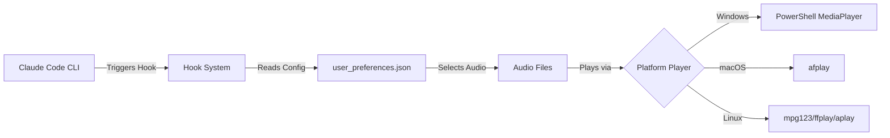
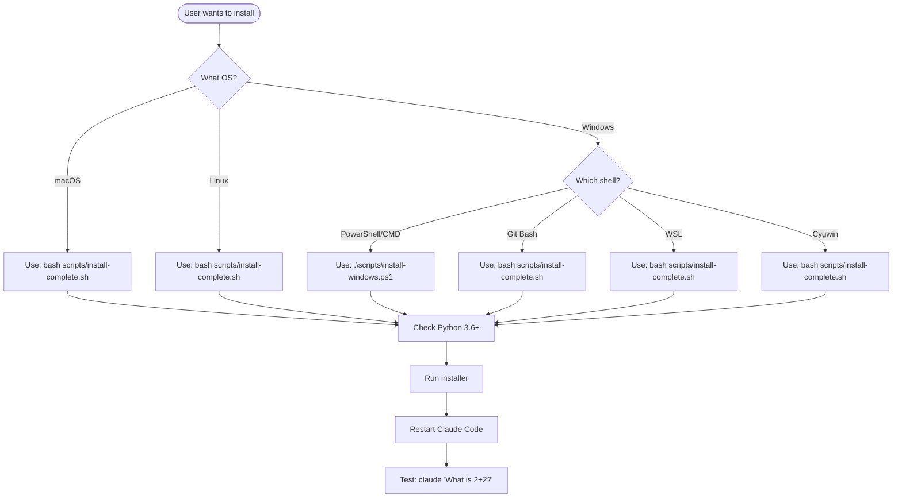
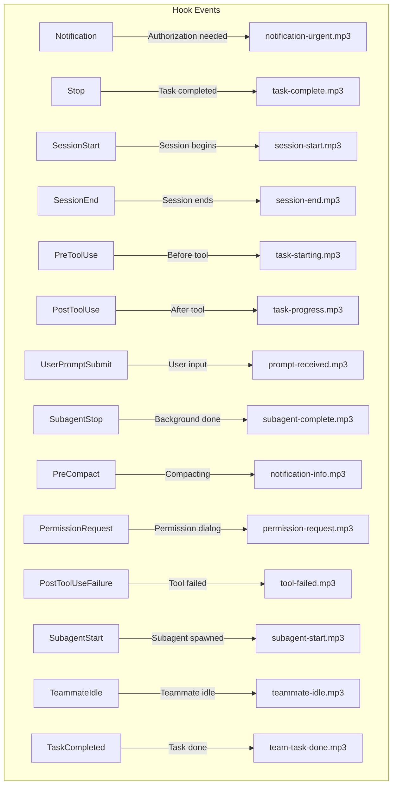
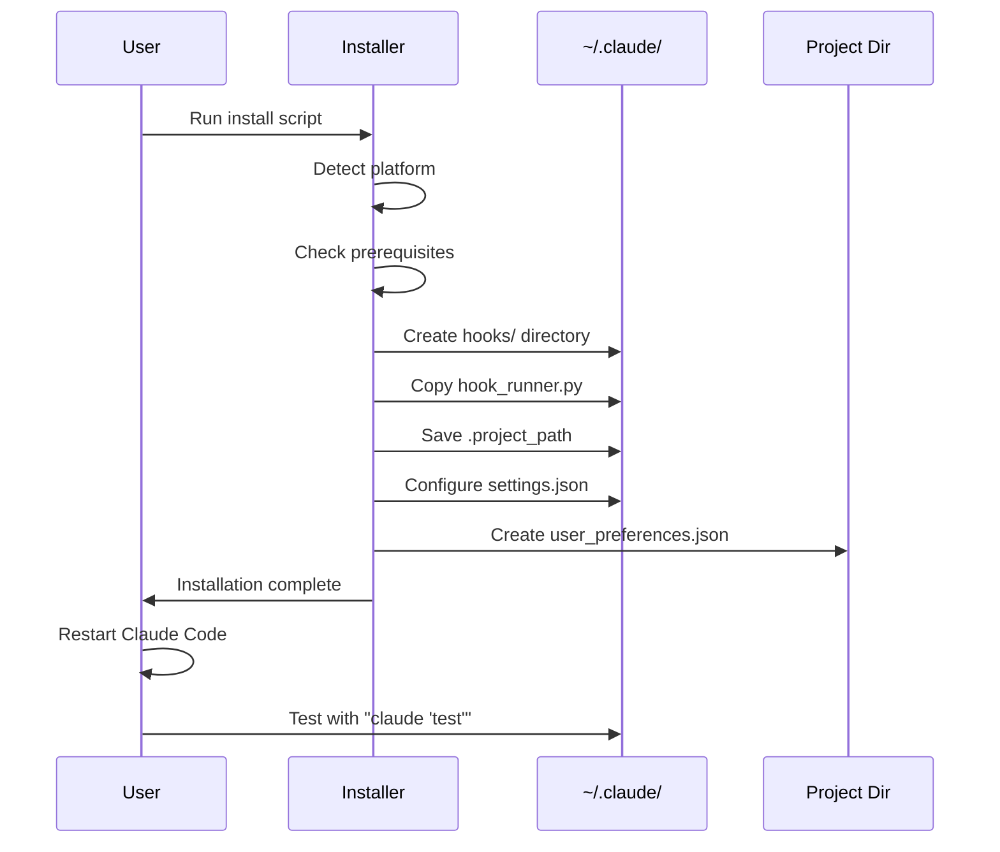

# Claude Code Audio Hooks - AI Assistant Guide

> **Version:** 4.2.2 | **Last Updated:** 2026-02-14

This document is designed for AI assistants (Claude Code, Cursor, Copilot, etc.) to understand and help users install this project correctly.

## Project Overview

**Claude Code Audio Hooks** provides audio notifications for Claude Code CLI events. When Claude completes tasks, triggers notifications, or needs authorization, users hear audio cues instead of constantly watching the terminal.



## Quick Reference: Installation Commands

### Quick Setup (Lite - Recommended First)
Zero dependencies, zero Python. Single command:
```bash
curl -sL https://raw.githubusercontent.com/ChanMeng666/claude-code-audio-hooks/master/scripts/quick-setup.sh | bash
```
Gives: desktop notifications + system sounds for Stop, Notification, SubagentStop, PermissionRequest hooks.

### Full Install (Standard/Pro)

| Platform | Command |
|----------|---------|
| **Windows (PowerShell)** | `.\scripts\install-windows.ps1` |
| **Windows (Git Bash)** | `bash scripts/install-complete.sh` |
| **WSL** | `bash scripts/install-complete.sh` |
| **macOS** | `bash scripts/install-complete.sh` |
| **Linux** | `bash scripts/install-complete.sh` |

Gives: custom MP3 audio + desktop notifications + context-aware alerts + TTS (optional).

## Platform Detection Decision Tree

Use this decision tree to determine the correct installation method:



## Project Structure

```
claude-code-audio-hooks/
├── CLAUDE.md                    # THIS FILE - AI assistant guide
├── README.md                    # User documentation
├── CHANGELOG.md                 # Version history
│
├── audio/
│   ├── default/                 # Voice audio files (14 MP3 files, ElevenLabs Jessica)
│   └── custom/                  # Chime audio files (14 MP3 files, non-voice sound effects)
│       ├── notification-urgent.mp3  # Authorization requests
│       ├── task-complete.mp3        # Task completion (Stop)
│       ├── session-start.mp3        # Session begins
│       ├── session-end.mp3          # Session ends
│       ├── task-starting.mp3        # Before tool execution
│       ├── task-progress.mp3        # After tool execution
│       ├── prompt-received.mp3      # User submits prompt
│       ├── subagent-complete.mp3    # Background task done
│       ├── notification-info.mp3    # Context compaction
│       ├── permission-request.mp3   # Permission dialog
│       ├── tool-failed.mp3          # Tool execution failed
│       ├── subagent-start.mp3       # Subagent spawned
│       ├── teammate-idle.mp3        # Teammate goes idle
│       └── team-task-done.mp3       # Team task completed
│
├── config/
│   ├── default_preferences.json # Default settings template
│   └── user_preferences.json    # User's active settings
│
├── hooks/
│   ├── hook_runner.py           # Main Python hook runner (Windows)
│   └── shared/
│       └── hook_config.sh       # Shared bash functions (macOS/Linux)
│
├── scripts/
│   ├── quick-setup.sh           # Lite tier installer (zero deps, curl | bash)
│   ├── quick-unsetup.sh         # Lite tier uninstaller
│   ├── install-complete.sh      # Full installer (all platforms)
│   ├── install-windows.ps1      # PowerShell installer (Windows)
│   ├── uninstall.sh             # Uninstaller
│   ├── configure.sh             # Configuration utility
│   ├── test-audio.sh            # Audio testing tool
│   └── diagnose.py              # Diagnostic tool
│
└── docs/                        # Detailed documentation
    ├── ARCHITECTURE.md          # System architecture
    ├── INSTALLATION_GUIDE.md    # Detailed installation guide
    └── TROUBLESHOOTING.md       # Problem solving guide
```

## Hook Types and Audio Mapping



| Hook | Trigger | Default Audio | Recommended |
|------|---------|---------------|-------------|
| `Notification` | Authorization requests | notification-urgent.mp3 | **Enable** |
| `Stop` | Task completion | task-complete.mp3 | **Enable** |
| `SubagentStop` | Background task done | subagent-complete.mp3 | **Enable** |
| `PermissionRequest` | Permission dialog appears | permission-request.mp3 | **Enable** |
| `SessionStart` | New session begins | session-start.mp3 | Optional |
| `SessionEnd` | Session closes | session-end.mp3 | Optional |
| `PreToolUse` | Before each tool | task-starting.mp3 | Disable (noisy) |
| `PostToolUse` | After each tool | task-progress.mp3 | Disable (noisy) |
| `PostToolUseFailure` | Tool execution fails | tool-failed.mp3 | Optional |
| `UserPromptSubmit` | User sends message | prompt-received.mp3 | Optional |
| `PreCompact` | Context compaction | notification-info.mp3 | Optional |
| `SubagentStart` | Subagent spawned | subagent-start.mp3 | Optional |
| `TeammateIdle` | Teammate goes idle | teammate-idle.mp3 | Optional |
| `TaskCompleted` | Team task completed | team-task-done.mp3 | Optional |

## Installation Prerequisites

### All Platforms
- **Claude Code CLI** - Must be installed and working
- **Python 3.6+** - Required for hook execution

### Platform-Specific

| Platform | Audio Player | Notes |
|----------|--------------|-------|
| Windows | PowerShell MediaPlayer | Built-in, no install needed |
| macOS | afplay | Built-in, no install needed |
| Linux | mpg123, ffplay, or aplay | May need: `sudo apt install mpg123` |
| WSL | PowerShell (via Windows) | Audio plays through Windows |

## Installation Flow



## Key Files After Installation

### ~/.claude/settings.json
The 4 default-enabled hooks are registered. Commands use absolute paths and defensive wrapping so a missing `hook_runner.py` returns success instead of blocking the user:
```json
{
  "hooks": {
    "Notification": [{"hooks": [{"type": "command", "command": "test -f /home/user/.claude/hooks/hook_runner.py && python3 /home/user/.claude/hooks/hook_runner.py notification || true", "timeout": 10}]}],
    "Stop": [{"hooks": [{"type": "command", "command": "test -f /home/user/.claude/hooks/hook_runner.py && python3 /home/user/.claude/hooks/hook_runner.py stop || true", "timeout": 10}]}],
    "SubagentStop": [{"hooks": [{"type": "command", "command": "test -f /home/user/.claude/hooks/hook_runner.py && python3 /home/user/.claude/hooks/hook_runner.py subagent_stop || true", "timeout": 10}]}],
    "PermissionRequest": [{"matcher": "", "hooks": [{"type": "command", "command": "test -f /home/user/.claude/hooks/hook_runner.py && python3 /home/user/.claude/hooks/hook_runner.py permission_request || true", "timeout": 10}]}]
  }
}
```

### ~/.claude/hooks/.project_path
Contains the absolute path to the project directory (Windows format on Windows):
```
D:/github_repository/claude-code-audio-hooks
```

### config/user_preferences.json
```json
{
  "enabled_hooks": {
    "notification": true,
    "stop": true,
    "subagent_stop": true,
    "permission_request": true,
    "session_start": false,
    "session_end": false,
    "pretooluse": false,
    "posttooluse": false,
    "posttoolusefailure": false,
    "userpromptsubmit": false,
    "precompact": false,
    "subagent_start": false,
    "teammate_idle": false,
    "task_completed": false
  },
  "notification_settings": {
    "mode": "audio_and_notification",
    "show_context": true
  },
  "tts_settings": {
    "enabled": false,
    "messages": {
      "stop": "Task completed",
      "notification": "Attention, authorization needed",
      "permission_request": "Permission required",
      "posttoolusefailure": "Tool execution failed",
      "subagent_start": "Background task starting",
      "teammate_idle": "Teammate is idle",
      "task_completed": "Team task completed"
    }
  }
}
```

## Troubleshooting Quick Reference

### Enable Debug Logging
```bash
# Bash/Zsh (Linux/macOS/Git Bash/WSL)
export CLAUDE_HOOKS_DEBUG=1

# PowerShell
$env:CLAUDE_HOOKS_DEBUG = "1"
```

### Run Diagnostics
```bash
python scripts/diagnose.py -v --test-audio
```

### Common Issues

| Issue | Cause | Solution |
|-------|-------|----------|
| No audio after install | Didn't restart Claude | Restart terminal/Claude Code |
| macOS 15+ no sound (Quick Setup) | osascript notifications blocked | Re-run Quick Setup (now uses `afplay`) |
| macOS no desktop notification | Script Editor lacks permission | System Settings > Notifications > Script Editor |
| Path errors on Windows | Git Bash path format | Re-run installer (auto-converts) |
| WSL no audio | PowerShell not accessible | Check `powershell.exe` works |
| Linux no audio | No audio player | Install: `sudo apt install mpg123` |
| "Invalid Settings" error | Old hooks format | Re-run installer for new format |

### Log Locations

| Platform | Log Directory |
|----------|---------------|
| Windows | `%TEMP%\claude_audio_hooks_queue\logs\` |
| Linux/macOS | `/tmp/claude_audio_hooks_queue/logs/` |
| WSL | `/tmp/claude_audio_hooks_queue/logs/` |

## Audio Customization

### Two Built-in Audio Themes
- **default** (`audio/default/`): 14 professional ElevenLabs Jessica voice recordings
- **custom** (`audio/custom/`): 14 modern UI sound effects (non-voice chimes)

### Switching Themes (Two Methods)

**Method 1: Command line**
```bash
bash scripts/configure.sh --theme custom    # Switch to chimes
bash scripts/configure.sh --theme default   # Switch back to voice
```

**Method 2: Edit one line** in `config/user_preferences.json`
```json
"audio_theme": "custom"
```
Change `"default"` to `"custom"` (or vice versa), then restart Claude Code.

### Using Custom Audio Files
Users can replace MP3 files in `audio/default/` with their own. **Keep the same filenames** - no configuration changes needed. Just swap files and restart Claude Code.

---

## For AI Assistants: Installation Steps

When a user asks to install this project, **recommend Quick Setup first** unless they specifically need custom audio or TTS.

### Option A: Quick Setup (Recommended)

```bash
curl -sL https://raw.githubusercontent.com/ChanMeng666/claude-code-audio-hooks/master/scripts/quick-setup.sh | bash
```

Then instruct user to restart Claude Code.

### Option B: Full Install (Custom Audio / TTS / Advanced Features)

#### Step 1: Detect Environment
```bash
# Check OS
uname -s  # Linux, Darwin (macOS), or MINGW*/MSYS* (Git Bash)

# Check for WSL
cat /proc/version 2>/dev/null | grep -i microsoft

# Check Python
python3 --version || python --version || py --version
```

#### Step 2: Clone Repository
```bash
git clone https://github.com/ChanMeng666/claude-code-audio-hooks.git
cd claude-code-audio-hooks
```

#### Step 3: Run Appropriate Installer

**Windows PowerShell:**
```powershell
.\scripts\install-windows.ps1
```

**All other platforms (Git Bash, WSL, macOS, Linux):**
```bash
bash scripts/install-complete.sh
```

#### Step 4: Verify Installation
```bash
# Check hook runner installed
ls -la ~/.claude/hooks/hook_runner.py

# Check settings configured
cat ~/.claude/settings.json | grep hook_runner

# Check project path saved
cat ~/.claude/hooks/.project_path
```

#### Step 5: Test
Instruct user to:
1. Restart Claude Code (close and reopen terminal)
2. Run: `claude "What is 2+2?"`
3. Listen for audio when response completes

## Version History

| Version | Date | Key Changes |
|---------|------|-------------|
| 4.2.2 | 2026-02-14 | Robust theme switching: remove conflicting `audio_files` config, add hook_runner.py auto-sync from project dir, configure.sh syncs on theme switch |
| 4.2.0 | 2026-02-13 | Add 4 new hooks (PostToolUseFailure, SubagentStart, TeammateIdle, TaskCompleted), 14 total hooks, 14 unique audio files |
| 4.0.3 | 2026-02-11 | Fix Windows installer hook filtering, uninstaller hook_runner.py detection, defensive wrapping |
| 4.0.0 | 2026-02-10 | Quick Setup (Lite tier), desktop notifications, TTS, context-aware alerts |
| 3.3.5 | 2025-12-27 | UTF-8 BOM fix for Windows |
| 3.3.4 | 2025-12-22 | Windows PowerShell installer, diagnostic tool, debug logging |
| 3.3.3 | 2025-11-07 | WSL audio fix, hooks format fix |
| 3.3.0 | 2025-11-06 | Non-interactive mode for all scripts |
| 3.0.0 | 2025-11-05 | Complete rewrite, Python hook runner |

## Related Documentation

- [README.md](README.md) - Full user documentation
- [CHANGELOG.md](CHANGELOG.md) - Detailed version history
- [docs/ARCHITECTURE.md](docs/ARCHITECTURE.md) - System architecture details
- [docs/INSTALLATION_GUIDE.md](docs/INSTALLATION_GUIDE.md) - Step-by-step installation
- [docs/TROUBLESHOOTING.md](docs/TROUBLESHOOTING.md) - Problem solving guide

---

*This document is optimized for AI assistant consumption. For human-readable documentation, see [README.md](README.md).*
