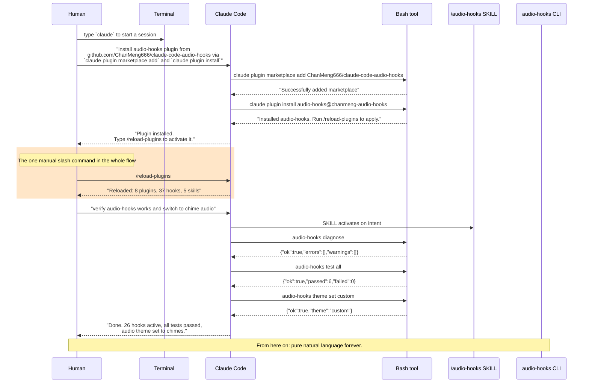
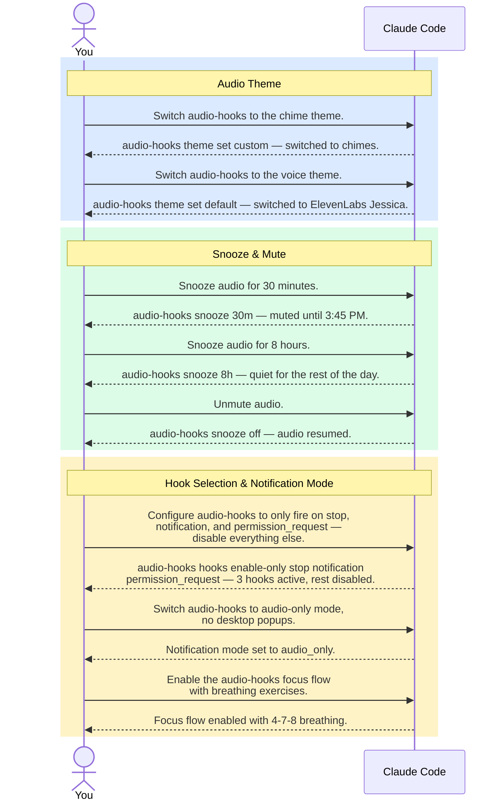
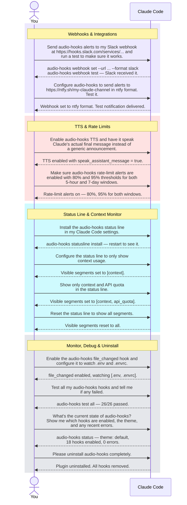
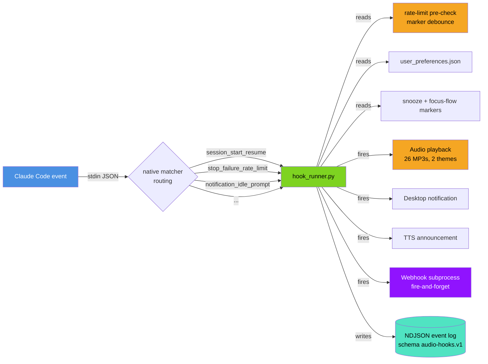
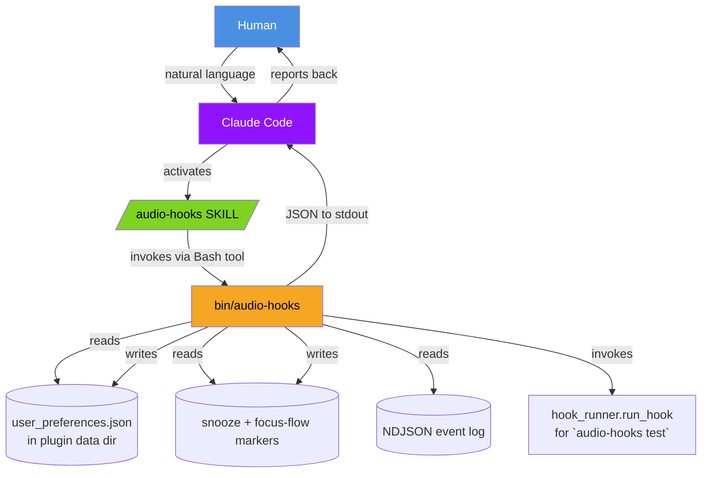
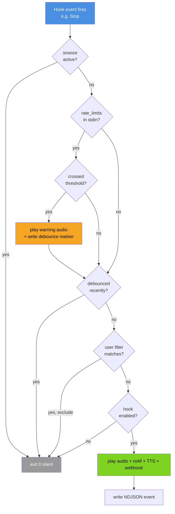
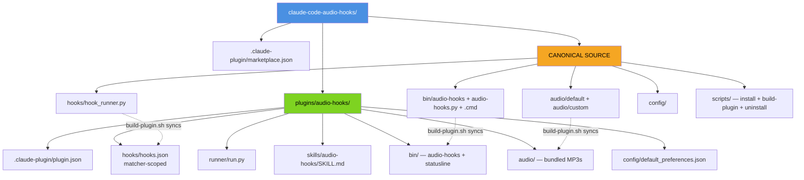

<div align="center"><a name="readme-top"></a>

[](#)

# Claude Code Audio Hooks

**AI-operated audio notification system for Claude Code.**<br/>
You type one slash command at install time. Then natural language forever.<br/>
26 hook events, 2 audio themes, rate-limit alerts, webhooks, TTS, context monitor — all operated by Claude Code on your behalf.

[](https://opensource.org/licenses/MIT)
[](https://github.com/ChanMeng666/claude-code-audio-hooks)
[](https://github.com/ChanMeng666/claude-code-audio-hooks)
[](https://claude.ai/download)
[](#-install-in-60-seconds)

**Share This Project**

[![][share-x-shield]][share-x-link]
[![][share-linkedin-shield]][share-linkedin-link]
[![][share-reddit-shield]][share-reddit-link]
[![][share-telegram-shield]][share-telegram-link]
[![][share-whatsapp-shield]][share-whatsapp-link]

---

### Promotional Video

https://github.com/user-attachments/assets/3504d214-efac-4e01-84c0-426430b842d6

<sup>Built with Remotion, Claude Code, ElevenLabs & Suno. Source: <a href="https://github.com/ChanMeng666/claude-code-audio-hooks-promo-video">claude-code-audio-hooks-promo-video</a></sup>

</div>

<details>
<summary><kbd>Table of Contents</kbd></summary>

- [What's New in v5.0](#-whats-new-in-v50)
- [Install in 60 Seconds](#-install-in-60-seconds)
- [Just Say It — Natural Language Control](#-just-say-it--natural-language-control)
- [How It Works](#-how-it-works)
- [Key Features](#-key-features)
- [Technical Reference](#-technical-reference)
- [Platform Support](#-platform-support)
- [Troubleshooting](#-troubleshooting)
- [Uninstall](#-uninstall)
- [For Developers](#-for-developers)
- [Documentation](#-documentation)
- [Contributing](#-contributing)
- [License](#-license)
- [Author](#-author)

</details>

---

## What's New in v5.0

<details>
<summary><kbd>v5.0 — AI-first redesign (click to expand)</kbd></summary>
<br>

v5.0 is an **AI-first redesign**. Every project surface is now machine-operable end-to-end so Claude Code can install, configure, snooze, troubleshoot, and upgrade the project on a human's behalf without any clicks, prompts, or doc reading.

| Highlight | Effect |
|---|---|
| **`audio-hooks` JSON CLI** | Single binary with 27 subcommands. JSON to stdout, stable error codes + suggested commands. |
| **`/audio-hooks` SKILL** | Natural-language activation: "snooze audio for an hour" — Claude runs it for you. |
| **NDJSON structured logging** | Schema `audio-hooks.v1` with stable error code enums. |
| **Plugin-native install** | Two commands and you're done. |
| **4 new hook events** | `PermissionDenied`, `CwdChanged`, `FileChanged`, `TaskCreated` — 26 total. |
| **Native matcher routing** | `hooks.json` registers per-matcher handlers with unique audio per variant. |
| **Rate-limit alerts** | One-shot warning at 80%/95% of your 5h or 7d quota. |
| **TTS speak Claude's reply** | Instead of "Task completed", TTS speaks Claude's actual final message. |
| **Status line with context monitor** | Color-coded Context and API Quota bars with `/compact` reminders. |
| **ElevenLabs audio generator** | One-line manifest edit + one-command rebuild for new audio. |

### v5.0 in Action

<div align="center">
  <table>
    <tr>
      <td width="50%" align="center">
        
        <br/><em>Plugin Installed — 26 hooks registered</em>
      </td>
      <td width="50%" align="center">
        
        <br/><em>/audio-hooks SKILL active</em>
      </td>
    </tr>
    <tr>
      <td width="50%" align="center">
        
        <br/><em>Context monitor status line</em>
      </td>
      <td width="50%" align="center">
        
        <br/><em>Marketplace registration</em>
      </td>
    </tr>
  </table>
</div>

See [`CHANGELOG.md`](CHANGELOG.md) for full details.

</details>

---

## Install in 60 Seconds

**For 99% of operations, you just talk to Claude Code in plain English.** The exception is the one-time install: `/reload-plugins` has no CLI equivalent, so the human types it exactly once. Everything else — configure, snooze, theme, webhook, troubleshoot, uninstall — is pure natural language.



### Step 1 — Open Claude Code

```bash
claude
```

### Step 2 — Install with one prompt

Paste this into Claude Code:

> **Please install the audio-hooks plugin from `github.com/ChanMeng666/claude-code-audio-hooks`. Use the Bash tool to run `claude plugin marketplace add ChanMeng666/claude-code-audio-hooks` then `claude plugin install audio-hooks@chanmeng-audio-hooks`. After both commands complete, tell me to type `/reload-plugins` to activate the plugin.**

### Step 3 — Type `/reload-plugins` (the one manual slash command)

```text
/reload-plugins
```

### Step 4 — Verify and configure with one prompt

> **Verify audio-hooks works by running `audio-hooks diagnose` and `audio-hooks test all`. Then switch to the chime audio theme.**

**Total:** 1 shell command + 2 natural-language prompts + 1 slash command = **4 things**. From here on: natural language forever.

---

## Just Say It — Natural Language Control

Once installed, you operate the project the same way — just talk to Claude Code. Every configuration is a single message:





Each prompt is one message. Claude Code parses it, runs the right subcommand(s), and reports back. **You don't memorise anything.**

<details>
<summary><kbd>Plain-text prompt reference — copy-friendly table</kbd></summary>
<br>

| Goal | Paste this into Claude Code |
|---|---|
| Switch to chime sounds | *"Switch audio-hooks to the chime theme."* |
| Switch to voice sounds | *"Switch audio-hooks to the voice theme."* |
| Mute for 30 minutes | *"Snooze audio for 30 minutes."* |
| Mute for the rest of the day | *"Snooze audio for 8 hours."* |
| Unmute | *"Unmute audio."* |
| Only keep critical alerts | *"Only fire audio-hooks on stop, notification, and permission_request. Disable everything else."* |
| Audio only, no desktop popups | *"Switch audio-hooks to audio-only mode."* |
| Turn on breathing exercises | *"Enable the audio-hooks focus flow with breathing exercises."* |
| Send alerts to Slack | *"Send audio-hooks alerts to my Slack webhook at `https://hooks.slack.com/services/...` and test it."* |
| Send alerts to ntfy | *"Send audio-hooks alerts to `https://ntfy.sh/my-topic` in ntfy format. Test it."* |
| Speak Claude's reply out loud | *"Enable audio-hooks TTS and speak Claude's actual final message."* |
| Warn me before I hit the rate limit | *"Enable audio-hooks rate-limit alerts at 80% and 95% for both windows."* |
| Watch .env for changes | *"Enable the audio-hooks file_changed hook and watch `.env` and `.envrc`."* |
| Add a status bar | *"Install the audio-hooks status line."* |
| Status bar: context only | *"Only show context usage in the audio-hooks status line."* |
| Status bar: context + API quota | *"Show context and API quota in the audio-hooks status line."* |
| Status bar: show everything | *"Reset the audio-hooks status line to show all segments."* |
| Test all hooks | *"Test all audio-hooks and tell me if any failed."* |
| Show current state | *"Show the current audio-hooks status — enabled hooks, theme, and recent errors."* |
| Why no sound? | *"Audio-hooks isn't playing sounds. Diagnose and fix it."* |
| Show recent errors | *"Show me the last 20 audio-hooks errors."* |
| Uninstall | *"Please uninstall audio-hooks completely."* |

</details>

---

## How It Works



Claude Code fires hook events as JSON on stdin. Native matchers in `hooks.json` route each event to `hook_runner.py` with a synthetic event name. The runner checks snooze state, rate-limit thresholds, debounce, and user filters — then fires audio playback, desktop notifications, TTS, and webhooks as configured.

<table><tbody>
<tr></tr>
<tr><td width="10000">
<details>
<summary>&nbsp;&nbsp;<strong>AI Control Surface</strong></summary><br>



</details>
</td></tr>
<tr></tr>
<tr><td width="10000">
<details>
<summary>&nbsp;&nbsp;<strong>Hook Lifecycle</strong></summary><br>



</details>
</td></tr>
<tr></tr>
<tr><td width="10000">
<details>
<summary>&nbsp;&nbsp;<strong>Plugin Layout</strong></summary><br>



</details>
</td></tr>
</tbody></table>

---

## Key Features

### Status Line with Context Monitor

Real-time context window and API quota bars — color-coded warnings before Claude enters the "agent dumb zone".

<p align="center">

</p>

```text
[Opus] Audio Hooks v5.0.3 | 6/26 Sounds | Webhook: ntfy | Theme: Voice
[MUTED 23m]  feat/audio-v5  API Quota: 78%  Context: 65%  /compact
```

| Color | Range | Meaning | Action |
|---|---|---|---|
| Green | < 50% | Safe — agent performs well | Keep working |
| Yellow | 50-80% | Caution — entering the "dumb zone" | Type `/compact` or `/clear` |
| Red | > 80% | Danger — agent makes frequent errors | Type `/compact` immediately |

<details>
<summary><kbd>10 customisable segments</kbd></summary>
<br>

| Segment | Shows |
|---|---|
| `model` | Model name (e.g. `[Opus]`) |
| `version` | Audio Hooks version |
| `sounds` | Enabled sound count |
| `webhook` | Webhook status |
| `theme` | Audio theme |
| `snooze` | Mute countdown (when active) |
| `focus` | Focus Flow mode (when active) |
| `branch` | Git branch name |
| `api_quota` | API usage quota bar |
| `context` | Context window usage bar |

</details>

### Audio Themes

| Theme | Style | Source |
|---|---|---|
| `default` | ElevenLabs **Jessica** voice — short spoken phrases like *"Task completed"* | `audio/default/*.mp3` |
| `custom` | Modern UI sound effects (chimes, beeps) | `audio/custom/chime-*.mp3` |

Say *"switch to chimes"* or *"switch to voice"* — Claude Code handles the rest.

### 26 Hook Events

26 events covering the full Claude Code lifecycle — from session start to file changes, permission requests to rate-limit warnings. 6 are enabled by default; toggle any with natural language.

<details>
<summary><kbd>Full hook events table</kbd></summary>
<br>

| Hook | Default | Audio file | Native matchers |
|---|:-:|---|---|
| `notification` | on | notification-urgent.mp3 | `permission_prompt` / `idle_prompt` / `auth_success` / `elicitation_dialog` |
| `stop` | on | task-complete.mp3 | |
| `subagent_stop` | on | subagent-complete.mp3 | agent type |
| `permission_request` | on | permission-request.mp3 | tool name |
| `permission_denied` | on | permission-denied.mp3 | |
| `task_created` | on | task-created.mp3 | |
| `task_completed` | | team-task-done.mp3 | |
| `session_start` | | session-start.mp3 | `startup` / `resume` / `clear` / `compact` |
| `session_end` | | session-end.mp3 | `clear` / `resume` / `logout` / `prompt_input_exit` |
| `pretooluse` | | task-starting.mp3 | tool name |
| `posttooluse` | | task-progress.mp3 | tool name |
| `posttoolusefailure` | | tool-failed.mp3 | tool name |
| `userpromptsubmit` | | prompt-received.mp3 | |
| `subagent_start` | | subagent-start.mp3 | agent type |
| `precompact` / `postcompact` | | notification-info.mp3 / post-compact.mp3 | `manual` / `auto` |
| `stop_failure` | | stop-failure.mp3 | `rate_limit` / `authentication_failed` / `billing_error` / `server_error` / `unknown` |
| `teammate_idle` | | teammate-idle.mp3 | |
| `config_change` | | config-change.mp3 | |
| `instructions_loaded` | | instructions-loaded.mp3 | |
| `worktree_create` / `worktree_remove` | | worktree-create.mp3 / worktree-remove.mp3 | |
| `elicitation` / `elicitation_result` | | elicitation.mp3 / elicitation-result.mp3 | |
| `cwd_changed` | | cwd-changed.mp3 | |
| `file_changed` | | file-changed.mp3 | literal filenames |

</details>

### Webhooks

Fan out hook events to Slack, Discord, Teams, ntfy, or any HTTP endpoint. Versioned `audio-hooks.webhook.v1` payload. Fire-and-forget via subprocess — never blocks the hook. Say *"send alerts to my Slack"* and Claude Code sets it up.

### Rate-limit Alerts

Watches every hook's stdin for `rate_limits` and plays a one-shot warning at configurable thresholds (default 80%/95%). Each `(window, threshold, resets_at)` fires exactly once — warned at 80%, again at 95%, never spammed.

### TTS — Speak Claude's Reply

Instead of a static "Task completed", TTS speaks Claude's actual final message (truncated to 200 chars). Off by default — privacy-conscious. Say *"speak Claude's actual reply when done"* to enable.

### Focus Flow

Anti-distraction micro-task during Claude's thinking time: guided breathing exercise, hydration reminder, custom URL, or shell command. Auto-closes when Claude finishes. Say *"enable focus flow with breathing exercises"*.

---

## Technical Reference

<details>
<summary><kbd>CLI, configuration, environment variables, error codes, logging, manual install (click to expand)</kbd></summary>

### `audio-hooks` CLI

Single Python binary on PATH. JSON output, no prompts, no spinners.

| Subcommand | Purpose |
|---|---|
| `audio-hooks manifest` | Canonical introspection — every subcommand, hook, config key, error code, env var |
| `audio-hooks manifest --schema` | JSON Schema for `user_preferences.json` |
| `audio-hooks status` | Full state snapshot |
| `audio-hooks version` | Version + install mode detection |
| `audio-hooks get <dotted.key>` | Read any config key |
| `audio-hooks set <dotted.key> <value>` | Write any config key (auto-coerces) |
| `audio-hooks hooks list` | All 26 hooks with current state |
| `audio-hooks hooks enable/disable <name>` | Toggle a hook |
| `audio-hooks hooks enable-only <a> <b>` | Exclusive enable |
| `audio-hooks theme list/set <name>` | Audio theme |
| `audio-hooks snooze [duration]/off/status` | Mute hooks (default 30m) |
| `audio-hooks webhook/set/clear/test` | Webhook config + test |
| `audio-hooks tts set ...` | TTS config |
| `audio-hooks rate-limits set ...` | Rate-limit alert thresholds |
| `audio-hooks test <hook\|all>` | Smoke-test hooks |
| `audio-hooks diagnose` | System check |
| `audio-hooks logs tail/clear` | NDJSON event log |
| `audio-hooks install/uninstall` | Non-interactive install/uninstall |
| `audio-hooks statusline show/install/uninstall` | Status line management |

### Configuration Keys

| Key | Type | Default | Effect |
|---|---|---|---|
| `audio_theme` | `default` \| `custom` | `default` | Voice recordings vs chimes |
| `enabled_hooks.<hook>` | bool | varies | Per-hook toggle |
| `playback_settings.debounce_ms` | int | 500 | Min ms between same hook firing |
| `notification_settings.mode` | enum | `audio_and_notification` | `audio_only` / `notification_only` / `audio_and_notification` / `disabled` |
| `notification_settings.detail_level` | enum | `standard` | `minimal` / `standard` / `verbose` |
| `webhook_settings.enabled` | bool | `false` | Webhook fan-out |
| `webhook_settings.url` | string | `""` | Target URL |
| `webhook_settings.format` | enum | `raw` | `slack` / `discord` / `teams` / `ntfy` / `raw` |
| `webhook_settings.hook_types` | array | `["stop","notification",...]` | Which hooks fire the webhook |
| `tts_settings.enabled` | bool | `false` | TTS announcements |
| `tts_settings.speak_assistant_message` | bool | `false` | TTS Claude's actual reply on stop |
| `tts_settings.assistant_message_max_chars` | int | 200 | Truncation cap |
| `rate_limit_alerts.enabled` | bool | `true` | Watch stdin rate_limits |
| `rate_limit_alerts.five_hour_thresholds` | int[] | `[80, 95]` | 5h window thresholds |
| `rate_limit_alerts.seven_day_thresholds` | int[] | `[80, 95]` | 7d window thresholds |
| `focus_flow.enabled` / `mode` / `min_thinking_seconds` / `breathing_pattern` | mixed | off / `breathing` / 15 / `4-7-8` | Anti-distraction micro-task |
| `statusline_settings.visible_segments` | string[] | `[]` (all) | Status line segments to show |

### Environment Variables

| Variable | Purpose |
|---|---|
| `CLAUDE_PLUGIN_DATA` | Plugin install state directory (auto-set by Claude Code) |
| `CLAUDE_PLUGIN_ROOT` | Plugin install root (auto-set) |
| `CLAUDE_AUDIO_HOOKS_DATA` | Explicit override for state directory |
| `CLAUDE_AUDIO_HOOKS_PROJECT` | Explicit override for project root |
| `CLAUDE_HOOKS_DEBUG` | `1` to write debug-level events to NDJSON log |
| `CLAUDE_NONINTERACTIVE` | `1` to force scripts into non-interactive mode |
| `ELEVENLABS_API_KEY` | Used by `scripts/generate-audio.py` (never logged) |

### Stable Error Codes

| Code | When | Suggested fix |
|---|---|---|
| `AUDIO_FILE_MISSING` | Audio file doesn't exist | `audio-hooks diagnose` |
| `AUDIO_PLAYER_NOT_FOUND` | No audio player binary | `audio-hooks diagnose` |
| `AUDIO_PLAY_FAILED` | Player exited with error | `audio-hooks test` |
| `INVALID_CONFIG` | `user_preferences.json` malformed | `audio-hooks manifest --schema` |
| `CONFIG_READ_ERROR` | Can't read config | `audio-hooks status` |
| `WEBHOOK_HTTP_ERROR` | Webhook returned non-2xx | `audio-hooks webhook test` |
| `WEBHOOK_TIMEOUT` | Webhook timed out | `audio-hooks webhook test` |
| `NOTIFICATION_FAILED` | Desktop notification failed | `audio-hooks diagnose` |
| `TTS_FAILED` | TTS engine failed | `audio-hooks tts set --enabled false` |
| `SETTINGS_DISABLE_ALL_HOOKS` | `disableAllHooks: true` in settings | `audio-hooks diagnose` |
| `DUAL_INSTALL_DETECTED` | Both install methods active | `bash scripts/uninstall.sh --yes` |
| `PROJECT_DIR_NOT_FOUND` | Can't locate project | `audio-hooks status` |
| `UNKNOWN_HOOK_TYPE` | Unrecognised hook name | `audio-hooks hooks list` |
| `INTERNAL_ERROR` | Unexpected error | `audio-hooks logs tail` |

### NDJSON Event Log

Every event is one JSON object per line at `${CLAUDE_PLUGIN_DATA}/logs/events.ndjson`. Schema `audio-hooks.v1`.

```json
{"ts":"2026-04-11T10:23:45.123Z","schema":"audio-hooks.v1","level":"info","hook":"stop","session_id":"abc","action":"play_audio","audio_file":"chime-task-complete.mp3","duration_ms":42}
```

Levels: `debug`, `info`, `warn`, `error`. Log rotation: 5 MB cap, 3 files kept.

### Manual Install Reference

**Plugin install** (two slash commands inside Claude Code):

```text
/plugin marketplace add ChanMeng666/claude-code-audio-hooks
/plugin install audio-hooks@chanmeng-audio-hooks
/reload-plugins
```

**Legacy script install** (pre-v5.0, still works):

```bash
git clone https://github.com/ChanMeng666/claude-code-audio-hooks.git
cd claude-code-audio-hooks
bash scripts/install-complete.sh    # auto non-interactive on non-TTY
```

Both paths share the same `hook_runner.py` and `audio-hooks` CLI. They are mutually exclusive — `audio-hooks diagnose` reports `DUAL_INSTALL_DETECTED` if both are active.

### ElevenLabs Audio Generator

`scripts/generate-audio.py` reads `config/audio_manifest.json` and regenerates audio via the ElevenLabs API:

```bash
ELEVENLABS_API_KEY=sk_... python scripts/generate-audio.py           # generate missing
ELEVENLABS_API_KEY=sk_... python scripts/generate-audio.py --force   # regenerate all
python scripts/generate-audio.py --dry-run                           # preview
```

To add a new audio file: edit `config/audio_manifest.json`, run the generator, then `bash scripts/build-plugin.sh`.

</details>

---

## Platform Support

| Platform | Audio player | Status |
|---|---|---|
| **Windows** (PowerShell / Git Bash / WSL2) | PowerShell MediaPlayer | Fully supported |
| **macOS** | `afplay` | Fully supported |
| **Linux** | `mpg123` / `ffplay` / `paplay` / `aplay` (auto-detected) | Fully supported |

Python 3.6+ is the only runtime requirement.

---

## Troubleshooting

<table><tbody>
<tr></tr>
<tr><td width="10000">
<details>
<summary>&nbsp;&nbsp;<strong>No sound at all</strong></summary><br>

Run `audio-hooks diagnose`, look for any error code, and run its `suggested_command`. Or just say: *"Audio-hooks isn't playing sounds. Diagnose and fix it."*

</details>
</td></tr>
<tr></tr>
<tr><td width="10000">
<details>
<summary>&nbsp;&nbsp;<strong>Hearing double sounds</strong></summary><br>

Both legacy script install and plugin install are active. Diagnose reports `DUAL_INSTALL_DETECTED`. Fix: `bash scripts/uninstall.sh --yes` (removes legacy, preserves config).

</details>
</td></tr>
<tr></tr>
<tr><td width="10000">
<details>
<summary>&nbsp;&nbsp;<strong>Plugin won't install</strong></summary><br>

Run `claude plugin validate plugins/audio-hooks` from the project root — surfaces manifest schema errors. v5.0.1+ verified clean on Claude Code v2.1.101.

</details>
</td></tr>
<tr></tr>
<tr><td width="10000">
<details>
<summary>&nbsp;&nbsp;<strong>pretooluse / posttooluse too noisy</strong></summary><br>

They fire on every tool execution (Read, Glob, Grep, etc.) — disabled by default for this reason. Enable explicitly with *"enable pretooluse and posttooluse audio"*.

</details>
</td></tr>
</tbody></table>

---

## Uninstall

**Plugin install:** say *"uninstall audio-hooks"* or manually:

```text
/plugin uninstall audio-hooks@chanmeng-audio-hooks
```

**Legacy script install:**

```bash
bash scripts/uninstall.sh --yes              # preserve config + audio
bash scripts/uninstall.sh --yes --purge      # remove everything
```

---

## For Developers

<details>
<summary><kbd>Repository layout, workflow, and contribution guide (click to expand)</kbd></summary>

### Repository Layout

```
claude-code-audio-hooks/
├── .claude-plugin/marketplace.json
├── plugins/audio-hooks/              # plugin layout (populated by build-plugin.sh)
│   ├── .claude-plugin/plugin.json
│   ├── hooks/hooks.json
│   ├── runner/run.py
│   ├── skills/audio-hooks/SKILL.md
│   ├── bin/
│   ├── audio/
│   └── config/default_preferences.json
├── hooks/hook_runner.py              # CANONICAL
├── bin/                              # CANONICAL
│   ├── audio-hooks / audio-hooks.py / audio-hooks.cmd
│   └── audio-hooks-statusline / .py / .cmd
├── audio/                            # CANONICAL: 26 default + 26 custom
├── config/
│   ├── default_preferences.json
│   ├── user_preferences.schema.json
│   └── audio_manifest.json
├── scripts/
│   ├── install-complete.sh / install-windows.ps1
│   ├── uninstall.sh / build-plugin.sh
│   ├── generate-audio.py
│   └── ...
├── CLAUDE.md
├── README.md
└── CHANGELOG.md
```

### Workflow

1. Edit canonical files (`/hooks/`, `/bin/`, `/audio/`, `/config/`)
2. Run `bash scripts/build-plugin.sh` to sync into plugin layout
3. CI verifies in-sync via `bash scripts/build-plugin.sh --check`
4. Validate: `claude plugin validate plugins/audio-hooks`
5. Test: `python bin/audio-hooks.py test all`

### Contributing

Pull requests welcome. Fork, clone, make changes to canonical files, run `build-plugin.sh`, validate, test end-to-end, and submit with a conventional commit message.

</details>

---

## Documentation

| Document | Purpose |
|---|---|
| [**CLAUDE.md**](CLAUDE.md) | Canonical AI-facing operating guide |
| [**CHANGELOG.md**](CHANGELOG.md) | Detailed version history |
| [**docs/ARCHITECTURE.md**](docs/ARCHITECTURE.md) | System architecture details |
| `audio-hooks manifest` | Live source of truth — always up to date |

---

<table>
<tr>
<td>

**Design Philosophy** — This project is **AI-operated**, not AI-assisted. A typical CLI tool: the human learns the tool. **claude-code-audio-hooks**: the human says what they want, Claude Code learns the tool and does the work. The human is **upstream** of Claude Code, not downstream of the CLI.

</td>
</tr>
</table>

---

## License

This project is licensed under the **MIT License** — see [LICENSE](LICENSE) for details.

- Commercial use allowed
- Modification allowed
- Distribution allowed
- Private use allowed

---

## Author

<div align="center">
  <table>
    <tr>
      <td align="center">
        <a href="https://github.com/ChanMeng666">
          
          <br />
          <sub><b>Chan Meng</b></sub>
        </a>
        <br />
        <small>Creator & Lead Developer</small>
      </td>
    </tr>
  </table>
</div>

<p align="center">
  <a href="https://github.com/ChanMeng666">
    
  </a>
  <a href="https://www.linkedin.com/in/chanmeng666/">
    
  </a>
  <a href="https://chanmeng.org/">
    
  </a>
</p>

<p align="center">
  <a href="https://buymeacoffee.com/chanmeng66u" target="_blank">
    
  </a>
</p>

---

<div align="right">

[![][back-to-top]](#readme-top)

</div>

<!-- LINK DEFINITIONS -->

[back-to-top]: https://img.shields.io/badge/-BACK_TO_TOP-black?style=flat-square

[share-x-shield]: https://img.shields.io/badge/-Share%20on%20X-black?labelColor=black&logo=x&logoColor=white&style=flat-square
[share-x-link]: https://x.com/intent/tweet?text=Check%20out%20Claude%20Code%20Audio%20Hooks%20-%20AI-operated%20audio%20notifications%20for%20Claude%20Code&url=https%3A%2F%2Fgithub.com%2FChanMeng666%2Fclaude-code-audio-hooks

[share-linkedin-shield]: https://img.shields.io/badge/-Share%20on%20LinkedIn-blue?labelColor=blue&logo=linkedin&logoColor=white&style=flat-square
[share-linkedin-link]: https://www.linkedin.com/sharing/share-offsite/?url=https%3A%2F%2Fgithub.com%2FChanMeng666%2Fclaude-code-audio-hooks

[share-reddit-shield]: https://img.shields.io/badge/-Share%20on%20Reddit-orange?labelColor=black&logo=reddit&logoColor=white&style=flat-square
[share-reddit-link]: https://www.reddit.com/submit?title=Claude%20Code%20Audio%20Hooks%20-%20AI-operated%20audio%20notifications&url=https%3A%2F%2Fgithub.com%2FChanMeng666%2Fclaude-code-audio-hooks

[share-telegram-shield]: https://img.shields.io/badge/-Share%20on%20Telegram-blue?labelColor=blue&logo=telegram&logoColor=white&style=flat-square
[share-telegram-link]: https://t.me/share/url?text=Claude%20Code%20Audio%20Hooks%20-%20AI-operated%20audio%20notifications&url=https%3A%2F%2Fgithub.com%2FChanMeng666%2Fclaude-code-audio-hooks

[share-whatsapp-shield]: https://img.shields.io/badge/-Share%20on%20WhatsApp-green?labelColor=green&logo=whatsapp&logoColor=white&style=flat-square
[share-whatsapp-link]: https://api.whatsapp.com/send?text=Check%20out%20Claude%20Code%20Audio%20Hooks%20-%20AI-operated%20audio%20notifications%20for%20Claude%20Code%20https%3A%2F%2Fgithub.com%2FChanMeng666%2Fclaude-code-audio-hooks
