[](#)

# Claude Code Audio Hooks

> **You type one slash command at install time. Then natural language forever.**
> Open Claude Code, ask it to install the plugin (the AI runs the install via its Bash tool), type `/reload-plugins` once to activate, and you're done. From then on, every operation is one English sentence — *"snooze for an hour"*, *"switch to chimes"*, *"send notifications to my Slack"*, *"why is there no sound"*. Claude Code translates each request into the right `audio-hooks` subcommand and reports back. **The human is the requester. Claude Code is the operator** (post-install, with one exception: `/reload-plugins` has no CLI equivalent, so you type it once).

> **AI-operated audio notification system for Claude Code.** 26 hook events, plugin-native distribution, single JSON CLI, `/audio-hooks` SKILL for natural-language activation, structured NDJSON logs, rate-limit alerts, ElevenLabs voice + chime themes.

[](https://opensource.org/licenses/MIT)
[](https://github.com/ChanMeng666/claude-code-audio-hooks)
[](https://github.com/ChanMeng666/claude-code-audio-hooks)
[](https://claude.ai/download)
[](#-the-ai-first-way-just-talk-to-claude-code)

---

## Promotional Video

https://github.com/user-attachments/assets/3504d214-efac-4e01-84c0-426430b842d6

> Built entirely with code using Remotion, Claude Code, ElevenLabs & Suno.
> Source: [claude-code-audio-hooks-promo-video](https://github.com/ChanMeng666/claude-code-audio-hooks-promo-video)

---

## What's new in v5.0

v5.0 is an **AI-first redesign**. Every project surface is now machine-operable end-to-end so Claude Code can install, configure, snooze, troubleshoot, and upgrade the project on a human's behalf without any clicks, prompts, or doc reading.

| Highlight | Effect |
|---|---|
| **`audio-hooks` JSON CLI** | Single binary with 27 subcommands. Default invocation returns the canonical machine manifest. No prompts, no colors, no spinners — JSON to stdout, errors with stable codes + suggested commands. |
| **`/audio-hooks` SKILL** | Natural-language activation: "snooze audio for an hour" → Claude runs `audio-hooks snooze 1h` for you. |
| **NDJSON structured logging** | One JSON object per line at `${CLAUDE_PLUGIN_DATA}/logs/events.ndjson`, schema `audio-hooks.v1`. Stable error code enums with `hint` and `suggested_command`. |
| **Plugin-native install** | `/plugin marketplace add ChanMeng666/claude-code-audio-hooks` → `/plugin install audio-hooks@chanmeng-audio-hooks`. Two slash commands and you're done. |
| **4 new hook events** | `PermissionDenied`, `CwdChanged`, `FileChanged`, `TaskCreated` → 26 total. |
| **Native matcher routing** | `hooks/hooks.json` registers per-matcher handlers. Each variant gets its own audio. |
| **Rate-limit alerts** | Watches stdin `rate_limits` and plays a one-shot warning at 80%/95% of your 5h or 7d quota. Marker-debounced per `(window, threshold, resets_at)`. |
| **TTS speak Claude's reply** | `audio-hooks tts set --speak-assistant-message true` — instead of "Task completed", TTS speaks Claude's actual final message. |
| **Status line with context monitor** | Two-line bottom bar with color-coded **Context** and **API Quota** progress bars, mute indicator, branch name, and 10 customisable segments. Context bar warns when the "agent dumb zone" approaches (🟢 <50% safe, 🟡 50–80% caution, 🔴 >80% danger). |
| **ElevenLabs audio generator** | `scripts/generate-audio.py` reads `config/audio_manifest.json` and regenerates any audio file via the ElevenLabs API. Future audio additions are a one-line manifest edit + one-command rebuild. |

See [`CHANGELOG.md`](CHANGELOG.md) for the full v5.0 / v5.0.1 entries.

---

## v5.0 in action

### Plugin Marketplace

The plugin is distributed via Claude Code's native plugin marketplace — one command to add, one to install.

<p align="center">
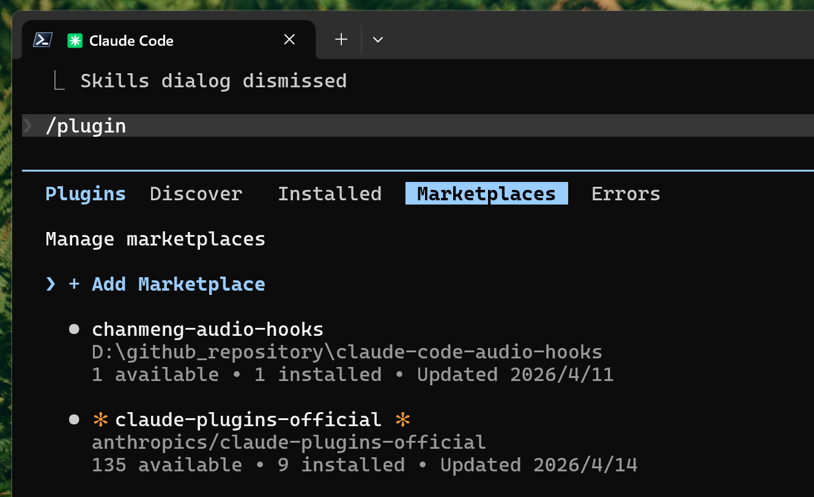
</p>

### Plugin Installed & Enabled

After install, the plugin appears in the Installed tab with all 26 hooks registered and the SKILL active.

<p align="center">
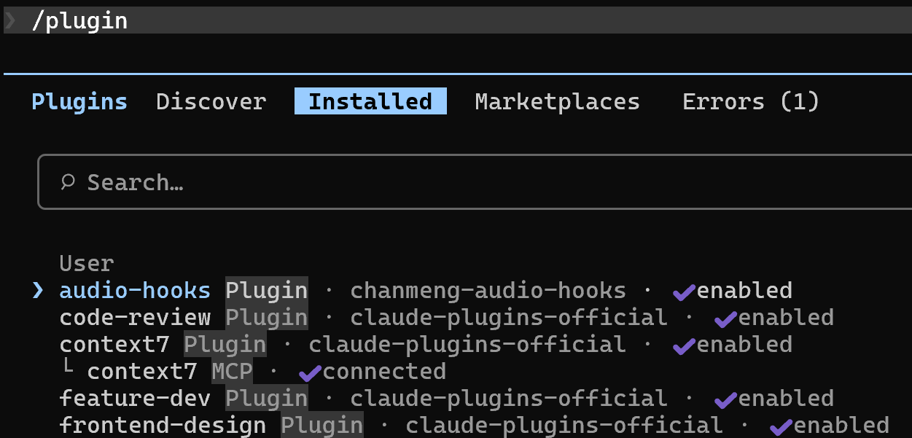
</p>

### `/audio-hooks` SKILL

The bundled SKILL lets Claude Code understand natural-language audio requests — no commands to memorise.

<p align="center">
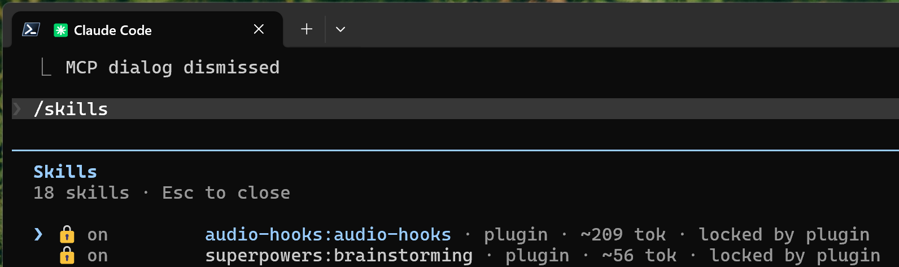
</p>

### Status Line with Context Monitor

Real-time context window and API quota bars — color-coded warnings before Claude enters the "agent dumb zone".

<p align="center">
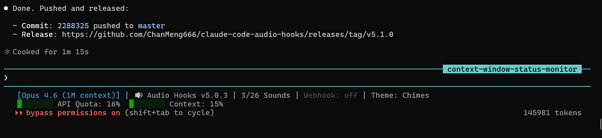
</p>

### Marketplace Registration

The project registers as a first-party marketplace source that Claude Code discovers automatically.

<p align="center">
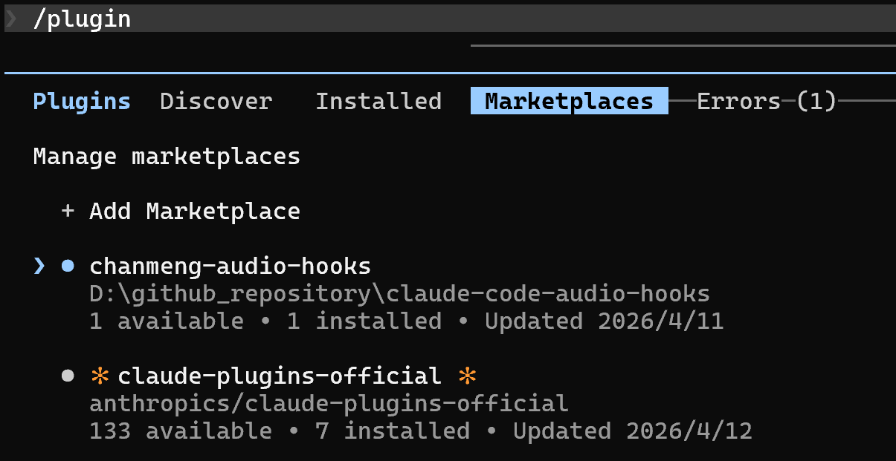
</p>

---

## 🤖 The AI-first way (talk to Claude Code, with one slash command at install time)

**For 99% of operations, you just talk to Claude Code in plain English** and the AI runs the right `audio-hooks` subcommand via its Bash tool. The exception is the one-time install: Claude Code's `/reload-plugins` command has no CLI equivalent (it's REPL-only), so the human types it exactly once after the plugin is installed. Everything else — install fetch, configure, snooze, theme switch, webhook setup, troubleshoot, uninstall — is pure natural language.

This is the project's defining selling point: **after the one `/reload-plugins`, you never type another command for the rest of the project's life on your machine.** You say *"snooze for an hour"*, *"switch to chimes"*, *"send notifications to my Slack"*, *"why is there no sound"* — and Claude Code translates each request into the right `audio-hooks` subcommand, runs it via its Bash tool, and reports the result. You never see a slash command unless you want to.

### How the install conversation works

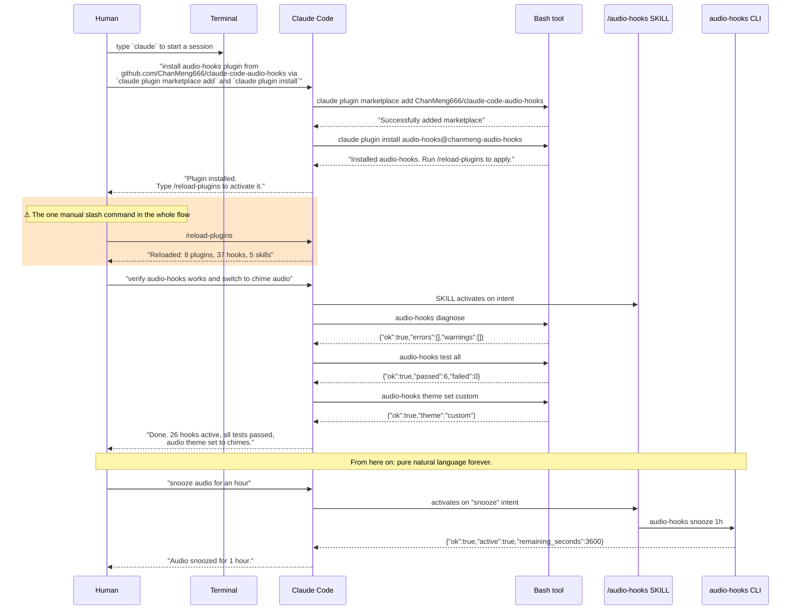

### Step 1 — open Claude Code

In any terminal (PowerShell, bash, zsh, Windows Terminal, iTerm2, anything):

```bash
claude
```

That's the only **shell** command you type in this whole guide.

### Step 2 — install with one prompt

Paste this into Claude Code:

> **Please install the audio-hooks plugin from `github.com/ChanMeng666/claude-code-audio-hooks`. Use the Bash tool to run `claude plugin marketplace add ChanMeng666/claude-code-audio-hooks` then `claude plugin install audio-hooks@chanmeng-audio-hooks`. After both commands complete, tell me to type `/reload-plugins` to activate the plugin.**

Claude Code will:

1. Run `claude plugin marketplace add ChanMeng666/claude-code-audio-hooks` via the Bash tool — fetches the marketplace.json from this GitHub repo
2. Run `claude plugin install audio-hooks@chanmeng-audio-hooks` via the Bash tool — clones the plugin source into `~/.claude/plugins/cache/`
3. Tell you to type `/reload-plugins`

You don't need to clone the repo manually. You don't need to know what a marketplace is. You don't need to run any other bash command. The AI handles both install steps via its Bash tool.

### Step 3 — type `/reload-plugins` (the one manual slash command)

```text
/reload-plugins
```

This is the **only** slash command you type in this entire guide. It exists because Claude Code's plugin loader needs an explicit reload signal to pick up newly installed plugins, and the loader has no CLI equivalent — only the interactive REPL command. Every other operation in this project is automated.

After reload, Claude Code reports something like *"Reloaded: 8 plugins, 37 hooks, 5 skills"* — the bump from ~25 hooks to 37 means the audio-hooks plugin's matcher-scoped handlers are now live.

### Step 4 — verify and configure with one prompt

Paste this:

> **Verify audio-hooks works by running `audio-hooks diagnose` and `audio-hooks test all`. Then switch to the chime audio theme.**

Claude Code will:

1. Run `audio-hooks diagnose` (returns JSON; Claude reads it)
2. Run `audio-hooks test all` (plays every enabled hook's audio)
3. Run `audio-hooks theme set custom`
4. Report back in plain English: *"Done. 26 hooks active, all tests passed, audio theme set to chimes."*

**Total user actions for the entire install + first config:** 1 shell command + 2 natural-language prompts + 1 slash command = **4 things**. Steps 2 and 4 are pure natural language; steps 1 and 3 are unavoidable because they're entry/reload primitives the AI literally has no tool to invoke.

### Step 2 — configure with one sentence

Once installed, you operate the project the same way. Pick the prompt that matches what you want:

| You want to... | Paste this into Claude Code |
|---|---|
| **Switch to chime audio** (non-voice) | *"Switch audio-hooks to the chime theme."* |
| **Switch to voice** (ElevenLabs Jessica) | *"Switch audio-hooks to the voice theme."* |
| **Be quiet for 30 minutes** | *"Snooze audio for 30 minutes."* |
| **Be quiet for the rest of the day** | *"Snooze audio for 8 hours."* |
| **Resume audio** | *"Unmute audio."* |
| **Only get critical alerts** (no chatty hooks) | *"Configure audio-hooks to only fire on stop, notification, and permission_request — disable everything else."* |
| **Send alerts to my Slack** | *"Send audio-hooks alerts to my Slack webhook at `https://hooks.slack.com/services/...` and run a test to make sure it works."* |
| **Send alerts to ntfy** | *"Configure audio-hooks to send alerts to `https://ntfy.sh/my-claude-channel` in ntfy format. Test it."* |
| **Speak Claude's actual reply when done** | *"Enable audio-hooks TTS and have it speak Claude's actual final message instead of a generic announcement."* |
| **Get a warning when I'm running low on quota** | *"Make sure audio-hooks rate-limit alerts are enabled with 80% and 95% thresholds for both 5-hour and 7-day windows."* |
| **Watch my .env file for changes** | *"Enable the audio-hooks file_changed hook and configure it to watch `.env` and `.envrc`."* |
| **Test that audio is working** | *"Test all my audio-hooks hooks and tell me if any failed."* |
| **Show me a status snapshot** | *"What's the current state of audio-hooks? Show me which hooks are enabled, the theme, and any recent errors."* |
| **Add a status line at the bottom** | *"Install the audio-hooks status line in my Claude Code settings."* |
| **Only show context usage in the status line** | *"Configure the status line to only show context usage."* |
| **Show context + API quota in the status line** | *"Show only context and API quota in the status line."* |
| **Show everything in the status line** | *"Reset the status line to show all segments."* |
| **Only play audio, no desktop notifications** | *"Switch audio-hooks to audio-only mode."* |
| **Enable focus flow breathing exercises** | *"Enable the audio-hooks focus flow with breathing exercises."* |

Each prompt is one message. Claude Code parses it, picks the right `audio-hooks` subcommand(s), runs them, and reports back. You don't memorise anything.

### Step 3 — troubleshoot with one sentence

If you ever stop hearing audio, paste this:

> **Audio-hooks isn't playing sounds. Run `audio-hooks diagnose` and `audio-hooks logs tail --level error --n 20`, then fix whatever it reports.**

Claude Code will run the diagnose command, parse the JSON errors (each one carries a `suggested_command` field), run the suggested fixes in order, and report what it fixed.

### Step 4 — uninstall with one sentence

> **Please uninstall audio-hooks completely.**

Claude Code runs `/plugin uninstall audio-hooks@chanmeng-audio-hooks`.

### Why this matters

Most CLI tools force the human to learn the tool. This project inverts the contract: **the tool is designed to be learned by Claude Code, not by humans.** The entire surface area is documented in `audio-hooks manifest` (one JSON document), the SKILL teaches Claude Code how to map natural language to that surface, and every error event includes a `suggested_command` Claude Code can execute autonomously. The human's job is to say what they want; Claude Code's job is to make it happen.

This is what "AI-first" means in practice: not "AI-assisted", not "AI-friendly", but **AI-operated**. The human is upstream of Claude Code, not downstream of the CLI.

**The honest scope:** the AI can run **every** `audio-hooks` subcommand and **every** `claude plugin` subcommand via its Bash tool. It cannot run interactive REPL commands like `/reload-plugins`, `/exit`, or `/clear` because Claude Code's slash-command parser only accepts user keystrokes, not tool calls. So the install flow includes exactly **one** manual slash command (`/reload-plugins` after install) and the install assumes Claude Code is already running (you typed `claude` to start it). Everything from Step 4 onwards — every configure / snooze / theme / webhook / TTS / rate-limit / diagnose / log-tail / uninstall operation — is pure natural language.

---

## Install the plugin (manual reference)

> ⚠ **You almost certainly don't need to read this section.** The natural-language prompts in [The AI-first way](#-the-ai-first-way-just-talk-to-claude-code) above already cover install, configure, troubleshoot, and uninstall. This section is for people who want to know what Claude Code is doing internally on their behalf, or who are operating the project from a script / CI.

<details>
<summary>Screenshot: plugin marketplace and installed views</summary>
<br>
<p align="center">

</p>
<p align="center">

</p>
</details>

The plugin install is two slash commands inside Claude Code:

```text
/plugin marketplace add ChanMeng666/claude-code-audio-hooks
/plugin install audio-hooks@chanmeng-audio-hooks
```

After install, reload plugins so the new hooks take effect:

```text
/reload-plugins
```

Verify and smoke-test:

```text
> run audio-hooks status
> run audio-hooks test all
```

**That's it.** All 26 hook events are registered, every audio file is bundled, and `${CLAUDE_PLUGIN_DATA}/user_preferences.json` is auto-initialised from the default template on first read.

You don't need to clone the repo manually — Claude Code's plugin system fetches the marketplace.json from `github.com/ChanMeng666/claude-code-audio-hooks` and clones the plugin source into its own plugin cache (`~/.claude/plugins/cache/audio-hooks-chanmeng-audio-hooks/`).

To uninstall:

```text
/plugin uninstall audio-hooks@chanmeng-audio-hooks
```

### Alternative: legacy script install

The pre-v5.0 install path still works for users who'd rather not use the plugin system, or for environments where the plugin system isn't available (CI, headless servers, scripted deployments):

```bash
git clone https://github.com/ChanMeng666/claude-code-audio-hooks.git
cd claude-code-audio-hooks
bash scripts/install-complete.sh    # auto non-interactive on non-TTY
```

Both paths share the same `hook_runner.py` and `audio-hooks` CLI. They are mutually exclusive — **don't enable both** or you'll hear double audio. `audio-hooks diagnose` reports `DUAL_INSTALL_DETECTED` if it finds both and tells you exactly how to fix it.

---

## How it works

### High-level architecture

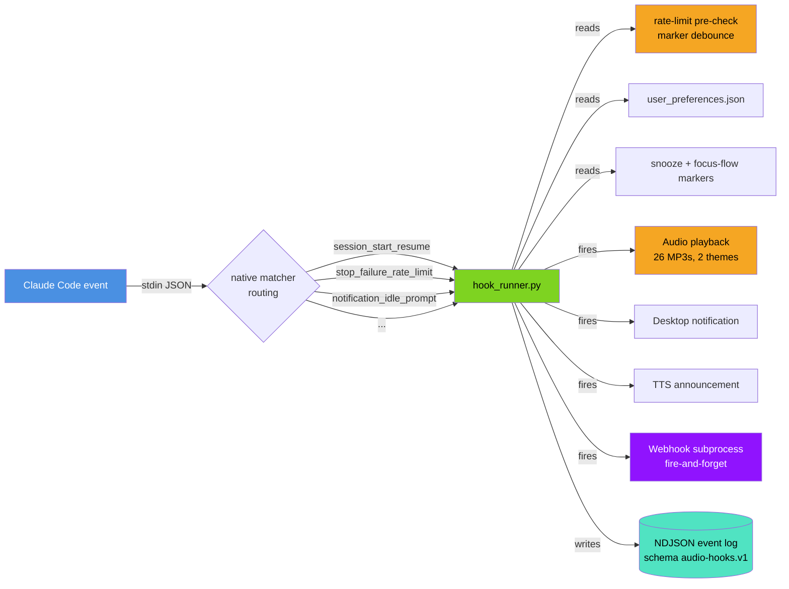

### AI control surface (the v5.0 keystone)

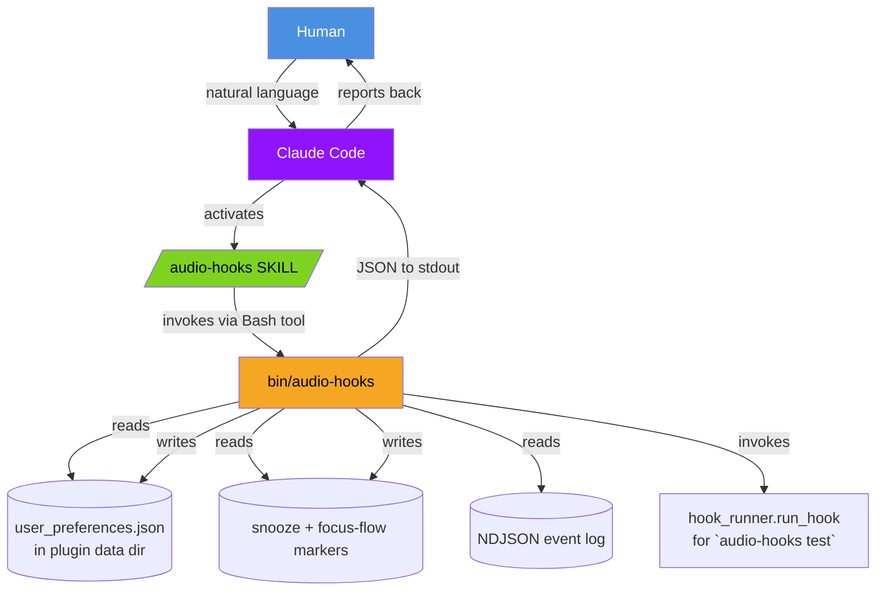

A user says *"snooze audio for 30 minutes"*. The `/audio-hooks` SKILL recognises the intent, Claude runs `audio-hooks snooze 30m` via its Bash tool, the binary writes the marker file, and Claude reports back the JSON result. Zero human-in-the-loop interactions.

### Hook lifecycle

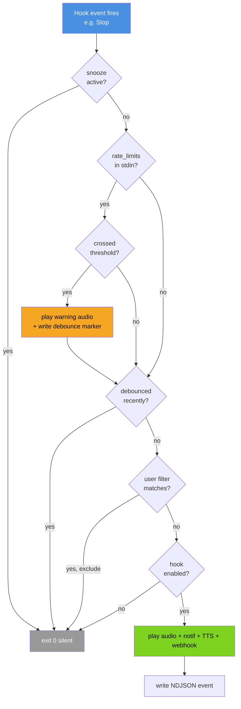

### Plugin layout (single monolith, one repo)

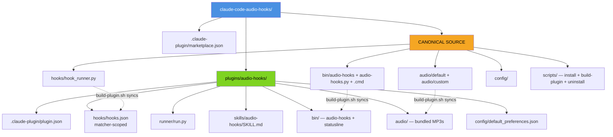

Single source of truth lives at the repo root. `scripts/build-plugin.sh` mirrors the canonical files into the plugin layout. The plugin install ships everything self-contained; the legacy script install reads from the canonical paths directly.

---

## The 26 hook events

| Hook | Default | Audio file | Native matchers |
|---|:-:|---|---|
| `notification` | ✓ | notification-urgent.mp3 | `permission_prompt` / `idle_prompt` / `auth_success` / `elicitation_dialog` |
| `stop` | ✓ | task-complete.mp3 | |
| `subagent_stop` | ✓ | subagent-complete.mp3 | agent type |
| `permission_request` | ✓ | permission-request.mp3 | tool name |
| **`permission_denied`** ⓥ | ✓ | permission-denied.mp3 | |
| **`task_created`** ⓥ | ✓ | task-created.mp3 | |
| `task_completed` | | team-task-done.mp3 | |
| `session_start` | | session-start.mp3 | `startup` / `resume` / `clear` / `compact` |
| `session_end` | | session-end.mp3 | `clear` / `resume` / `logout` / `prompt_input_exit` |
| `pretooluse` | | task-starting.mp3 | tool name |
| `posttooluse` | | task-progress.mp3 | tool name |
| `posttoolusefailure` | | tool-failed.mp3 | tool name |
| `userpromptsubmit` | | prompt-received.mp3 | |
| `subagent_start` | | subagent-start.mp3 | agent type |
| `precompact` / `postcompact` | | notification-info.mp3 / post-compact.mp3 | `manual` / `auto` |
| `stop_failure` | | stop-failure.mp3 | `rate_limit` / `authentication_failed` / `billing_error` / `invalid_request` / `server_error` / `max_output_tokens` / `unknown` |
| `teammate_idle` | | teammate-idle.mp3 | |
| `config_change` | | config-change.mp3 | |
| `instructions_loaded` | | instructions-loaded.mp3 | |
| `worktree_create` / `worktree_remove` | | worktree-create.mp3 / worktree-remove.mp3 | |
| `elicitation` / `elicitation_result` | | elicitation.mp3 / elicitation-result.mp3 | |
| **`cwd_changed`** ⓥ | | cwd-changed.mp3 | |
| **`file_changed`** ⓥ | | file-changed.mp3 | literal filenames |

ⓥ = new in v5.0. Run `audio-hooks hooks list` for the live state.

---

## The `audio-hooks` CLI

Single Python binary on your Bash tool's PATH. Default output is JSON. No prompts, no colors, no spinners.

| Subcommand | Purpose |
|---|---|
| `audio-hooks manifest` | **Canonical introspection.** Lists every subcommand, hook, config key, error code, env var. Read this first when in doubt. |
| `audio-hooks manifest --schema` | JSON Schema for `user_preferences.json` |
| `audio-hooks status` | Full state snapshot (theme, enabled hooks, snooze, focus flow, webhook, TTS, rate-limit alerts, install mode) |
| `audio-hooks version` | Version + script_install/plugin_install detection |
| `audio-hooks get <dotted.key>` | Read any config key |
| `audio-hooks set <dotted.key> <value>` | Write any config key (auto-coerces bool/int/JSON) |
| `audio-hooks hooks list` | All 26 hooks with current state |
| `audio-hooks hooks enable <name>` / `disable <name>` | Toggle a hook |
| `audio-hooks hooks enable-only <a> <b>` | Exclusive enable |
| `audio-hooks theme list` / `theme set <default\|custom>` | Audio theme |
| `audio-hooks snooze [duration]` / `snooze off` / `snooze status` | Mute hooks (default 30m). Forms: `30m`, `1h`, `90s`, `2d` |
| `audio-hooks webhook` / `webhook set --url --format` / `webhook clear` / `webhook test` | Webhook config + test |
| `audio-hooks tts set --enabled true --speak-assistant-message true` | TTS config |
| `audio-hooks rate-limits set --five-hour-thresholds 80,95` | Rate-limit alert thresholds |
| `audio-hooks test <hook\|all>` | Run a hook with synthetic stdin |
| `audio-hooks diagnose` | System check: settings.json, audio player, audio files, dual-install detection, errors, warnings |
| `audio-hooks logs tail [--n N] [--level error]` | Recent NDJSON events |
| `audio-hooks logs clear` | Truncate the event log |
| `audio-hooks install --plugin\|--scripts` | Install non-interactively |
| `audio-hooks uninstall --plugin\|--scripts [--keep-data]` | Uninstall non-interactively |
| `audio-hooks statusline show\|install\|uninstall` | Manage Claude Code status line registration |
| `audio-hooks update [--check]` | Show current version |

**Example session** (everything Claude Code might run on your behalf):

```bash
audio-hooks status                                # JSON snapshot
audio-hooks theme set custom                      # switch to chimes
audio-hooks snooze 1h                             # quiet for an hour
audio-hooks tts set --enabled true                # enable TTS
audio-hooks webhook set --url https://ntfy.sh/x --format ntfy
audio-hooks webhook test                          # POST a test payload
audio-hooks rate-limits set --five-hour-thresholds 75,90,98
audio-hooks test all                              # smoke-test every enabled hook
audio-hooks diagnose                              # full system check
audio-hooks logs tail --n 20 --level error
```

---

## Operating via natural language (the SKILL)

The plugin ships a `/audio-hooks` SKILL at `plugins/audio-hooks/skills/audio-hooks/SKILL.md`. It triggers on phrases like *"configure audio hooks"*, *"snooze audio"*, *"enable rate-limit alerts"*, *"test audio"*, *"why is there no sound"*, etc.

Inside Claude Code, just talk:

| You say | Claude runs |
|---|---|
| "snooze audio for 30 minutes" | `audio-hooks snooze 30m` |
| "shut up for an hour" | `audio-hooks snooze 1h` |
| "be quiet for the rest of the day" | `audio-hooks snooze 8h` |
| "unmute" / "resume audio" | `audio-hooks snooze off` |
| "switch to chime audio" | `audio-hooks theme set custom` |
| "switch back to voice" | `audio-hooks theme set default` |
| "stop the noisy tool execution audio" | `audio-hooks hooks disable pretooluse` + `audio-hooks hooks disable posttooluse` |
| "I only want stop and notification audio" | `audio-hooks hooks enable-only stop notification permission_request` |
| "watch .env files" | `audio-hooks hooks enable file_changed` + `audio-hooks set file_changed.watch '[".env",".envrc"]'` |
| "send notifications to my Slack" | `audio-hooks webhook set --url <slack-url> --format slack` then `webhook test` |
| "speak Claude's actual reply when done" | `audio-hooks tts set --enabled true --speak-assistant-message true` |
| "test that audio is working" | `audio-hooks test all` |
| "why is there no sound" | `audio-hooks diagnose` then runs the `suggested_command` from each error |
| "show me the recent errors" | `audio-hooks logs tail --level error --n 20` |
| "install the status line" | `audio-hooks statusline install` → tell user to restart Claude Code |
| "only show context in the status line" | `audio-hooks set statusline_settings.visible_segments '["context"]'` |
| "show context and API quota in the status line" | `audio-hooks set statusline_settings.visible_segments '["context","api_quota"]'` |
| "show everything in the status line" | `audio-hooks set statusline_settings.visible_segments '[]'` |
| "only play audio, no desktop popups" | `audio-hooks set notification_settings.mode audio_only` |
| "enable focus flow" | `audio-hooks set focus_flow.enabled true` |
| "uninstall audio hooks" | `/plugin uninstall audio-hooks@chanmeng-audio-hooks` |

The SKILL's golden rule is: **always run `audio-hooks manifest` first** if you're unsure what's available. The manifest is the live source of truth and never goes stale relative to the binary.

---

## Audio themes

Two bundled themes, both with 26 files:

| Theme | Style | Source |
|---|---|---|
| `default` | ElevenLabs **Jessica** voice (TTS) — short spoken phrases like *"Task completed"*, *"Permission denied"* | `audio/default/*.mp3` |
| `custom` | Modern UI sound effects (chimes, beeps, notifications) | `audio/custom/chime-*.mp3` |

Switch with `audio-hooks theme set <default|custom>`.

### Generate or regenerate audio via ElevenLabs

`scripts/generate-audio.py` is a non-interactive ElevenLabs generator. It reads `config/audio_manifest.json` (the single source of truth for every audio file's text prompt + voice + theme) and regenerates any subset:

```bash
# Generate every missing file (default behavior — skip files that exist)
ELEVENLABS_API_KEY=sk_... python scripts/generate-audio.py

# Force regenerate everything
ELEVENLABS_API_KEY=sk_... python scripts/generate-audio.py --force

# Only regenerate specific files
ELEVENLABS_API_KEY=sk_... python scripts/generate-audio.py --only permission-denied.mp3,task-created.mp3

# Dry run — show what would be generated without API calls
python scripts/generate-audio.py --dry-run
```

Output is NDJSON per file plus a final summary JSON. Stdlib-only (no third-party deps).

To **add a new audio file**: edit `config/audio_manifest.json`, add an entry with `filename` / `theme` / `type` (`voice` or `sound_effect`) / `text`, then run the generator. The generator creates the file; `bash scripts/build-plugin.sh` syncs it into the plugin layout.

---

## Integrations

### Webhooks (Slack, Discord, Teams, ntfy, raw)

Fan out hook events to any HTTP endpoint. Versioned `audio-hooks.webhook.v1` payload with every enriched stdin field surfaced as a top-level key.

```bash
audio-hooks webhook set --url https://hooks.slack.com/services/... --format slack
audio-hooks webhook set --url https://discord.com/api/webhooks/...  --format discord
audio-hooks webhook set --url https://ntfy.sh/my-channel            --format ntfy
audio-hooks webhook set --url https://webhook.site/your-id          --format raw
audio-hooks webhook test
```

The raw payload looks like:

```json
{
  "schema": "audio-hooks.webhook.v1",
  "version": "5.0.1",
  "hook_type": "stop",
  "context": "Task completed: All 47 tests passing.",
  "timestamp": 1775863220.41,
  "session_id": "...",
  "session_name": "feat-auth-refactor",
  "worktree": {"name": "feat-auth", "branch": "feat/auth"},
  "agent_type": "code-reviewer",
  "rate_limits": {"five_hour": {"used_percentage": 78, "resets_at": 1775888000}},
  "last_assistant_message": "All 47 tests passing.",
  "notification_type": null,
  "error_type": null,
  "source": null,
  "trigger": null,
  "load_reason": null,
  "permission_suggestions": null,
  "tool_name": null,
  "tool_input": null,
  "event_data": {"...full stdin minus transcript_path..."}
}
```

Webhook dispatch is fire-and-forget via subprocess so the parent hook process exits immediately even on slow webhooks. Failures land in NDJSON with `WEBHOOK_TIMEOUT` or `WEBHOOK_HTTP_ERROR` codes.

### Status line with context window monitor

Two-line bottom bar that shows the project state and real-time resource usage. Auto-refreshes every 60 seconds.


```text
[Opus] 🔊 Audio Hooks v5.0.3 | 6/26 Sounds | Webhook: ntfy | Theme: Voice
[MUTED 23m]  🌿 feat/audio-v5  ████░░░░ API Quota: 78%  █████░░░ Context: 65% ⚠️ /compact
```

**Context window monitoring** is the headline feature. When Claude Code's context usage exceeds 60–70%, agent performance noticeably degrades (the "agent dumb zone"). The status line shows a color-coded **Context** bar that tells you exactly when to act:

| Color | Range | What it means | What to do |
|---|---|---|---|
| 🟢 Green | < 50% | Safe — agent performs well | Nothing, keep working |
| 🟡 Yellow | 50–80% | Caution — entering the "dumb zone" | Type `/compact` or `/clear` |
| 🔴 Red | > 80% | Danger — agent makes frequent errors | Type `/compact` immediately |

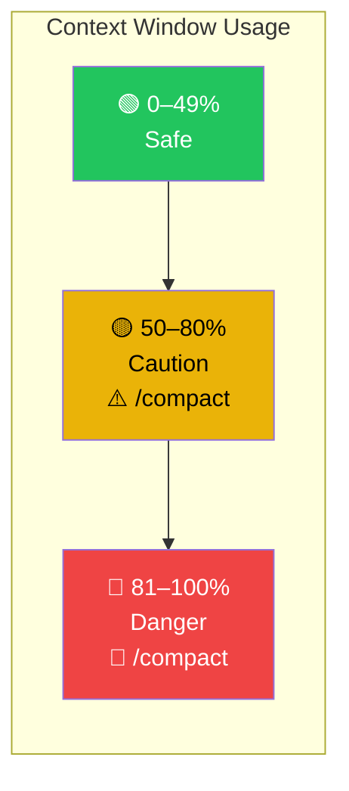

**10 customisable segments** — users can choose exactly which information appears:

| Line | Segment name | What it shows |
|---|---|---|
| Line 1 | `model` | Model name (e.g. `[Opus]`) |
| Line 1 | `version` | Audio Hooks version |
| Line 1 | `sounds` | Enabled sound count (e.g. `6/26 Sounds`) |
| Line 1 | `webhook` | Webhook status |
| Line 1 | `theme` | Audio theme (`Voice` or `Chimes`) |
| Line 2 | `snooze` | Mute countdown (only when active) |
| Line 2 | `focus` | Focus Flow mode (only when active) |
| Line 2 | `branch` | Git branch name |
| Line 2 | `api_quota` | API usage quota bar (5-hour window) |
| Line 2 | `context` | Context window usage bar with `/compact` hints |

Examples of what customised status lines look like:

```text
# Only context (minimal, focused on the most actionable metric):
█████░░░ Context: 65% ⚠️ /compact

# Context + API quota (two progress bars, nothing else):
██████░░ API Quota: 85%  █████░░░ Context: 65% ⚠️ /compact

# Model + branch + context:
[Opus]
🌿 main  █████░░░ Context: 65% ⚠️ /compact

# Everything (default):
[Opus] 🔊 Audio Hooks v5.0.3 | 6/26 Sounds | Webhook: off | Theme: Voice
🌿 main  ████░░░░ API Quota: 60%  █████░░░ Context: 65% ⚠️ /compact
```

```bash
audio-hooks statusline install     # register the status line (restart Claude Code after)
audio-hooks statusline show        # check registration state
audio-hooks statusline uninstall   # remove the status line

# Customise which segments to show:
audio-hooks set statusline_settings.visible_segments '["context"]'               # context only
audio-hooks set statusline_settings.visible_segments '["context","api_quota"]'   # two bars only
audio-hooks set statusline_settings.visible_segments '[]'                        # show all (default)
```

### Rate-limit alerts (v5.0)

The runner inspects every hook's stdin for `rate_limits.{five_hour,seven_day}.used_percentage` and plays a one-shot warning audio when crossing thresholds. Default thresholds are `[80, 95]`. Each `(window, threshold, resets_at)` tuple fires exactly once per reset window — you're warned at 80% and again at 95% but never spammed.

```bash
audio-hooks rate-limits set --enabled true
audio-hooks rate-limits set --five-hour-thresholds 75,90,98
audio-hooks rate-limits set --seven-day-thresholds 80,95
```

### TTS speak Claude's actual reply (v5.0)

Instead of speaking a static "Task completed" message, TTS the truncated `last_assistant_message` from the stop hook stdin:

```bash
audio-hooks tts set --enabled true
audio-hooks tts set --speak-assistant-message true
audio-hooks tts set --assistant-message-max-chars 200
```

Off by default — privacy-conscious. When enabled, Claude finishes a task and your speakers say *"All 47 tests passing"* instead of *"Task completed"*.

### Focus Flow (v4.7.0, still shipped)

Anti-distraction micro-task during Claude's thinking time: launches a guided breathing exercise, hydration reminder, custom URL, or shell command after `min_thinking_seconds`, then auto-closes when Claude finishes.

```bash
audio-hooks set focus_flow.enabled true
audio-hooks set focus_flow.mode breathing       # or hydration | url | command | disabled
audio-hooks set focus_flow.min_thinking_seconds 15
audio-hooks set focus_flow.breathing_pattern 4-7-8
```

---

## NDJSON event log

Every event is one JSON object per line at `${CLAUDE_PLUGIN_DATA}/logs/events.ndjson` (plugin install) or `<temp>/claude_audio_hooks_queue/logs/` (script install). Schema is versioned `audio-hooks.v1`.

```json
{"ts":"2026-04-11T10:23:45.123Z","schema":"audio-hooks.v1","level":"info","hook":"stop","session_id":"abc","action":"play_audio","audio_file":"chime-task-complete.mp3","duration_ms":42}
{"ts":"2026-04-11T10:24:01.402Z","schema":"audio-hooks.v1","level":"warn","hook":"stop","session_id":"abc","action":"rate_limit_alert","window":"five_hour","threshold":80,"used_percentage":85,"resets_at":1775888000,"audio_file":"notification-urgent.mp3"}
{"ts":"2026-04-11T10:24:01.453Z","schema":"audio-hooks.v1","level":"error","hook":"stop","session_id":"abc","action":"webhook_dispatch","error":{"code":"WEBHOOK_TIMEOUT","message":"timed out","hint":"Webhook request timed out.","suggested_command":"audio-hooks webhook test"}}
```

Levels: `debug`, `info`, `warn`, `error`. Log rotation: 5 MB cap, 3 files kept.

Read with:

```bash
audio-hooks logs tail --n 50              # last 50 events (any level)
audio-hooks logs tail --n 100 --level error
audio-hooks logs clear
```

---

## Stable error codes

Every error event in NDJSON carries one of these codes:

| Code | When | Suggested fix |
|---|---|---|
| `AUDIO_FILE_MISSING` | Configured audio file does not exist on disk | `audio-hooks diagnose` |
| `AUDIO_PLAYER_NOT_FOUND` | No audio player binary on this system | `audio-hooks diagnose` (then `apt install mpg123` on Linux) |
| `AUDIO_PLAY_FAILED` | Player exited with error | `audio-hooks test` |
| `INVALID_CONFIG` | `user_preferences.json` missing or malformed | `audio-hooks manifest --schema` |
| `CONFIG_READ_ERROR` | Could not read `user_preferences.json` | `audio-hooks status` |
| `WEBHOOK_HTTP_ERROR` | Webhook returned non-2xx | `audio-hooks webhook test` |
| `WEBHOOK_TIMEOUT` | Webhook request timed out | `audio-hooks webhook test` |
| `NOTIFICATION_FAILED` | Desktop notification dispatch failed | `audio-hooks diagnose` |
| `TTS_FAILED` | Text-to-speech engine failed or missing | `audio-hooks tts set --enabled false` |
| `SETTINGS_DISABLE_ALL_HOOKS` | `~/.claude/settings.json` has `disableAllHooks: true` | `audio-hooks diagnose` |
| `DUAL_INSTALL_DETECTED` | Both legacy script install and plugin install are active | `bash scripts/uninstall.sh --yes` |
| `PROJECT_DIR_NOT_FOUND` | Could not locate project directory | `audio-hooks status` |
| `SELF_UPDATE_FAILED` | Auto-sync from project directory failed | `audio-hooks update` |
| `UNKNOWN_HOOK_TYPE` | Hook runner invoked with unrecognised name | `audio-hooks hooks list` |
| `INTERNAL_ERROR` | Unexpected internal error | `audio-hooks logs tail` |

---

## Configuration reference

| Key | Type | Default | Effect |
|---|---|---|---|
| `audio_theme` | `default` \| `custom` | `default` | Voice recordings vs chimes |
| `enabled_hooks.<hook>` | bool | varies | Per-hook toggle |
| `playback_settings.debounce_ms` | int | 500 | Min ms between same hook firing |
| `notification_settings.mode` | `audio_only` \| `notification_only` \| `audio_and_notification` \| `disabled` | `audio_and_notification` | Output channel |
| `notification_settings.detail_level` | `minimal` \| `standard` \| `verbose` | `standard` | Notification text richness |
| `webhook_settings.enabled` | bool | `false` | Webhook fan-out |
| `webhook_settings.url` | string | `""` | Target URL |
| `webhook_settings.format` | `slack` \| `discord` \| `teams` \| `ntfy` \| `raw` | `raw` | Payload format |
| `webhook_settings.hook_types` | array | `["stop","notification",...]` | Which hooks fire the webhook |
| `tts_settings.enabled` | bool | `false` | TTS announcements |
| `tts_settings.speak_assistant_message` | bool | `false` | **v5.0:** TTS Claude's actual reply on stop |
| `tts_settings.assistant_message_max_chars` | int | 200 | Truncation cap |
| `rate_limit_alerts.enabled` | bool | `true` | **v5.0:** Watch stdin rate_limits |
| `rate_limit_alerts.five_hour_thresholds` | int[] | `[80, 95]` | 5h window thresholds |
| `rate_limit_alerts.seven_day_thresholds` | int[] | `[80, 95]` | 7d window thresholds |
| `focus_flow.enabled` / `mode` / `min_thinking_seconds` / `breathing_pattern` | mixed | off / `breathing` / 15 / `4-7-8` | Anti-distraction micro-task |
| `statusline_settings.visible_segments` | string[] | `[]` (all) | Which segments to show: `model`, `version`, `sounds`, `webhook`, `theme`, `snooze`, `focus`, `branch`, `api_quota`, `context`. Empty = all. |

Set any of these via `audio-hooks set <dotted.key> <value>`. The auto-coerce handles bool/int/JSON.

---

## Environment variables

| Variable | Purpose |
|---|---|
| `CLAUDE_PLUGIN_DATA` | Plugin install state directory (auto-set by Claude Code in hook fire context) |
| `CLAUDE_PLUGIN_ROOT` | Plugin install root (auto-set by Claude Code) |
| `CLAUDE_AUDIO_HOOKS_DATA` | Explicit override for state directory |
| `CLAUDE_AUDIO_HOOKS_PROJECT` | Explicit override for project root |
| `CLAUDE_HOOKS_DEBUG` | Set to `1` to write debug-level events to NDJSON log |
| `CLAUDE_NONINTERACTIVE` | Set to `1` to force scripts into non-interactive mode regardless of TTY detection |
| `ELEVENLABS_API_KEY` | Used by `scripts/generate-audio.py` (never logged, never written to disk) |

---

## Platform support

| Platform | Audio player | Status |
|---|---|---|
| **Windows (PowerShell / Git Bash / WSL2)** | PowerShell MediaPlayer | ✓ Fully supported |
| **macOS** | `afplay` | ✓ Fully supported |
| **Linux** | `mpg123` / `ffplay` / `paplay` / `aplay` (auto-detected) | ✓ Fully supported |

Python 3.6+ is the only runtime requirement. The `audio-hooks` binary handles Microsoft Store python3 stub detection automatically (skips broken stubs and falls back to `python` or `py`).

---

## Troubleshooting

`audio-hooks diagnose` is your first stop. It returns a JSON document listing the platform, audio player binary, the state of `~/.claude/settings.json` (including `disableAllHooks`), any audio files missing for the active theme, dual-install detection, and explicit error codes with `suggested_command` you can run next.

```bash
audio-hooks diagnose
audio-hooks logs tail --level error --n 20
```

**No sound at all?** Run `audio-hooks diagnose`, look for any error code, and run its `suggested_command`.

**Hearing two sounds?** You probably have both the legacy script install and the new plugin install active. Diagnose reports `DUAL_INSTALL_DETECTED`. Fix:

```bash
bash scripts/uninstall.sh --yes        # removes legacy script install, preserves config + audio
```

**Plugin won't install?** Run `claude plugin validate plugins/audio-hooks` from the project root — it'll surface manifest schema errors. v5.0.1 has been verified clean on Claude Code v2.1.101.

**Want pretooluse / posttooluse audio?** They're disabled by default because they fire on every tool execution including Read, Glob, Grep — very noisy. Enable explicitly:

```bash
audio-hooks hooks enable pretooluse
audio-hooks hooks enable posttooluse
```

---

## Uninstall

**Plugin install:**

```text
/plugin uninstall audio-hooks@chanmeng-audio-hooks
```

**Legacy script install:**

```bash
bash scripts/uninstall.sh --yes              # preserve config + audio
bash scripts/uninstall.sh --yes --purge      # remove everything
```

The uninstall scripts auto-engage non-interactive mode when stdin is not a TTY, so AI agents and CI can run them without prompts.

---

## For developers

### Repository layout

```
claude-code-audio-hooks/
├── .claude-plugin/
│   └── marketplace.json              # marketplace catalog
├── plugins/
│   └── audio-hooks/                  # plugin layout (populated by build-plugin.sh)
│       ├── .claude-plugin/plugin.json
│       ├── hooks/hooks.json          # matcher-scoped hook registration
│       ├── runner/run.py             # plugin entry point
│       ├── skills/audio-hooks/SKILL.md
│       ├── bin/                      # audio-hooks + statusline
│       ├── audio/                    # 26 default + 26 custom
│       └── config/default_preferences.json
├── hooks/hook_runner.py              # CANONICAL: source of truth
├── bin/                              # CANONICAL: source of truth
│   ├── audio-hooks                   # bash wrapper (portable)
│   ├── audio-hooks.py                # Python entry
│   ├── audio-hooks.cmd               # Windows shim
│   ├── audio-hooks-statusline        # bash wrapper
│   ├── audio-hooks-statusline.py     # Python entry
│   └── audio-hooks-statusline.cmd
├── audio/                            # CANONICAL: 26 default + 26 custom
├── config/
│   ├── default_preferences.json
│   ├── user_preferences.schema.json
│   └── audio_manifest.json           # ElevenLabs generation manifest
├── scripts/
│   ├── install-complete.sh           # legacy install (auto non-interactive on non-TTY)
│   ├── install-windows.ps1
│   ├── quick-setup.sh                # lite tier
│   ├── snooze.sh                     # legacy snooze (audio-hooks snooze is preferred)
│   ├── uninstall.sh                  # auto non-interactive
│   ├── build-plugin.sh               # syncs canonical → plugin layout
│   ├── generate-audio.py             # ElevenLabs audio generator
│   ├── configure.sh                  # human-only menu (auto-redirects to audio-hooks)
│   ├── test-audio.sh                 # human-only menu
│   └── diagnose.py                   # legacy (audio-hooks diagnose is preferred)
├── CLAUDE.md                         # canonical AI doc
├── README.md                         # this file
└── CHANGELOG.md
```

### Workflow when editing canonical files

1. Edit any file under `/hooks/`, `/bin/`, `/audio/`, or `/config/`.
2. Run `bash scripts/build-plugin.sh` to mirror into the plugin layout.
3. CI verifies in-sync via `bash scripts/build-plugin.sh --check`.
4. Commit + push.

### Adding a new audio file

1. Add an entry to `config/audio_manifest.json` with `filename`, `theme`, `type` (`voice` or `sound_effect`), and `text` prompt.
2. Run `ELEVENLABS_API_KEY=... python scripts/generate-audio.py`.
3. Run `bash scripts/build-plugin.sh`.
4. Commit the new MP3 + manifest entry.

### Validating the plugin

```bash
claude plugin validate plugins/audio-hooks
```

---

## Documentation

| Document | Purpose |
|---|---|
| [**CLAUDE.md**](CLAUDE.md) | **Canonical AI doc.** Read this first if you're an AI agent operating the project. |
| [**CHANGELOG.md**](CHANGELOG.md) | Detailed version history including the v5.0/v5.0.1 entries |
| [**docs/ARCHITECTURE.md**](docs/ARCHITECTURE.md) | System architecture details |
| `audio-hooks manifest` | Live source of truth for every subcommand, hook, config key, error code, and env var. Always up to date. |

When in doubt, **run `audio-hooks manifest`** instead of reading docs. The manifest is the live, authoritative description of every project surface and never goes stale relative to the running version.

---

## Design philosophy

This project is **AI-operated**, not AI-assisted. The contract is inverted from a typical CLI tool:

> A typical CLI: the human learns the tool, types commands, reads logs.
> **claude-code-audio-hooks**: the human says what they want, Claude Code learns the tool and does the work.

The human is **upstream** of Claude Code. The CLI surface, the SKILL, the NDJSON logs, the stable error codes — none of it is designed for a human to read. It's all designed for Claude Code to read, operate, and report back to the human in plain English. The human's only job is to be specific about what they want.

**Concrete constraints that follow:**

1. **No interactive CLI prompts.** Every script auto-engages non-interactive mode on non-TTY or when `CLAUDE_NONINTERACTIVE=1` is set. If Claude Code can't be confronted with a `[y/N]`, neither can the human via Claude Code.
2. **No human-readable error logs.** All logs are NDJSON (`audio-hooks.v1` schema) with stable `code` enums and machine-actionable `hint` + `suggested_command` fields. Claude Code parses them; the human gets a one-sentence summary.
3. **No GUI consoles.** A GUI would force a human into the loop.
4. **No 2FA / CAPTCHA gates** anywhere in the install or operate path. They break automation.
5. **Every config knob is settable in one shot** via `audio-hooks set` or a typed setter. Claude Code can configure anything in a single Bash tool call.
6. **Every state read returns a single JSON document** in <100ms. Claude Code can introspect the entire project surface in one round-trip.
7. **`audio-hooks manifest` is the canonical introspection target.** Claude Code reads it once and knows every subcommand, every config key, every hook, every audio file, every error code, every env var. The SKILL's golden rule is: *if you're unsure of the project's current state, run `audio-hooks manifest` first*.
8. **The `/audio-hooks` SKILL bridges natural language to the CLI.** Trigger phrases like *"snooze audio"*, *"why is there no sound"*, *"send notifications to Slack"* activate the SKILL, which loads a structured prose-and-table guide telling Claude Code exactly which subcommand to run for any user request.
9. **Single monolith, one repo, one codebase.** No microservices, no multi-repo. The plugin lives inside the same repo as a subdirectory. Claude Code can understand the entire project end-to-end in a single context window.

The natural-language operating model: a human says *"install audio hooks for me"* or *"snooze audio for an hour"* or *"figure out why I'm not hearing anything"* — and Claude Code runs the right sequence of `audio-hooks` and `claude plugin` subcommands via its Bash tool. The human never opens a config file, never reads a log, never picks a menu option. **The human types one slash command in their lifetime with this project** (`/reload-plugins`, once, at install time, because Claude Code's plugin loader has no CLI equivalent for reload). Every other operation, forever after, is natural language.

---

## Contributing

Pull requests welcome. Before submitting:

1. Fork and clone.
2. Make your changes to canonical files (`/hooks/`, `/bin/`, `/audio/`, `/config/`).
3. Run `bash scripts/build-plugin.sh` to sync the plugin layout.
4. Run `bash scripts/build-plugin.sh --check` to verify in-sync.
5. Run `claude plugin validate plugins/audio-hooks` to verify the manifest.
6. Test end-to-end: `python bin/audio-hooks.py test all` or install the plugin locally and run a real Claude Code session.
7. Submit the PR with a conventional commit message.

For audio additions, see [Adding a new audio file](#adding-a-new-audio-file).

---

## License

MIT — see [LICENSE](LICENSE).

## Author

**Chan Meng** — [github.com/ChanMeng666](https://github.com/ChanMeng666)

---

*This README is the public face of claude-code-audio-hooks. For the canonical AI-facing operating guide, see [CLAUDE.md](CLAUDE.md). For the live machine description of every subcommand and config key, run `audio-hooks manifest`.*
