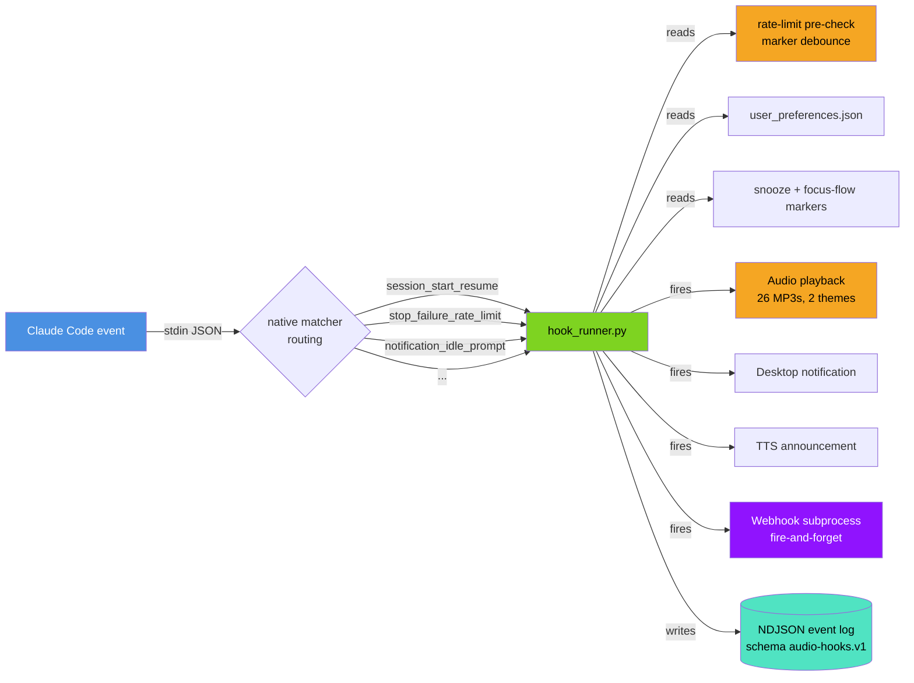
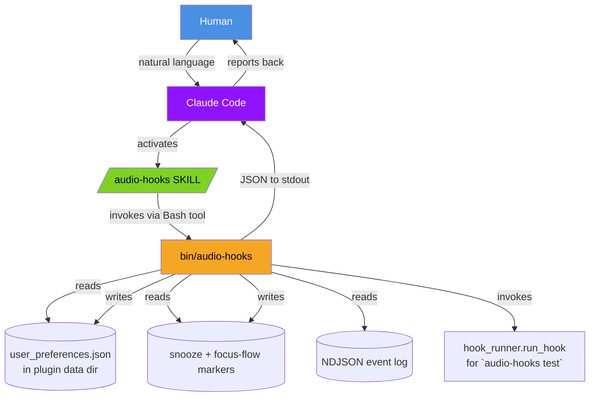
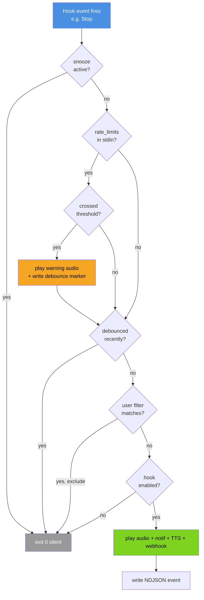
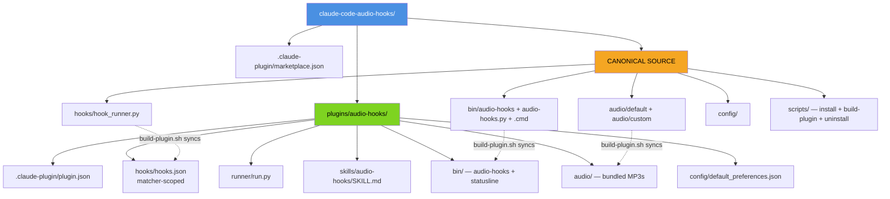

[](#)

# Claude Code Audio Hooks

> **AI-operated audio notification system for Claude Code.** 26 hook events, plugin-native distribution, single JSON CLI, structured NDJSON logs, rate-limit alerts, ElevenLabs voice + chime themes. Claude Code is the operator — humans never touch a config file.

[](https://opensource.org/licenses/MIT)
[](https://github.com/ChanMeng666/claude-code-audio-hooks)
[](https://github.com/ChanMeng666/claude-code-audio-hooks)
[](https://claude.ai/download)
[](#install-the-plugin)

---

## Promotional Video

https://github.com/user-attachments/assets/3504d214-efac-4e01-84c0-426430b842d6

> Built entirely with code using Remotion, Claude Code, ElevenLabs & Suno.
> Source: [claude-code-audio-hooks-promo-video](https://github.com/ChanMeng666/claude-code-audio-hooks-promo-video)

---

## What's new in v5.0

v5.0 is an **AI-first redesign**. Every project surface is now machine-operable end-to-end so Claude Code can install, configure, snooze, troubleshoot, and upgrade the project on a human's behalf without any clicks, prompts, or doc reading.

| Highlight | Effect |
|---|---|
| **`audio-hooks` JSON CLI** | Single binary with 27 subcommands. Default invocation returns the canonical machine manifest. No prompts, no colors, no spinners — JSON to stdout, errors with stable codes + suggested commands. |
| **`/audio-hooks` SKILL** | Natural-language activation: "snooze audio for an hour" → Claude runs `audio-hooks snooze 1h` for you. |
| **NDJSON structured logging** | One JSON object per line at `${CLAUDE_PLUGIN_DATA}/logs/events.ndjson`, schema `audio-hooks.v1`. Stable error code enums with `hint` and `suggested_command`. |
| **Plugin-native install** | `/plugin marketplace add ChanMeng666/claude-code-audio-hooks` → `/plugin install audio-hooks@chanmeng-audio-hooks`. Two slash commands and you're done. |
| **4 new hook events** | `PermissionDenied`, `CwdChanged`, `FileChanged`, `TaskCreated` → 26 total. |
| **Native matcher routing** | `hooks/hooks.json` registers per-matcher handlers. Each variant gets its own audio. |
| **Rate-limit alerts** | Watches stdin `rate_limits` and plays a one-shot warning at 80%/95% of your 5h or 7d quota. Marker-debounced per `(window, threshold, resets_at)`. |
| **TTS speak Claude's reply** | `audio-hooks tts set --speak-assistant-message true` — instead of "Task completed", TTS speaks Claude's actual final message. |
| **Status line** | Two-line bottom bar with snooze indicator, worktree branch, and color-coded rate-limit progress bar. Auto-refreshes every 60s. |
| **ElevenLabs audio generator** | `scripts/generate-audio.py` reads `config/audio_manifest.json` and regenerates any audio file via the ElevenLabs API. Future audio additions are a one-line manifest edit + one-command rebuild. |

See [`CHANGELOG.md`](CHANGELOG.md) for the full v5.0 / v5.0.1 entries.

---

## Install the plugin

This is the **recommended path**. Inside Claude Code, run two slash commands:

```text
/plugin marketplace add ChanMeng666/claude-code-audio-hooks
/plugin install audio-hooks@chanmeng-audio-hooks
```

Then verify and smoke-test:

```text
> run audio-hooks status
> run audio-hooks test all
```

**That's it.** All 26 hook events are registered, every audio file is bundled, and `${CLAUDE_PLUGIN_DATA}/user_preferences.json` is auto-initialised from the default template on first read.

To switch the audio theme:

```text
> switch audio to chimes      # the SKILL activates and runs `audio-hooks theme set custom`
```

To snooze for an hour:

```text
> snooze audio for 1 hour     # the SKILL runs `audio-hooks snooze 1h`
```

To uninstall:

```text
/plugin uninstall audio-hooks@chanmeng-audio-hooks
```

### Alternative: legacy script install

The pre-v5.0 install path still works for users who'd rather not use the plugin system:

```bash
git clone https://github.com/ChanMeng666/claude-code-audio-hooks.git
cd claude-code-audio-hooks
bash scripts/install-complete.sh    # auto non-interactive on non-TTY
```

Both paths share the same `hook_runner.py` and `audio-hooks` CLI. They are mutually exclusive — **don't enable both** or you'll hear double audio. `audio-hooks diagnose` reports `DUAL_INSTALL_DETECTED` if it finds both and tells you exactly how to fix it.

---

## How it works

### High-level architecture



### AI control surface (the v5.0 keystone)



A user says *"snooze audio for 30 minutes"*. The `/audio-hooks` SKILL recognises the intent, Claude runs `audio-hooks snooze 30m` via its Bash tool, the binary writes the marker file, and Claude reports back the JSON result. Zero human-in-the-loop interactions.

### Hook lifecycle



### Plugin layout (single monolith, one repo)



Single source of truth lives at the repo root. `scripts/build-plugin.sh` mirrors the canonical files into the plugin layout. The plugin install ships everything self-contained; the legacy script install reads from the canonical paths directly.

---

## The 26 hook events

| Hook | Default | Audio file | Native matchers |
|---|:-:|---|---|
| `notification` | ✓ | notification-urgent.mp3 | `permission_prompt` / `idle_prompt` / `auth_success` / `elicitation_dialog` |
| `stop` | ✓ | task-complete.mp3 | |
| `subagent_stop` | ✓ | subagent-complete.mp3 | agent type |
| `permission_request` | ✓ | permission-request.mp3 | tool name |
| **`permission_denied`** ⓥ | ✓ | permission-denied.mp3 | |
| **`task_created`** ⓥ | ✓ | task-created.mp3 | |
| `task_completed` | | team-task-done.mp3 | |
| `session_start` | | session-start.mp3 | `startup` / `resume` / `clear` / `compact` |
| `session_end` | | session-end.mp3 | `clear` / `resume` / `logout` / `prompt_input_exit` |
| `pretooluse` | | task-starting.mp3 | tool name |
| `posttooluse` | | task-progress.mp3 | tool name |
| `posttoolusefailure` | | tool-failed.mp3 | tool name |
| `userpromptsubmit` | | prompt-received.mp3 | |
| `subagent_start` | | subagent-start.mp3 | agent type |
| `precompact` / `postcompact` | | notification-info.mp3 / post-compact.mp3 | `manual` / `auto` |
| `stop_failure` | | stop-failure.mp3 | `rate_limit` / `authentication_failed` / `billing_error` / `invalid_request` / `server_error` / `max_output_tokens` / `unknown` |
| `teammate_idle` | | teammate-idle.mp3 | |
| `config_change` | | config-change.mp3 | |
| `instructions_loaded` | | instructions-loaded.mp3 | |
| `worktree_create` / `worktree_remove` | | worktree-create.mp3 / worktree-remove.mp3 | |
| `elicitation` / `elicitation_result` | | elicitation.mp3 / elicitation-result.mp3 | |
| **`cwd_changed`** ⓥ | | cwd-changed.mp3 | |
| **`file_changed`** ⓥ | | file-changed.mp3 | literal filenames |

ⓥ = new in v5.0. Run `audio-hooks hooks list` for the live state.

---

## The `audio-hooks` CLI

Single Python binary on your Bash tool's PATH. Default output is JSON. No prompts, no colors, no spinners.

| Subcommand | Purpose |
|---|---|
| `audio-hooks manifest` | **Canonical introspection.** Lists every subcommand, hook, config key, error code, env var. Read this first when in doubt. |
| `audio-hooks manifest --schema` | JSON Schema for `user_preferences.json` |
| `audio-hooks status` | Full state snapshot (theme, enabled hooks, snooze, focus flow, webhook, TTS, rate-limit alerts, install mode) |
| `audio-hooks version` | Version + script_install/plugin_install detection |
| `audio-hooks get <dotted.key>` | Read any config key |
| `audio-hooks set <dotted.key> <value>` | Write any config key (auto-coerces bool/int/JSON) |
| `audio-hooks hooks list` | All 26 hooks with current state |
| `audio-hooks hooks enable <name>` / `disable <name>` | Toggle a hook |
| `audio-hooks hooks enable-only <a> <b>` | Exclusive enable |
| `audio-hooks theme list` / `theme set <default\|custom>` | Audio theme |
| `audio-hooks snooze [duration]` / `snooze off` / `snooze status` | Mute hooks (default 30m). Forms: `30m`, `1h`, `90s`, `2d` |
| `audio-hooks webhook` / `webhook set --url --format` / `webhook clear` / `webhook test` | Webhook config + test |
| `audio-hooks tts set --enabled true --speak-assistant-message true` | TTS config |
| `audio-hooks rate-limits set --five-hour-thresholds 80,95` | Rate-limit alert thresholds |
| `audio-hooks test <hook\|all>` | Run a hook with synthetic stdin |
| `audio-hooks diagnose` | System check: settings.json, audio player, audio files, dual-install detection, errors, warnings |
| `audio-hooks logs tail [--n N] [--level error]` | Recent NDJSON events |
| `audio-hooks logs clear` | Truncate the event log |
| `audio-hooks install --plugin\|--scripts` | Install non-interactively |
| `audio-hooks uninstall --plugin\|--scripts [--keep-data]` | Uninstall non-interactively |
| `audio-hooks statusline show\|install\|uninstall` | Manage Claude Code status line registration |
| `audio-hooks update [--check]` | Show current version |

**Example session** (everything Claude Code might run on your behalf):

```bash
audio-hooks status                                # JSON snapshot
audio-hooks theme set custom                      # switch to chimes
audio-hooks snooze 1h                             # quiet for an hour
audio-hooks tts set --enabled true                # enable TTS
audio-hooks webhook set --url https://ntfy.sh/x --format ntfy
audio-hooks webhook test                          # POST a test payload
audio-hooks rate-limits set --five-hour-thresholds 75,90,98
audio-hooks test all                              # smoke-test every enabled hook
audio-hooks diagnose                              # full system check
audio-hooks logs tail --n 20 --level error
```

---

## Operating via natural language (the SKILL)

The plugin ships a `/audio-hooks` SKILL at `plugins/audio-hooks/skills/audio-hooks/SKILL.md`. It triggers on phrases like *"configure audio hooks"*, *"snooze audio"*, *"enable rate-limit alerts"*, *"test audio"*, *"why is there no sound"*, etc.

Inside Claude Code, just talk:

| You say | Claude runs |
|---|---|
| "snooze audio for 30 minutes" | `audio-hooks snooze 30m` |
| "shut up for an hour" | `audio-hooks snooze 1h` |
| "be quiet for the rest of the day" | `audio-hooks snooze 8h` |
| "unmute" / "resume audio" | `audio-hooks snooze off` |
| "switch to chime audio" | `audio-hooks theme set custom` |
| "switch back to voice" | `audio-hooks theme set default` |
| "stop the noisy tool execution audio" | `audio-hooks hooks disable pretooluse` + `audio-hooks hooks disable posttooluse` |
| "I only want stop and notification audio" | `audio-hooks hooks enable-only stop notification permission_request` |
| "watch .env files" | `audio-hooks hooks enable file_changed` + `audio-hooks set file_changed.watch '[".env",".envrc"]'` |
| "send notifications to my Slack" | `audio-hooks webhook set --url <slack-url> --format slack` then `webhook test` |
| "speak Claude's actual reply when done" | `audio-hooks tts set --enabled true --speak-assistant-message true` |
| "test that audio is working" | `audio-hooks test all` |
| "why is there no sound" | `audio-hooks diagnose` then runs the `suggested_command` from each error |
| "show me the recent errors" | `audio-hooks logs tail --level error --n 20` |

The SKILL's golden rule is: **always run `audio-hooks manifest` first** if you're unsure what's available. The manifest is the live source of truth and never goes stale relative to the binary.

---

## Audio themes

Two bundled themes, both with 26 files:

| Theme | Style | Source |
|---|---|---|
| `default` | ElevenLabs **Jessica** voice (TTS) — short spoken phrases like *"Task completed"*, *"Permission denied"* | `audio/default/*.mp3` |
| `custom` | Modern UI sound effects (chimes, beeps, notifications) | `audio/custom/chime-*.mp3` |

Switch with `audio-hooks theme set <default|custom>`.

### Generate or regenerate audio via ElevenLabs

`scripts/generate-audio.py` is a non-interactive ElevenLabs generator. It reads `config/audio_manifest.json` (the single source of truth for every audio file's text prompt + voice + theme) and regenerates any subset:

```bash
# Generate every missing file (default behavior — skip files that exist)
ELEVENLABS_API_KEY=sk_... python scripts/generate-audio.py

# Force regenerate everything
ELEVENLABS_API_KEY=sk_... python scripts/generate-audio.py --force

# Only regenerate specific files
ELEVENLABS_API_KEY=sk_... python scripts/generate-audio.py --only permission-denied.mp3,task-created.mp3

# Dry run — show what would be generated without API calls
python scripts/generate-audio.py --dry-run
```

Output is NDJSON per file plus a final summary JSON. Stdlib-only (no third-party deps).

To **add a new audio file**: edit `config/audio_manifest.json`, add an entry with `filename` / `theme` / `type` (`voice` or `sound_effect`) / `text`, then run the generator. The generator creates the file; `bash scripts/build-plugin.sh` syncs it into the plugin layout.

---

## Integrations

### Webhooks (Slack, Discord, Teams, ntfy, raw)

Fan out hook events to any HTTP endpoint. Versioned `audio-hooks.webhook.v1` payload with every enriched stdin field surfaced as a top-level key.

```bash
audio-hooks webhook set --url https://hooks.slack.com/services/... --format slack
audio-hooks webhook set --url https://discord.com/api/webhooks/...  --format discord
audio-hooks webhook set --url https://ntfy.sh/my-channel            --format ntfy
audio-hooks webhook set --url https://webhook.site/your-id          --format raw
audio-hooks webhook test
```

The raw payload looks like:

```json
{
  "schema": "audio-hooks.webhook.v1",
  "version": "5.0.1",
  "hook_type": "stop",
  "context": "Task completed: All 47 tests passing.",
  "timestamp": 1775863220.41,
  "session_id": "...",
  "session_name": "feat-auth-refactor",
  "worktree": {"name": "feat-auth", "branch": "feat/auth"},
  "agent_type": "code-reviewer",
  "rate_limits": {"five_hour": {"used_percentage": 78, "resets_at": 1775888000}},
  "last_assistant_message": "All 47 tests passing.",
  "notification_type": null,
  "error_type": null,
  "source": null,
  "trigger": null,
  "load_reason": null,
  "permission_suggestions": null,
  "tool_name": null,
  "tool_input": null,
  "event_data": {"...full stdin minus transcript_path..."}
}
```

Webhook dispatch is fire-and-forget via subprocess so the parent hook process exits immediately even on slow webhooks. Failures land in NDJSON with `WEBHOOK_TIMEOUT` or `WEBHOOK_HTTP_ERROR` codes.

### Status line

Two-line bottom bar with snooze indicator, worktree branch, and color-coded rate-limit progress bar. Auto-refreshes every 60 seconds.

```text
[Opus] 🔊 audio-hooks v5.0.1 | 6/26 hooks | webhook: ntfy | theme: custom
[SNOOZED 23m]  🌿 feat/audio-v5  ████████░░ 5h: 78%
```

```bash
audio-hooks statusline install     # writes the statusLine field in ~/.claude/settings.json
audio-hooks statusline show        # current state
audio-hooks statusline uninstall   # removes the field
```

### Rate-limit alerts (v5.0)

The runner inspects every hook's stdin for `rate_limits.{five_hour,seven_day}.used_percentage` and plays a one-shot warning audio when crossing thresholds. Default thresholds are `[80, 95]`. Each `(window, threshold, resets_at)` tuple fires exactly once per reset window — you're warned at 80% and again at 95% but never spammed.

```bash
audio-hooks rate-limits set --enabled true
audio-hooks rate-limits set --five-hour-thresholds 75,90,98
audio-hooks rate-limits set --seven-day-thresholds 80,95
```

### TTS speak Claude's actual reply (v5.0)

Instead of speaking a static "Task completed" message, TTS the truncated `last_assistant_message` from the stop hook stdin:

```bash
audio-hooks tts set --enabled true
audio-hooks tts set --speak-assistant-message true
audio-hooks tts set --assistant-message-max-chars 200
```

Off by default — privacy-conscious. When enabled, Claude finishes a task and your speakers say *"All 47 tests passing"* instead of *"Task completed"*.

### Focus Flow (v4.7.0, still shipped)

Anti-distraction micro-task during Claude's thinking time: launches a guided breathing exercise, hydration reminder, custom URL, or shell command after `min_thinking_seconds`, then auto-closes when Claude finishes.

```bash
audio-hooks set focus_flow.enabled true
audio-hooks set focus_flow.mode breathing       # or hydration | url | command | disabled
audio-hooks set focus_flow.min_thinking_seconds 15
audio-hooks set focus_flow.breathing_pattern 4-7-8
```

---

## NDJSON event log

Every event is one JSON object per line at `${CLAUDE_PLUGIN_DATA}/logs/events.ndjson` (plugin install) or `<temp>/claude_audio_hooks_queue/logs/` (script install). Schema is versioned `audio-hooks.v1`.

```json
{"ts":"2026-04-11T10:23:45.123Z","schema":"audio-hooks.v1","level":"info","hook":"stop","session_id":"abc","action":"play_audio","audio_file":"chime-task-complete.mp3","duration_ms":42}
{"ts":"2026-04-11T10:24:01.402Z","schema":"audio-hooks.v1","level":"warn","hook":"stop","session_id":"abc","action":"rate_limit_alert","window":"five_hour","threshold":80,"used_percentage":85,"resets_at":1775888000,"audio_file":"notification-urgent.mp3"}
{"ts":"2026-04-11T10:24:01.453Z","schema":"audio-hooks.v1","level":"error","hook":"stop","session_id":"abc","action":"webhook_dispatch","error":{"code":"WEBHOOK_TIMEOUT","message":"timed out","hint":"Webhook request timed out.","suggested_command":"audio-hooks webhook test"}}
```

Levels: `debug`, `info`, `warn`, `error`. Log rotation: 5 MB cap, 3 files kept.

Read with:

```bash
audio-hooks logs tail --n 50              # last 50 events (any level)
audio-hooks logs tail --n 100 --level error
audio-hooks logs clear
```

---

## Stable error codes

Every error event in NDJSON carries one of these codes:

| Code | When | Suggested fix |
|---|---|---|
| `AUDIO_FILE_MISSING` | Configured audio file does not exist on disk | `audio-hooks diagnose` |
| `AUDIO_PLAYER_NOT_FOUND` | No audio player binary on this system | `audio-hooks diagnose` (then `apt install mpg123` on Linux) |
| `AUDIO_PLAY_FAILED` | Player exited with error | `audio-hooks test` |
| `INVALID_CONFIG` | `user_preferences.json` missing or malformed | `audio-hooks manifest --schema` |
| `CONFIG_READ_ERROR` | Could not read `user_preferences.json` | `audio-hooks status` |
| `WEBHOOK_HTTP_ERROR` | Webhook returned non-2xx | `audio-hooks webhook test` |
| `WEBHOOK_TIMEOUT` | Webhook request timed out | `audio-hooks webhook test` |
| `NOTIFICATION_FAILED` | Desktop notification dispatch failed | `audio-hooks diagnose` |
| `TTS_FAILED` | Text-to-speech engine failed or missing | `audio-hooks tts set --enabled false` |
| `SETTINGS_DISABLE_ALL_HOOKS` | `~/.claude/settings.json` has `disableAllHooks: true` | `audio-hooks diagnose` |
| `DUAL_INSTALL_DETECTED` | Both legacy script install and plugin install are active | `bash scripts/uninstall.sh --yes` |
| `PROJECT_DIR_NOT_FOUND` | Could not locate project directory | `audio-hooks status` |
| `SELF_UPDATE_FAILED` | Auto-sync from project directory failed | `audio-hooks update` |
| `UNKNOWN_HOOK_TYPE` | Hook runner invoked with unrecognised name | `audio-hooks hooks list` |
| `INTERNAL_ERROR` | Unexpected internal error | `audio-hooks logs tail` |

---

## Configuration reference

| Key | Type | Default | Effect |
|---|---|---|---|
| `audio_theme` | `default` \| `custom` | `default` | Voice recordings vs chimes |
| `enabled_hooks.<hook>` | bool | varies | Per-hook toggle |
| `playback_settings.debounce_ms` | int | 500 | Min ms between same hook firing |
| `notification_settings.mode` | `audio_only` \| `notification_only` \| `audio_and_notification` \| `disabled` | `audio_and_notification` | Output channel |
| `notification_settings.detail_level` | `minimal` \| `standard` \| `verbose` | `standard` | Notification text richness |
| `webhook_settings.enabled` | bool | `false` | Webhook fan-out |
| `webhook_settings.url` | string | `""` | Target URL |
| `webhook_settings.format` | `slack` \| `discord` \| `teams` \| `ntfy` \| `raw` | `raw` | Payload format |
| `webhook_settings.hook_types` | array | `["stop","notification",...]` | Which hooks fire the webhook |
| `tts_settings.enabled` | bool | `false` | TTS announcements |
| `tts_settings.speak_assistant_message` | bool | `false` | **v5.0:** TTS Claude's actual reply on stop |
| `tts_settings.assistant_message_max_chars` | int | 200 | Truncation cap |
| `rate_limit_alerts.enabled` | bool | `true` | **v5.0:** Watch stdin rate_limits |
| `rate_limit_alerts.five_hour_thresholds` | int[] | `[80, 95]` | 5h window thresholds |
| `rate_limit_alerts.seven_day_thresholds` | int[] | `[80, 95]` | 7d window thresholds |
| `focus_flow.enabled` / `mode` / `min_thinking_seconds` / `breathing_pattern` | mixed | off / `breathing` / 15 / `4-7-8` | Anti-distraction micro-task |

Set any of these via `audio-hooks set <dotted.key> <value>`. The auto-coerce handles bool/int/JSON.

---

## Environment variables

| Variable | Purpose |
|---|---|
| `CLAUDE_PLUGIN_DATA` | Plugin install state directory (auto-set by Claude Code in hook fire context) |
| `CLAUDE_PLUGIN_ROOT` | Plugin install root (auto-set by Claude Code) |
| `CLAUDE_AUDIO_HOOKS_DATA` | Explicit override for state directory |
| `CLAUDE_AUDIO_HOOKS_PROJECT` | Explicit override for project root |
| `CLAUDE_HOOKS_DEBUG` | Set to `1` to write debug-level events to NDJSON log |
| `CLAUDE_NONINTERACTIVE` | Set to `1` to force scripts into non-interactive mode regardless of TTY detection |
| `ELEVENLABS_API_KEY` | Used by `scripts/generate-audio.py` (never logged, never written to disk) |

---

## Platform support

| Platform | Audio player | Status |
|---|---|---|
| **Windows (PowerShell / Git Bash / WSL2)** | PowerShell MediaPlayer | ✓ Fully supported |
| **macOS** | `afplay` | ✓ Fully supported |
| **Linux** | `mpg123` / `ffplay` / `paplay` / `aplay` (auto-detected) | ✓ Fully supported |

Python 3.6+ is the only runtime requirement. The `audio-hooks` binary handles Microsoft Store python3 stub detection automatically (skips broken stubs and falls back to `python` or `py`).

---

## Troubleshooting

`audio-hooks diagnose` is your first stop. It returns a JSON document listing the platform, audio player binary, the state of `~/.claude/settings.json` (including `disableAllHooks`), any audio files missing for the active theme, dual-install detection, and explicit error codes with `suggested_command` you can run next.

```bash
audio-hooks diagnose
audio-hooks logs tail --level error --n 20
```

**No sound at all?** Run `audio-hooks diagnose`, look for any error code, and run its `suggested_command`.

**Hearing two sounds?** You probably have both the legacy script install and the new plugin install active. Diagnose reports `DUAL_INSTALL_DETECTED`. Fix:

```bash
bash scripts/uninstall.sh --yes        # removes legacy script install, preserves config + audio
```

**Plugin won't install?** Run `claude plugin validate plugins/audio-hooks` from the project root — it'll surface manifest schema errors. v5.0.1 has been verified clean on Claude Code v2.1.101.

**Want pretooluse / posttooluse audio?** They're disabled by default because they fire on every tool execution including Read, Glob, Grep — very noisy. Enable explicitly:

```bash
audio-hooks hooks enable pretooluse
audio-hooks hooks enable posttooluse
```

---

## Uninstall

**Plugin install:**

```text
/plugin uninstall audio-hooks@chanmeng-audio-hooks
```

**Legacy script install:**

```bash
bash scripts/uninstall.sh --yes              # preserve config + audio
bash scripts/uninstall.sh --yes --purge      # remove everything
```

The uninstall scripts auto-engage non-interactive mode when stdin is not a TTY, so AI agents and CI can run them without prompts.

---

## For developers

### Repository layout

```
claude-code-audio-hooks/
├── .claude-plugin/
│   └── marketplace.json              # marketplace catalog
├── plugins/
│   └── audio-hooks/                  # plugin layout (populated by build-plugin.sh)
│       ├── .claude-plugin/plugin.json
│       ├── hooks/hooks.json          # matcher-scoped hook registration
│       ├── runner/run.py             # plugin entry point
│       ├── skills/audio-hooks/SKILL.md
│       ├── bin/                      # audio-hooks + statusline
│       ├── audio/                    # 26 default + 26 custom
│       └── config/default_preferences.json
├── hooks/hook_runner.py              # CANONICAL: source of truth
├── bin/                              # CANONICAL: source of truth
│   ├── audio-hooks                   # bash wrapper (portable)
│   ├── audio-hooks.py                # Python entry
│   ├── audio-hooks.cmd               # Windows shim
│   ├── audio-hooks-statusline        # bash wrapper
│   ├── audio-hooks-statusline.py     # Python entry
│   └── audio-hooks-statusline.cmd
├── audio/                            # CANONICAL: 26 default + 26 custom
├── config/
│   ├── default_preferences.json
│   ├── user_preferences.schema.json
│   └── audio_manifest.json           # ElevenLabs generation manifest
├── scripts/
│   ├── install-complete.sh           # legacy install (auto non-interactive on non-TTY)
│   ├── install-windows.ps1
│   ├── quick-setup.sh                # lite tier
│   ├── snooze.sh                     # legacy snooze (audio-hooks snooze is preferred)
│   ├── uninstall.sh                  # auto non-interactive
│   ├── build-plugin.sh               # syncs canonical → plugin layout
│   ├── generate-audio.py             # ElevenLabs audio generator
│   ├── configure.sh                  # human-only menu (auto-redirects to audio-hooks)
│   ├── test-audio.sh                 # human-only menu
│   └── diagnose.py                   # legacy (audio-hooks diagnose is preferred)
├── CLAUDE.md                         # canonical AI doc
├── README.md                         # this file
└── CHANGELOG.md
```

### Workflow when editing canonical files

1. Edit any file under `/hooks/`, `/bin/`, `/audio/`, or `/config/`.
2. Run `bash scripts/build-plugin.sh` to mirror into the plugin layout.
3. CI verifies in-sync via `bash scripts/build-plugin.sh --check`.
4. Commit + push.

### Adding a new audio file

1. Add an entry to `config/audio_manifest.json` with `filename`, `theme`, `type` (`voice` or `sound_effect`), and `text` prompt.
2. Run `ELEVENLABS_API_KEY=... python scripts/generate-audio.py`.
3. Run `bash scripts/build-plugin.sh`.
4. Commit the new MP3 + manifest entry.

### Validating the plugin

```bash
claude plugin validate plugins/audio-hooks
```

---

## Documentation

| Document | Purpose |
|---|---|
| [**CLAUDE.md**](CLAUDE.md) | **Canonical AI doc.** Read this first if you're an AI agent operating the project. |
| [**CHANGELOG.md**](CHANGELOG.md) | Detailed version history including the v5.0/v5.0.1 entries |
| [**docs/ARCHITECTURE.md**](docs/ARCHITECTURE.md) | System architecture details |
| `audio-hooks manifest` | Live source of truth for every subcommand, hook, config key, error code, and env var. Always up to date. |

When in doubt, **run `audio-hooks manifest`** instead of reading docs. The manifest is the live, authoritative description of every project surface and never goes stale relative to the running version.

---

## Design philosophy

This project is designed for **Claude Code as the operator**, not a human user. The constraints follow:

1. **No interactive CLI prompts.** Every script auto-engages non-interactive mode on non-TTY or when `CLAUDE_NONINTERACTIVE=1` is set.
2. **No human-readable error logs.** All logs are NDJSON with stable error codes and machine-actionable hints.
3. **No GUI consoles.**
4. **No 2FA / CAPTCHA gates** anywhere in the install or operate path.
5. **Every config knob is settable in one shot** via `audio-hooks set` or a typed setter.
6. **Every state read returns a single JSON document** in <100ms.
7. **All documentation that Claude Code reads is self-contained, structured, and current.** `CLAUDE.md` is the canonical AI doc; this README is the public face.
8. **Single monolith, one repo, one codebase.** No microservices, no multi-repo. The plugin lives inside the same repo as a subdirectory.

The natural-language operating model: a human says *"install audio hooks for me"* or *"snooze audio for an hour"* and Claude Code does everything. The human never opens a config file, never reads a log, never picks a menu option.

---

## Contributing

Pull requests welcome. Before submitting:

1. Fork and clone.
2. Make your changes to canonical files (`/hooks/`, `/bin/`, `/audio/`, `/config/`).
3. Run `bash scripts/build-plugin.sh` to sync the plugin layout.
4. Run `bash scripts/build-plugin.sh --check` to verify in-sync.
5. Run `claude plugin validate plugins/audio-hooks` to verify the manifest.
6. Test end-to-end: `python bin/audio-hooks.py test all` or install the plugin locally and run a real Claude Code session.
7. Submit the PR with a conventional commit message.

For audio additions, see [Adding a new audio file](#adding-a-new-audio-file).

---

## License

MIT — see [LICENSE](LICENSE).

## Author

**Chan Meng** — [github.com/ChanMeng666](https://github.com/ChanMeng666)

---

*This README is the public face of claude-code-audio-hooks. For the canonical AI-facing operating guide, see [CLAUDE.md](CLAUDE.md). For the live machine description of every subcommand and config key, run `audio-hooks manifest`.*
