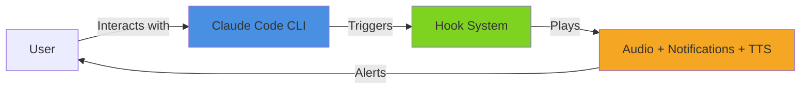
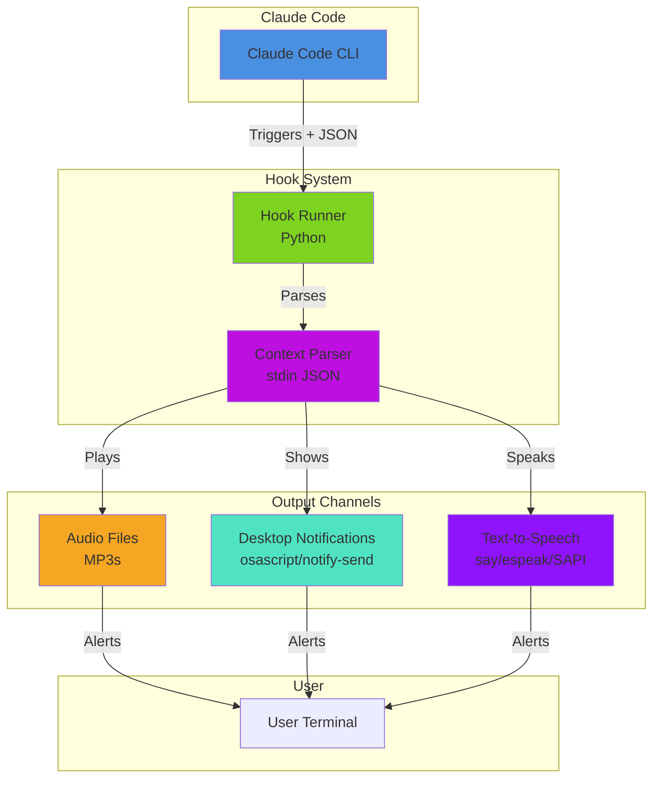
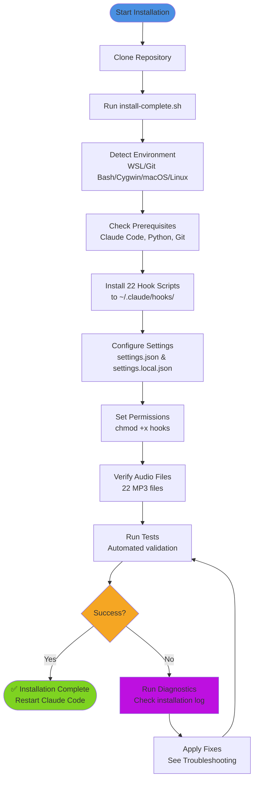
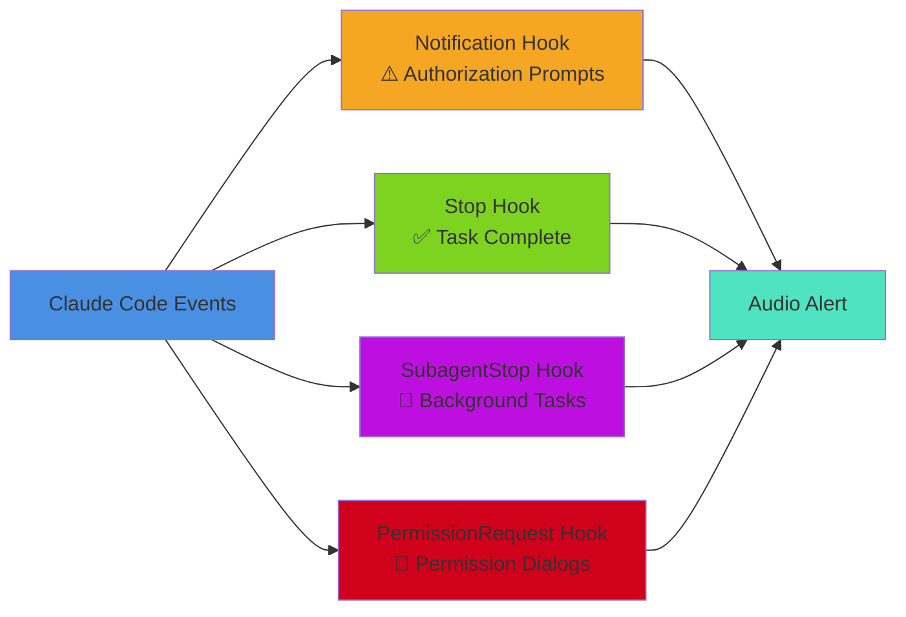
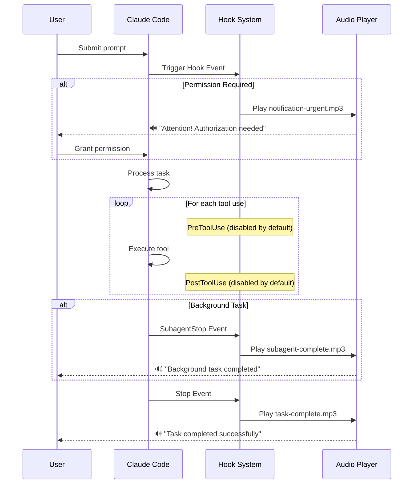

[](#)

# Claude Code Audio Hooks

Get notified when Claude Code finishes tasks or needs your attention.
Audio, desktop notifications, and text-to-speech - all platforms.

[](https://opensource.org/licenses/MIT)
[](https://github.com/ChanMeng666/claude-code-audio-hooks)
[](https://github.com/ChanMeng666/claude-code-audio-hooks)
[](https://claude.ai/download)

---

## Promotional Video

https://github.com/user-attachments/assets/3504d214-efac-4e01-84c0-426430b842d6

> Built entirely with code using Remotion, Claude Code, ElevenLabs & Suno.
> Source: [claude-code-audio-hooks-promo-video](https://github.com/ChanMeng666/claude-code-audio-hooks-promo-video)

<details>
<summary>Previous version</summary>

https://github.com/user-attachments/assets/e314be82-8c88-4026-997e-d25168ac9f5c

</details>

---

## Installation Guide
⚠ *This is an installation demonstration of the older version, so the installation speed is relatively slow. The new version now installs extremely quickly, giving you a lightning-fast experience!* 😉

https://github.com/user-attachments/assets/a9919363-f76c-4dd2-9141-e1c681573d75

---

## Effects Comparison

<details>
<summary><kbd>📷 Effects before version v4.0.0</kbd></summary>

https://github.com/user-attachments/assets/107ff48b-9d4f-40fd-9368-e36741b262ed

</details>

<details open>
<summary><kbd>📷 Effects after version v4.0.0 — Voice Notifications (Default Theme)</kbd></summary>

### Ubuntu

https://github.com/user-attachments/assets/2e2f1046-e690-409c-ba05-e621ded295dd

### PowerShell

https://github.com/user-attachments/assets/a1b11528-a248-415f-93d9-7859261d9abd

https://github.com/user-attachments/assets/3fd4c3aa-8204-4a06-be1b-d49dc9bb7cf9

</details>

<details open>
<summary><kbd>🔔 Non-Voice Chimes (Custom Theme)</kbd></summary>

### Full Demo

https://github.com/user-attachments/assets/25be4d51-8385-4f95-aaac-3cc782b603bf

### SessionStart & SessionEnd

https://github.com/user-attachments/assets/9e35f43c-e22b-44e3-8251-35057162f192

### PermissionRequest, TaskCompleted & SubagentStop

https://github.com/user-attachments/assets/0a855974-143c-424e-9c22-af2db2728d2f

</details>

---

## Quick Setup (30 seconds)

One command. No dependencies. No Python. No cloning.

```bash
curl -sL https://raw.githubusercontent.com/ChanMeng666/claude-code-audio-hooks/master/scripts/quick-setup.sh | bash
```

Restart Claude Code. Done.

**This gives you:**
- Desktop notification + sound when tasks complete
- Urgent alert when authorization is needed
- Alert when permission dialog appears ("Allow this bash command?")
- Background task completion alerts

**To remove:**
```bash
curl -sL https://raw.githubusercontent.com/ChanMeng666/claude-code-audio-hooks/master/scripts/quick-unsetup.sh | bash
```

**Customize which hooks are active** (no clone needed):
```bash
# See which hooks are enabled/disabled
curl -sL https://raw.githubusercontent.com/ChanMeng666/claude-code-audio-hooks/master/scripts/quick-configure.sh | bash -s -- --list

# Disable a noisy hook
curl -sL https://raw.githubusercontent.com/ChanMeng666/claude-code-audio-hooks/master/scripts/quick-configure.sh | bash -s -- --disable SubagentStop

# Re-enable it later
curl -sL https://raw.githubusercontent.com/ChanMeng666/claude-code-audio-hooks/master/scripts/quick-configure.sh | bash -s -- --enable SubagentStop

# Keep only specific hooks (disables the rest)
curl -sL https://raw.githubusercontent.com/ChanMeng666/claude-code-audio-hooks/master/scripts/quick-configure.sh | bash -s -- --only Stop Notification
```

Want custom audio, TTS, or advanced features? See [Full Installation](#-full-installation) below.

---

## Comparison

| | DIY Hooks | Quick Setup | Full Install |
|---|---|---|---|
| **Setup time** | Manual JSON editing | 30 seconds | 2 minutes |
| **Dependencies** | None | None | Python 3.6+ |
| **Desktop notifications** | macOS only | All platforms | All platforms |
| **Custom MP3 audio** | No | System sounds | 22 professional sounds |
| **Text-to-speech** | No | No | Yes |
| **Context-aware alerts** | No | No | Yes ("Permission needed for Bash") |
| **Debouncing** | No | No | Yes |
| **Per-hook config** | No | No | Yes (22 hook types) |
| **Logging/diagnostics** | No | No | Yes |

---

## Table of Contents

- [Quick Setup](#quick-setup-30-seconds)
- [Comparison](#comparison)
- [What Does This Do?](#what-does-this-do)
- [Full Installation](#-full-installation)
- [The 22 Notification Types](#-the-22-notification-types)
- [Configuration](#-configuration)
- [Desktop Notifications & TTS](#-desktop-notifications--tts)
- [Audio Customization Options](#-audio-customization-options)
- [Troubleshooting](#-troubleshooting)
- [Uninstalling](#-uninstalling)
- [FAQ](#-faq)
- [Contributing](#-contributing)

---

## Documentation

| Document | Description |
|----------|-------------|
| [**CLAUDE.md**](CLAUDE.md) | AI Assistant Guide - For Claude Code, Cursor, Copilot |
| [**docs/ARCHITECTURE.md**](docs/ARCHITECTURE.md) | System architecture with Mermaid diagrams |
| [**docs/INSTALLATION_GUIDE.md**](docs/INSTALLATION_GUIDE.md) | Detailed installation for all platforms |
| [**docs/TROUBLESHOOTING.md**](docs/TROUBLESHOOTING.md) | Problem solving and debug guide |
| [**CHANGELOG.md**](CHANGELOG.md) | Version history and release notes |

---

## What Does This Do?

Claude Code Audio Hooks adds **intelligent notifications** to Claude Code CLI. Instead of constantly watching your terminal, you get audio cues, desktop notifications, and optional text-to-speech when important events occur.



**Perfect for:**
- **Multitasking** - Work on other things while Claude processes long tasks
- **Authorization Alerts** - Get notified when Claude needs your permission
- **Background Tasks** - Know when subagent tasks complete
- **Focus Mode** - Let notifications keep you informed without interrupting flow

**Example Workflow:**
1. Ask Claude to refactor a complex codebase
2. Switch to documentation work
3. Hear "Task completed successfully!" when Claude finishes
4. If Claude needs authorization, hear "Attention! Claude needs your authorization."
5. Return to review Claude's work - no time wasted!

---

## System Architecture



### Key Components

1. **Hook Runner** - Python-based hook executor that works on all platforms
2. **Context Parser** - Reads JSON from stdin for context-aware notifications
3. **Audio Files** - Professional ElevenLabs voice recordings + UI chimes
4. **Desktop Notifications** - Native popups (osascript, notify-send, PowerShell)
5. **Text-to-Speech** - Spoken context-aware messages (say, espeak, SAPI)
6. **Configuration** - JSON-based preferences for hooks, audio, notifications, and TTS

---

## Before You Start

*Skip this section if you used [Quick Setup](#quick-setup-30-seconds) above.*

### **Prerequisites:**

1. **Claude Code CLI** must be installed
   - [Download Claude Code](https://claude.ai/download) if you don't have it
   - Verify: `claude --version`

2. **Operating System:**
   - ✅ **Windows:** Git Bash (recommended), WSL, or Cygwin
   - ✅ **Linux:** Native Linux (Ubuntu, Debian, Fedora, Arch, etc.)
   - ✅ **macOS:** All versions with Terminal or iTerm2

3. **Optional (for manual setup):**
   - Python 3 (for configuration management)
   - Git (usually pre-installed)

### **Platform Compatibility:**

| Platform | Status | Audio Player | Installation |
|----------|--------|--------------|--------------|
| **Windows (Native)** | ✅ **NEW!** Full support | PowerShell | `.\scripts\install-windows.ps1` |
| **WSL (Ubuntu/Debian)** | ✅ Fully tested | PowerShell | `bash scripts/install-complete.sh` |
| **Git Bash (Windows)** | ✅ Fully supported<br/>*Auto path conversion* | PowerShell | `bash scripts/install-complete.sh` |
| **macOS** | ✅ Native support<br/>*Bash 3.2+ compatible* | afplay | `bash scripts/install-complete.sh` |
| **Native Linux** | ✅ Fully supported | mpg123/aplay | `bash scripts/install-complete.sh` |
| **Cygwin** | ✅ Fully supported | PowerShell | `bash scripts/install-complete.sh` |

> **NEW in v4.7.0:** Focus Flow anti-distraction system — guided breathing exercises, wellness reminders, and custom micro-tasks that auto-launch during Claude's thinking time and auto-close when Claude finishes! Plus async hooks, smart matchers, rich notifications, and webhook integration.

> **Note for Git Bash Users:** Version 2.2+ includes automatic path conversion to handle Git Bash's Unix-style paths. The installer will configure this automatically—no manual setup required!

> **Note for macOS Users:** Full compatibility with macOS's default bash 3.2! All scripts have been optimized to work with the older bash version that ships with macOS. No need to install bash from Homebrew.

### **Quick System Check:**

```bash
# Check if Claude Code is installed
claude --version

# Check Python 3
python3 --version

# Check Git
git --version
```

If Claude Code is missing, install it first. Other prerequisites are usually already present.

---

## Full Installation

### **AI-Assisted Installation** (Recommended - Zero Effort!)

**Just copy this to your AI assistant (Claude Code, Cursor, Copilot, ChatGPT, etc.):**

```
Please install Claude Code Audio Hooks version 4.6.0 from
https://github.com/ChanMeng666/claude-code-audio-hooks and configure it for me.
Run: git clone https://github.com/ChanMeng666/claude-code-audio-hooks.git && cd claude-code-audio-hooks && bash scripts/install-complete.sh
```

Your AI will handle everything automatically!

---

### **Manual Installation** (1-2 minutes)

```bash
# 1. Clone the repository
git clone https://github.com/ChanMeng666/claude-code-audio-hooks.git
cd claude-code-audio-hooks

# 2. Run the complete installer (handles everything automatically!)
bash scripts/install-complete.sh
# The installer will:
# - Detect your environment automatically
# - Install all 22 hooks
# - Configure settings and permissions
# - Validate the installation
# - Optionally test audio playback

# 3. Restart Claude Code
# Close and reopen your terminal

# 4. Test with Claude
claude "What is 2+2?"
# You should hear a notification when Claude finishes!
```

**That's it!** The installer automatically handles environment detection, configuration, validation, and testing.

**Success Rate:** 98%+
**Installation Time:** 1-2 minutes

---

### **🪟 Windows Native Installation** (PowerShell)

For Windows users who prefer not to use Git Bash:

```powershell
# 1. Clone the repository
git clone https://github.com/ChanMeng666/claude-code-audio-hooks.git
cd claude-code-audio-hooks

# 2. Run the PowerShell installer
.\scripts\install-windows.ps1

# 3. Restart Claude Code
# Close and reopen your terminal

# 4. Test with Claude
claude "What is 2+2?"
```

**Requirements:**
- Python 3.6+ (download from python.org)
- Claude Code CLI

**Non-interactive mode:**
```powershell
.\scripts\install-windows.ps1 -NonInteractive
```

---

### **🤖 Non-Interactive Installation** (For Claude Code & Automation)

Both installation and uninstallation scripts support **non-interactive mode** - perfect for Claude Code and automation!

**Install without prompts:**
```bash
# Skips audio test prompt, completes fully automated
bash scripts/install-complete.sh --yes
```

**Uninstall without prompts:**
```bash
# Auto-confirms all removals, creates backups
bash scripts/uninstall.sh --yes
```

**Claude Code can now:**
- ✅ Install automatically (no user input needed)
- ✅ Uninstall automatically (no confirmations needed)
- ✅ Configure hooks programmatically (via configure.sh CLI)
- ✅ Fully automate setup and teardown

**Options:**
- `--yes` or `-y` - Run in non-interactive mode
- `--help` or `-h` - Show usage documentation

**Note:** Non-interactive mode is perfect for CI/CD pipelines, deployment scripts, and AI assistants like Claude Code!

---

## 📊 Installation Flow



### **📍 Installation Locations**

**Good news:** You can install this project **anywhere** on your system!

The installation script automatically records your project location, so hooks will work regardless of where you clone the repository:

```bash
# Any of these locations will work:
~/claude-code-audio-hooks              # Home directory
~/projects/claude-code-audio-hooks     # Projects folder
~/Documents/claude-code-audio-hooks    # Documents
~/repos/claude-code-audio-hooks        # Custom repos directory
/any/custom/path/claude-code-audio-hooks  # Any path you prefer
```

**How it works:**
1. When you run `bash scripts/install-complete.sh`, it records your project path in `~/.claude/hooks/.project_path`
2. Hook scripts automatically find audio files and configuration using this recorded path
3. Universal path utilities handle conversion for WSL/Git Bash/Cygwin/macOS/Linux
4. No manual configuration needed - it just works!

**Verification:**
```bash
# Check your recorded project path
cat ~/.claude/hooks/.project_path

# Verification is automatically performed during installation
# If you need to check again, reinstall with:
bash scripts/install-complete.sh
```

**Moving the project?** Just run `bash scripts/install-complete.sh` again after moving, and it will update the path automatically.

---

## 🎵 The 22 Notification Types

### **✅ Enabled by Default (4 Essential Hooks)**



#### **1. ⚠️ Notification Hook** - Permission Prompt Alert ⭐ KEY FEATURE
- **When:** Claude shows "Do you want to proceed?" authorization prompts
- **Audio:** "Attention! Claude needs your authorization."
- **Why enabled:** **This is the primary hook for the project's core mission!**
- **Status:** ✅ Enabled by default
- **Verified:** When you see permission prompts, this hook triggers and plays `notification-urgent.mp3`

#### **2. ✅ Stop Hook** - Task Completion
- **When:** Claude finishes responding to you
- **Audio:** "Task completed successfully!"
- **Why enabled:** Know when Claude is done working
- **Status:** ✅ Enabled by default

#### **3. 🤖 SubagentStop Hook** - Background Tasks
- **When:** Background/subagent tasks complete
- **Audio:** "Subagent task completed."
- **Why enabled:** Important for long-running operations using Task tool
- **Status:** ✅ Enabled by default

#### **4. 🔐 PermissionRequest Hook** - Permission Dialog Alert ⭐ NEW
- **When:** Claude shows the "Allow this bash command?" permission dialog
- **Audio:** "Attention! Claude needs your authorization." (same as notification-urgent.mp3)
- **Why enabled:** **Without this, you won't know the tool is waiting for your input!**
- **Status:** ✅ Enabled by default (v4.1.1+)
- **Note:** Uses a distinct sound from `Notification` in Quick Setup to help differentiate

---

### **❌ Disabled by Default (18 Optional Hooks)**

These hooks are available but disabled to avoid noise. Enable them in `config/user_preferences.json` if needed.

#### **5. 🔨 PreToolUse Hook** - Before Tool Execution
- **When:** Before EVERY tool (Read, Write, Edit, Bash, etc.)
- **Audio:** "Starting task."
- **Why disabled:** Too frequent! Plays before every single tool execution
- **Status:** ❌ Disabled by default

#### **6. 📊 PostToolUse Hook** - After Tool Execution
- **When:** After EVERY tool execution
- **Audio:** "Task in progress."
- **Why disabled:** Extremely noisy during active development
- **Status:** ❌ Disabled by default

#### **7. 💬 UserPromptSubmit Hook** - Prompt Confirmation
- **When:** You press Enter to submit a prompt
- **Audio:** "Prompt received."
- **Why disabled:** Unnecessary - you already know when you submit
- **Status:** ❌ Disabled by default

#### **8. 🗜️ PreCompact Hook** - Conversation Compaction
- **When:** Before Claude compacts conversation history
- **Audio:** "Information: compacting conversation."
- **Why disabled:** Rare event, not critical
- **Status:** ❌ Disabled by default

#### **9. 👋 SessionStart Hook** - Session Start
- **When:** Claude Code session starts
- **Audio:** "Session started."
- **Why disabled:** Optional - not needed for core functionality
- **Status:** ❌ Disabled by default

#### **10. 👋 SessionEnd Hook** - Session End
- **When:** Claude Code session ends
- **Audio:** "Session ended."
- **Why disabled:** Optional - not needed for core functionality
- **Status:** ❌ Disabled by default

#### **11. ❌ PostToolUseFailure Hook** - Tool Failure Alert
- **When:** A tool execution fails (e.g., Bash command errors, file not found)
- **Audio:** "Warning! Tool execution failed."
- **Why disabled:** Niche - most users don't need failure-specific alerts
- **Status:** ❌ Disabled by default

#### **12. 🚀 SubagentStart Hook** - Subagent Spawned
- **When:** A background subagent is spawned (e.g., Task tool launches an agent)
- **Audio:** "Background task starting."
- **Why disabled:** Niche - only useful for heavy subagent workflows
- **Status:** ❌ Disabled by default

#### **13. 💤 TeammateIdle Hook** - Teammate Idle (Agent Teams)
- **When:** An Agent Teams teammate goes idle
- **Audio:** "Teammate is now idle."
- **Why disabled:** Only relevant for Agent Teams users
- **Status:** ❌ Disabled by default

#### **14. 🏁 TaskCompleted Hook** - Task Completed (Agent Teams)
- **When:** An Agent Teams task is marked complete
- **Audio:** "Team task completed."
- **Why disabled:** Only relevant for Agent Teams users
- **Status:** ❌ Disabled by default

#### **15. ⛔ StopFailure Hook** - API Error
- **When:** A turn ends due to an API error (rate limit, auth failure, server error)
- **Audio:** "API error occurred. The request could not be completed."
- **Why disabled:** Infrequent but useful for awareness
- **Status:** ❌ Disabled by default

#### **16. 📦 PostCompact Hook** - After Context Compaction
- **When:** After context compaction completes
- **Audio:** "Context compaction complete."
- **Why disabled:** Low-frequency informational event
- **Status:** ❌ Disabled by default

#### **17. ⚙️ ConfigChange Hook** - Configuration Changed
- **When:** A configuration file (settings, rules) changes during a session
- **Audio:** "Configuration has been updated."
- **Why disabled:** Low-frequency informational event
- **Status:** ❌ Disabled by default

#### **18. 📄 InstructionsLoaded Hook** - Instructions/Rules Loaded
- **When:** A CLAUDE.md or `.claude/rules/*.md` file is loaded into context
- **Audio:** "Instructions file loaded."
- **Why disabled:** Low-frequency informational event
- **Status:** ❌ Disabled by default

#### **19. 🌳 WorktreeCreate Hook** - Worktree Created
- **When:** A worktree is created for an isolated task (via `--worktree` or subagent isolation)
- **Audio:** "Worktree created for isolated task."
- **Why disabled:** Only relevant for worktree/isolation users
- **Status:** ❌ Disabled by default

#### **20. 🧹 WorktreeRemove Hook** - Worktree Removed
- **When:** A worktree is removed (session exit or subagent finishes)
- **Audio:** "Worktree removed. Cleanup complete."
- **Why disabled:** Only relevant for worktree/isolation users
- **Status:** ❌ Disabled by default

#### **21. 📝 Elicitation Hook** - MCP Input Requested
- **When:** An MCP server requests user input during a tool call
- **Audio:** "Input requested. An MCP server needs your response."
- **Why disabled:** Only relevant for MCP server users
- **Status:** ❌ Disabled by default

#### **22. ✉️ ElicitationResult Hook** - Elicitation Response
- **When:** After a user responds to an MCP elicitation
- **Audio:** "Response submitted successfully."
- **Why disabled:** Only relevant for MCP server users
- **Status:** ❌ Disabled by default

---

### **Audio Frequency Guide**

**Very Frequent (With default config):**
- ✅ Stop (Every response completion)

**Occasional (Few times per session):**
- ⚠️ Notification (Authorization prompts)
- 🔐 PermissionRequest (Permission dialogs - "Allow this bash command?")
- 🤖 SubagentStop (Background tasks)

**If you enable optional hooks (not recommended):**
- 🔨 PreToolUse + 📊 PostToolUse = VERY NOISY (before/after every tool!)
- 💬 UserPromptSubmit = Noisy (every prompt)
- 👋 SessionStart/End + 🗜️ PreCompact = Rare but unnecessary

**Want to customize?** Run `bash scripts/configure.sh` for an interactive menu!

---

## 🔄 Hook Execution Flow



---

## ⚙️ Configuration

### **🤖 Ask Claude Code (Fastest Way)**

Already using Claude Code? Just tell it what you want in plain language:

| What you want | What to say |
|---|---|
| **Switch to chime sounds** | *"Switch my audio hooks to chime sounds"* |
| **Switch back to voice** | *"Switch my audio hooks to voice/default theme"* |
| **Enable a hook** | *"Enable the session_start and session_end hooks"* |
| **Disable a hook** | *"Disable the pretooluse and posttooluse hooks"* |
| **Enable all hooks** | *"Enable all 22 audio hooks"* |
| **Reset to defaults** | *"Reset audio hooks to recommended defaults"* |
| **Check current config** | *"Show me which audio hooks are enabled"* |
| **Audio only, no popups** | *"Turn off all desktop notification popups, keep audio only"* |
| **Popups only, no audio** | *"Switch to desktop notifications only, disable all audio"* |
| **Audio + popups for critical hooks** | *"Set global mode to audio_only, but enable audio + desktop popup for stop, notification, and permission_request hooks"* |
| **Snooze for a meeting** | *"Snooze all audio hooks for 1 hour"* |
| **Check snooze status** | *"Are my audio hooks snoozed right now?"* |
| **Resume after snooze** | *"Cancel the snooze and resume audio hooks"* |
| **Silence noisy hooks** | *"Set pretooluse and posttooluse to disabled mode so they don't play audio or show popups"* |
| **Mixed per-hook setup** | *"I want audio for all hooks, but also desktop popups only for task completion and authorization requests"* |

Claude Code reads the project's `CLAUDE.md` and knows exactly which files to edit and which commands to run. **This is the fastest way to configure notification modes** — just describe what you want in plain language and Claude Code will update `config/user_preferences.json` for you.

---

### **🚀 Dual-Mode Configuration Tool**

The `configure.sh` script supports **both interactive and programmatic modes** - perfect for humans AND Claude Code!

#### **Interactive Mode** (Menu-Driven Interface)

Launch the interactive menu:

```bash
cd ~/claude-code-audio-hooks
bash scripts/configure.sh
```

**Interactive Features:**
- Toggle individual hooks on/off
- Test audio for each hook
- View current configuration
- Reset to defaults
- Save changes

**Interactive Menu:**
```
================================================
  Claude Code Audio Hooks - Configuration v2.0
================================================

Current Configuration:
  [✓]  1. Notification       - Authorization/confirmation alerts
  [✓]  2. Stop               - Task completion
  [ ]  3. PreToolUse         - Before tool execution
  [ ]  4. PostToolUse        - After tool execution
  [ ]  5. PostToolUseFailure - Tool execution failed
  [ ]  6. UserPromptSubmit   - Prompt submission
  [✓]  7. SubagentStop       - Background task completion
  [ ]  8. SubagentStart      - Subagent spawned
  [ ]  9. PreCompact         - Before conversation compaction
  [ ] 10. SessionStart       - Session start
  [ ] 11. SessionEnd         - Session end
  [✓] 12. PermissionRequest  - Permission dialog
  [ ] 13. TeammateIdle       - Teammate idle (Agent Teams)
  [ ] 14. TaskCompleted      - Task completed (Agent Teams)
  [ ] 15. StopFailure        - API error / stop failure
  [ ] 16. PostCompact        - After context compaction
  [ ] 17. ConfigChange       - Configuration file changed
  [ ] 18. InstructionsLoaded - Instructions/rules file loaded
  [ ] 19. WorktreeCreate     - Worktree created (isolation)
  [ ] 20. WorktreeRemove     - Worktree removed (cleanup)
  [ ] 21. Elicitation        - MCP elicitation (input needed)
  [ ] 22. ElicitationResult  - Elicitation response submitted

Options:
  [1-22] Toggle hook on/off
  [T]    Test audio for specific hook
  [R]    Reset to defaults
  [S]    Save and exit
  [Q]    Quit without saving
```

---

#### **Programmatic Mode** (CLI Interface for Scripts & Claude Code)

Perfect for automation, Claude Code, and other AI assistants!

**List all hooks:**
```bash
bash scripts/configure.sh --list
```

**Get status of a specific hook:**
```bash
bash scripts/configure.sh --get notification  # Returns: true or false
```

**Enable one or more hooks:**
```bash
bash scripts/configure.sh --enable notification stop subagent_stop
```

**Disable hooks:**
```bash
bash scripts/configure.sh --disable pretooluse posttooluse
```

**Set specific values:**
```bash
bash scripts/configure.sh --set notification=true --set pretooluse=false
```

**Reset to recommended defaults:**
```bash
bash scripts/configure.sh --reset
```

**Mixed operations:**
```bash
bash scripts/configure.sh --enable notification --disable pretooluse session_start
```

**Show help:**
```bash
bash scripts/configure.sh --help
```

**Available hooks (22 total):**
- `notification` - Authorization/confirmation requests (CRITICAL)
- `stop` - Task completion
- `permission_request` - Permission dialog ("Allow this bash command?")
- `pretooluse` - Before tool execution (can be noisy)
- `posttooluse` - After tool execution (very noisy)
- `posttoolusefailure` - Tool execution failure
- `userpromptsubmit` - User prompt submission
- `subagent_stop` - Subagent task completion
- `subagent_start` - Subagent spawned
- `precompact` - Before conversation compaction
- `session_start` - Session start
- `session_end` - Session end
- `teammate_idle` - Agent Teams teammate idle
- `task_completed` - Agent Teams task completed
- `stop_failure` - API error (rate limit, auth failure, etc.)
- `postcompact` - After context compaction completes
- `config_change` - Configuration file changed
- `instructions_loaded` - CLAUDE.md/rules file loaded
- `worktree_create` - Worktree created for isolation
- `worktree_remove` - Worktree removed/cleaned up
- `elicitation` - MCP server requests user input
- `elicitation_result` - Elicitation response submitted

**Note:** All programmatic commands automatically save changes. Remember to restart Claude Code to apply them!

---

#### **Snooze / Temporary Mute**

Need silence during a meeting or focus session? Snooze all hooks temporarily — they auto-resume when the timer expires.

**Standalone script:**
```bash
bash scripts/snooze.sh              # Snooze 30 minutes (default)
bash scripts/snooze.sh 1h           # Snooze 1 hour
bash scripts/snooze.sh 2h           # Snooze 2 hours
bash scripts/snooze.sh 90m          # Snooze 90 minutes
bash scripts/snooze.sh status       # Check remaining time
bash scripts/snooze.sh off          # Resume immediately
```

**Via configure.sh:**
```bash
bash scripts/configure.sh --snooze 1h
bash scripts/configure.sh --snooze-status
bash scripts/configure.sh --resume
```

**Via quick-configure.sh (Lite tier, no clone needed):**
```bash
curl -sL ...quick-configure.sh | bash -s -- --snooze 1h
curl -sL ...quick-configure.sh | bash -s -- --snooze-status
curl -sL ...quick-configure.sh | bash -s -- --resume
```

**How it works:** A timestamp marker file is written to the temp directory. All hook runners check this file before playing audio. When the timestamp is in the past, hooks automatically resume — no cleanup daemon needed.

---

### **Manual Configuration**

Edit `config/user_preferences.json`:

```json
{
  "version": "2.0.0",
  "audio_theme": "default",
  "enabled_hooks": {
    "notification": true,           // ⚠️ Authorization alerts
    "stop": true,                   // ✅ Task completion
    "permission_request": true,     // 🔐 Permission dialogs
    "subagent_stop": true,          // 🤖 Subagent completion
    "pretooluse": false,            // 🔨 Before tools
    "posttooluse": false,           // 📊 After tools
    "posttoolusefailure": false,    // ❌ Tool failure
    "userpromptsubmit": false,      // 💬 Prompt submission
    "subagent_start": false,        // 🚀 Subagent spawned
    "precompact": false,            // 🗜️ Before compaction
    "session_start": false,         // 👋 Session start
    "session_end": false,           // 👋 Session end
    "teammate_idle": false,         // 💤 Teammate idle
    "task_completed": false,        // 🏁 Team task done
    "stop_failure": false,          // ⛔ API error
    "postcompact": false,           // 📦 After compaction
    "config_change": false,         // ⚙️ Config changed
    "instructions_loaded": false,   // 📄 Rules loaded
    "worktree_create": false,       // 🌳 Worktree created
    "worktree_remove": false,       // 🧹 Worktree removed
    "elicitation": false,           // 📝 MCP input needed
    "elicitation_result": false     // ✉️ Elicitation response
  },
  "playback_settings": {
    "queue_enabled": true,     // Prevent overlapping
    "max_queue_size": 5,       // Max queued sounds
    "debounce_ms": 500         // Min ms between same notification
  }
}
```

> **Note:** The `audio_theme` field controls which sound set is used for **all** hooks at once (`"default"` = voice, `"custom"` = chimes). You do NOT need an `audio_files` section — just change `audio_theme` and restart Claude Code.

After editing, restart Claude Code for changes to take effect.

---

## Desktop Notifications & TTS

The Full Install supports three output channels that can be used independently or together:

### **Notification Modes**

Configure in `config/user_preferences.json`:

```json
{
  "notification_settings": {
    "mode": "audio_and_notification",
    "show_context": true
  }
}
```

| Mode | Audio | Desktop Popup | Best For |
|------|-------|---------------|----------|
| `audio_only` | Yes | No | Classic behavior, backward compatible |
| `notification_only` | No | Yes | Silent environments, visual-only alerts |
| `audio_and_notification` | Yes | Yes | Maximum awareness (recommended) |
| `disabled` | No | No | Suppress both (TTS/logging still works) |

Desktop notifications show context from Claude Code:
- **Stop**: "Task completed"
- **Notification**: "Authorization needed: Allow Bash command?"
- **PreToolUse**: "Running: Bash"
- **SubagentStop**: "Background task finished (Explore)"

### **Per-Hook Notification Mode** *(v4.3.0)*

Override the global mode for individual hooks. Hooks **not listed** in `per_hook` fall back to the global `mode`. This gives you fine-grained control: audio-only for noisy hooks, desktop popups for critical ones, or silence for hooks you only want logged.

#### How It Works

```
notification_settings.mode          ← global default for ALL hooks
notification_settings.per_hook.*    ← overrides for SPECIFIC hooks
```

Each hook resolves its mode like this:
1. Check `per_hook[hook_name]` — if present, use that mode
2. Otherwise, fall back to global `mode`

#### Available Modes

| Mode | Audio | Desktop Popup | Notes |
|------|-------|---------------|-------|
| `audio_only` | ✅ | ❌ | Fast, instant feedback |
| `notification_only` | ❌ | ✅ | Visual-only, no sound |
| `audio_and_notification` | ✅ | ✅ | Both channels, maximum awareness |
| `disabled` | ❌ | ❌ | Silent — TTS and logging still work |

> **`disabled` vs `enabled_hooks: false`** — `disabled` mode still fires the hook (TTS speaks, logs are written), it just skips audio and desktop notifications. Setting `enabled_hooks.xxx: false` skips the hook entirely.

#### Common Configurations

**🔇 Audio only, no desktop popups (clean & fast):**
```json
{
  "notification_settings": {
    "mode": "audio_only",
    "per_hook": {}
  }
}
```

**🖥️ Desktop popups only, no audio (silent environment):**
```json
{
  "notification_settings": {
    "mode": "notification_only",
    "per_hook": {}
  }
}
```

**🎯 Audio for everything + desktop popups only for critical hooks (recommended):**

Best for long-running tasks — you hear every event, but only get a desktop popup when Claude actually needs you:
```json
{
  "notification_settings": {
    "mode": "audio_only",
    "per_hook": {
      "stop": "audio_and_notification",
      "notification": "audio_and_notification",
      "permission_request": "audio_and_notification"
    }
  }
}
```

**🔕 Silence noisy hooks, keep the rest:**

PreToolUse/PostToolUse fire on every single tool call. Disable their audio and popups while keeping all other hooks at full volume:
```json
{
  "notification_settings": {
    "mode": "audio_and_notification",
    "per_hook": {
      "pretooluse": "disabled",
      "posttooluse": "disabled"
    }
  }
}
```

**🎧 Audio for frequent hooks, both channels for critical hooks:**

Hear a quick chime for routine events, but get audio + popup for things that need attention:
```json
{
  "notification_settings": {
    "mode": "audio_only",
    "per_hook": {
      "stop": "audio_and_notification",
      "notification": "audio_and_notification",
      "permission_request": "audio_and_notification",
      "subagent_stop": "audio_and_notification",
      "posttoolusefailure": "audio_and_notification"
    }
  }
}
```

**👀 Desktop popup for failures only, audio for everything else:**
```json
{
  "notification_settings": {
    "mode": "audio_only",
    "per_hook": {
      "posttoolusefailure": "audio_and_notification"
    }
  }
}
```

#### CLI Shortcut

```bash
# Set per-hook modes from command line
bash scripts/configure.sh --hook-mode pretooluse=audio_only posttooluse=disabled

# Multiple hooks at once
bash scripts/configure.sh --hook-mode stop=audio_and_notification notification=audio_and_notification permission_request=audio_and_notification
```

#### 🤖 Let Claude Code Configure It For You

The easiest way to set up per-hook modes is to **describe what you want in natural language** and let Claude Code do the editing. Claude Code reads this project's `CLAUDE.md` which contains the full config schema.

**Examples you can say to Claude Code:**

| Scenario | What to say |
|----------|-------------|
| Quiet focus mode | *"Turn off all desktop popups, I only want audio"* |
| Critical alerts only | *"Only show desktop popups for task completion and authorization, audio for everything else"* |
| Silent noisy hooks | *"Disable audio and popups for pretooluse and posttooluse, they're too noisy"* |
| Popup-only setup | *"I'm in a meeting, switch everything to desktop notifications only, no audio"* |
| Failure awareness | *"I want a desktop popup when a tool fails, but keep audio-only for all other hooks"* |
| Full awareness | *"Enable both audio and desktop popups for all hooks"* |
| Back to basics | *"Reset notification mode to audio_only for all hooks, clear all per-hook overrides"* |

Claude Code will directly edit `config/user_preferences.json` — no manual JSON editing needed.

### **Text-to-Speech**

Enable spoken context-aware messages:

```json
{
  "tts_settings": {
    "enabled": true,
    "messages": {
      "stop": "Task completed",
      "notification": "Attention, authorization needed",
      "subagent_stop": "Background task finished"
    }
  }
}
```

**Platform TTS engines:**

| Platform | Engine | Install |
|----------|--------|---------|
| macOS | `say` | Built-in |
| Linux | `espeak` or `spd-say` | `sudo apt install espeak` |
| Windows | SAPI (System.Speech) | Built-in |
| WSL | SAPI via PowerShell | Built-in |

Custom per-hook messages override the auto-generated context. Hooks not listed in `messages` use the auto-generated context string.

### **Webhook Integration** *(v4.6.0)*

Send notifications to external services — get Claude Code alerts on your phone, in Slack, or anywhere:

```json
{
  "webhook_settings": {
    "enabled": true,
    "url": "https://ntfy.sh/my-claude-alerts",
    "format": "ntfy",
    "hook_types": ["stop", "notification", "permission_request", "posttoolusefailure", "stop_failure"],
    "headers": {}
  }
}
```

**Supported services:**

| Format | Service | URL Example |
|--------|---------|-------------|
| `slack` | Slack Incoming Webhook | `https://hooks.slack.com/services/T.../B.../xxx` |
| `discord` | Discord Webhook | `https://discord.com/api/webhooks/xxx/yyy` |
| `teams` | Microsoft Teams Webhook | `https://outlook.office.com/webhook/xxx` |
| `ntfy` | ntfy.sh (free phone push) | `https://ntfy.sh/your-topic-name` |
| `raw` | Any custom endpoint | Full JSON payload with hook_type, context, event_data |

**Configure via CLI:**
```bash
bash scripts/configure.sh --webhook url=https://ntfy.sh/my-alerts format=ntfy
bash scripts/configure.sh --webhook enabled=true
```

Webhooks run in background threads — they never block audio or desktop notifications. Failures are silently logged.

### **Focus Flow: Anti-Distraction Micro-Tasks** *(v4.7.0)*

Stay present during Claude's thinking time instead of reaching for your phone. Focus Flow automatically launches a lightweight activity when Claude starts processing and **auto-closes it when Claude finishes**.

```
You submit prompt → Claude starts thinking → Focus Flow activates
                         ↓ (15s delay)
                    Micro-task keeps you engaged
                         ↓
                    Claude finishes → Micro-task auto-closes
```

**Available modes:**

| Mode | What happens |
|------|-------------|
| `breathing` | Opens a terminal with guided breathing exercise (4-7-8, box breathing, or energizing pattern) with visual progress bars |
| `hydration` | Shows a desktop notification reminder (drink water, stretch, check posture, rest eyes, or deep breath) |
| `url` | Opens a URL in your browser (e.g., your Jira board, GitHub issues, or daily standup notes) |
| `command` | Runs any custom shell command you define |

**Enable it:**
```json
{
  "focus_flow": {
    "enabled": true,
    "mode": "breathing",
    "min_thinking_seconds": 15,
    "breathing_pattern": "4-7-8"
  }
}
```

**Or ask Claude Code:**
```
Enable Focus Flow with breathing exercises and a 20 second delay
```

**Breathing patterns available:** `4-7-8` (calming), `box` (Navy SEAL focus technique), `energize` (quick energizer)

**Custom URL example** — open your GitHub issues while waiting:
```json
{
  "focus_flow": {
    "enabled": true,
    "mode": "url",
    "url": "https://github.com/your-org/your-repo/issues"
  }
}
```

The `min_thinking_seconds` (default: 15) prevents micro-tasks from appearing for quick 2-second responses.

---

## Testing & Verification

The installation script (`install-complete.sh`) automatically performs comprehensive validation, including:

1. ✅ Environment detection (WSL, Git Bash, Cygwin, macOS, Linux)
2. ✅ Prerequisites check (Claude Code, Git, Python)
3. ✅ Project structure validation
4. ✅ Hook installation verification
5. ✅ Settings configuration validation
6. ✅ Path utilities testing
7. ✅ Audio file verification

### **Audio Playback Test**

If you skipped the audio test during installation, you can test it anytime:

```bash
bash scripts/test-audio.sh
```

**Test options:**
1. Test all enabled hooks (recommended)
2. Test ALL audio files (including disabled)
3. Test specific hook
4. Quick test (task-complete only)

### **Real-World Test**

Test with actual Claude Code usage:

```bash
# Simple test
claude "What is 2+2?"
# You should hear audio when Claude finishes

# Longer task
claude "Explain how HTTP works in detail"
# You should hear audio when complete
```

---

## 🎵 Audio Customization Options

The project includes **two complete audio sets** with 22 sounds each:

### **🎤 Option 1: Voice Notifications (Default)**
Professional ElevenLabs voice recordings in `audio/default/` - perfect for clear, spoken alerts.

### **🔔 Option 2: Non-Voice Chimes**
Modern UI sound effects in `audio/custom/` - ideal for users who:
- Play music while coding
- Prefer instrumental sounds
- Dislike AI voices
- Want subtle, non-intrusive notifications

---

### **Quick Start: Switch Audio Theme**

**Ask Claude Code** (easiest):
```
Switch my audio hooks to chime sounds
```
Or switch back:
```
Switch my audio hooks to voice sounds
```

**Method 1: One command**
```bash
bash scripts/configure.sh --theme custom    # Switch to chimes
bash scripts/configure.sh --theme default   # Switch back to voice
```

**Method 2: Edit one line in config** (`config/user_preferences.json`)
```json
"audio_theme": "custom"
```
Change `"default"` to `"custom"` (or vice versa) and restart Claude Code.

> **How it works:** The `audio_theme` field switches **all 22 hooks** between voice recordings and chime sounds in one step. No need to configure individual audio file paths.

---

### **Advanced: Per-Hook Audio Override**

Want a specific hook to use a different sound? Add an `audio_files` section to `config/user_preferences.json` with **only the hooks you want to override**:

```json
{
  "audio_theme": "custom",
  "audio_files": {
    "stop": "default/task-complete.mp3"
  }
}
```

This plays voice for task completion but chimes for everything else. Only list the hooks you want to override — unlisted hooks follow `audio_theme`.

---

### **Available Audio Files**

#### **Voice Files** (`audio/default/`)
All narrated by Jessica voice from ElevenLabs:

| File | Hook | Description |
|------|------|-------------|
| `notification-urgent.mp3` | notification | "Attention! Claude needs your authorization." |
| `task-complete.mp3` | stop | "Task completed successfully!" |
| `subagent-complete.mp3` | subagent_stop | "Background task finished!" |
| `task-starting.mp3` | pretooluse | "Executing tool..." |
| `task-progress.mp3` | posttooluse | "Tool execution complete." |
| `prompt-received.mp3` | userpromptsubmit | "Prompt received." |
| `notification-info.mp3` | precompact | "Compacting conversation history..." |
| `session-start.mp3` | session_start | "Claude Code session started." |
| `session-end.mp3` | session_end | "Session ended." |
| `permission-request.mp3` | permission_request | "Permission required. Please review the action." |
| `tool-failed.mp3` | posttoolusefailure | "Warning! Tool execution failed." |
| `subagent-start.mp3` | subagent_start | "Background task starting." |
| `teammate-idle.mp3` | teammate_idle | "Teammate is now idle." |
| `team-task-done.mp3` | task_completed | "Team task completed." |
| `stop-failure.mp3` | stop_failure | "API error occurred. The request could not be completed." |
| `post-compact.mp3` | postcompact | "Context compaction complete." |
| `config-change.mp3` | config_change | "Configuration has been updated." |
| `instructions-loaded.mp3` | instructions_loaded | "Instructions file loaded." |
| `worktree-create.mp3` | worktree_create | "Worktree created for isolated task." |
| `worktree-remove.mp3` | worktree_remove | "Worktree removed. Cleanup complete." |
| `elicitation.mp3` | elicitation | "Input requested. An MCP server needs your response." |
| `elicitation-result.mp3` | elicitation_result | "Response submitted successfully." |

#### **Chime Files** (`audio/custom/`)
Modern UI sound effects (no voice):

| File | Hook | Description |
|------|------|-------------|
| `chime-notification-urgent.mp3` | notification | Urgent alarm, sharp rising tones |
| `chime-task-complete.mp3` | stop | Triumphant success jingle |
| `chime-task-starting.mp3` | pretooluse | Gentle activation whoosh |
| `chime-task-progress.mp3` | posttooluse | Subtle confirmation pop |
| `chime-tool-failed.mp3` | posttoolusefailure | Error descending buzzer |
| `chime-prompt-received.mp3` | userpromptsubmit | Soft bubble ping |
| `chime-subagent-complete.mp3` | subagent_stop | Achievement sparkle ding |
| `chime-subagent-start.mp3` | subagent_start | Futuristic launch whoosh |
| `chime-notification-info.mp3` | precompact | Gentle bell ding |
| `chime-session-start.mp3` | session_start | Welcoming opening melody |
| `chime-session-end.mp3` | session_end | Peaceful closing melody |
| `chime-permission-request.mp3` | permission_request | Security doorbell tone |
| `chime-teammate-idle.mp3` | teammate_idle | Sleepy standby ping |
| `chime-team-task-done.mp3` | task_completed | Team victory fanfare |
| `chime-stop-failure.mp3` | stop_failure | Error alert, descending warning tones |
| `chime-post-compact.mp3` | postcompact | Soft completion chime |
| `chime-config-change.mp3` | config_change | Subtle settings click chime |
| `chime-instructions-loaded.mp3` | instructions_loaded | Soft page-turn chime |
| `chime-worktree-create.mp3` | worktree_create | Sparkling creation chime |
| `chime-worktree-remove.mp3` | worktree_remove | Gentle closing chime |
| `chime-elicitation.mp3` | elicitation | Attention doorbell chime |
| `chime-elicitation-result.mp3` | elicitation_result | Confirmation ding |

---

### **Configuration Examples**

#### **Scenario 1: Music-Friendly Chimes**
You play music while coding — use chimes so notifications blend in:

```
Tell Claude Code: "Switch to chime audio and only enable notification and permission_request hooks"
```

Or manually in `config/user_preferences.json`:
```json
{
  "audio_theme": "custom",
  "enabled_hooks": {
    "notification": true,
    "permission_request": true,
    "stop": false,
    "subagent_stop": false
  }
}
```

#### **Scenario 2: Voice for Completions, Chimes for the Rest**
Hear a spoken "Task completed!" but subtle chimes for other events:

```json
{
  "audio_theme": "custom",
  "audio_files": {
    "stop": "default/task-complete.mp3"
  }
}
```

#### **Scenario 3: All 22 Hooks with Chimes**
Maximum awareness with non-intrusive sounds:

```
Tell Claude Code: "Enable all 22 hooks and switch to chime audio theme"
```

Or via CLI:
```bash
bash scripts/configure.sh --theme custom
bash scripts/configure.sh --enable notification stop pretooluse posttooluse posttoolusefailure userpromptsubmit subagent_stop subagent_start precompact session_start session_end permission_request teammate_idle task_completed stop_failure postcompact config_change instructions_loaded worktree_create worktree_remove elicitation elicitation_result
```

#### **Scenario 4: Audio + Selective Desktop Popups**
Chime audio for everything, but desktop popups only when Claude needs you:

```
Tell Claude Code: "Switch to chime audio, enable all hooks, set global mode to audio_only, and add desktop popups for stop, notification, and permission_request hooks only"
```

Or manually:
```json
{
  "audio_theme": "custom",
  "notification_settings": {
    "mode": "audio_only",
    "per_hook": {
      "stop": "audio_and_notification",
      "notification": "audio_and_notification",
      "permission_request": "audio_and_notification"
    }
  }
}
```

#### **Scenario 5: Silent Coding, Popups Only**
You're on a call or listening to music — no audio, just desktop popups for critical events:

```
Tell Claude Code: "Disable all audio, only show desktop notification popups for stop, notification, and permission_request hooks, disable everything else"
```

Or manually:
```json
{
  "notification_settings": {
    "mode": "disabled",
    "per_hook": {
      "stop": "notification_only",
      "notification": "notification_only",
      "permission_request": "notification_only"
    }
  }
}
```

---

### **Testing Your Configuration**

After changing audio files, test immediately:

```bash
# Test all enabled hooks
bash scripts/test-audio.sh

# Choose option 1 to test your enabled hooks
# You'll hear each audio file play in sequence
```

**Remember:** Restart Claude Code after configuration changes!

---

## 🎨 Customization

### **Using Custom Audio Files**

#### **Option 1: Replace Files Directly (Easiest)**

The simplest way to use your own audio: just replace the files in `audio/default/` with your own MP3 files, **keeping the same filenames**:

```bash
cd ~/claude-code-audio-hooks

# Example: Replace the task completion sound with your own
cp /path/to/my-completion-sound.mp3 audio/default/task-complete.mp3

# Example: Replace the notification sound
cp /path/to/my-alert.mp3 audio/default/notification-urgent.mp3

# Test your changes
bash scripts/test-audio.sh
```

**Required filenames** (replace any or all):
| Filename | Hook |
|----------|------|
| `notification-urgent.mp3` | notification |
| `task-complete.mp3` | stop |
| `task-starting.mp3` | pretooluse |
| `task-progress.mp3` | posttooluse |
| `tool-failed.mp3` | posttoolusefailure |
| `prompt-received.mp3` | userpromptsubmit |
| `subagent-complete.mp3` | subagent_stop |
| `subagent-start.mp3` | subagent_start |
| `notification-info.mp3` | precompact |
| `session-start.mp3` | session_start |
| `session-end.mp3` | session_end |
| `permission-request.mp3` | permission_request |
| `teammate-idle.mp3` | teammate_idle |
| `team-task-done.mp3` | task_completed |

No configuration changes needed - just swap the files and restart Claude Code!

#### **Option 2: Switch Between Voice and Chimes**

Use the built-in audio themes:

```bash
# Switch to chimes (no voice)
bash scripts/configure.sh --theme custom

# Switch back to voice
bash scripts/configure.sh --theme default
```

Or simply change `"audio_theme"` in `config/user_preferences.json`:
```json
"audio_theme": "custom"
```

#### **Option 3: Create Audio with ElevenLabs**

**ElevenLabs** provides AI text-to-speech with natural voices.

**Step-by-step:**

1. **Visit** https://elevenlabs.io
2. **Sign up** for free account (free credits included)
3. **Go to Text-to-Speech**
4. **Choose voice** (Jessica is current default, but explore others!)
5. **Enter text** for each notification:
   - Notification: "Attention! Claude needs your authorization."
   - Stop: "Task completed successfully!"
   - SubagentStop: "Background task finished!"
   - PermissionRequest: "Permission required. Please review the action."
   - PostToolUseFailure: "Warning! Tool execution failed."
   - SubagentStart: "Background task starting."
   - TeammateIdle: "Teammate is now idle."
   - TaskCompleted: "Team task completed."
   - *(and other hooks as needed)*
6. **Generate and download** MP3 files
7. **Replace in project** (keep filenames):
   ```bash
   cp ~/Downloads/my-notification.mp3 ~/claude-code-audio-hooks/audio/default/notification-urgent.mp3
   ```

### **Audio File Specifications**

**Recommended:**
- **Format:** MP3 (widely supported)
- **Duration:** 2-5 seconds (notifications should be brief)
- **Bitrate:** 128-192 kbps (balance quality and size)
- **Sample Rate:** 44.1 kHz or 48 kHz
- **Volume:** Normalized (consistent across files)

**Tips:**
- Keep it pleasant - you'll hear it frequently!
- Make it noticeable but not jarring
- Test at different system volumes
- Shorter is better for quick notifications

---

## 🔄 Upgrading to v3.0

### **Recommended Upgrade Method**

For the cleanest upgrade experience, we recommend uninstalling the old version and doing a fresh install:

```bash
# 1. Navigate to your project directory
cd ~/claude-code-audio-hooks

# 2. Uninstall the old version
bash scripts/uninstall.sh

# 3. Pull the latest version
git pull origin master

# 4. Run fresh installation
bash scripts/install-complete.sh

# 5. Restart Claude Code
# Close and reopen your terminal
```

**Why fresh install?**
- v3.0 has a completely reorganized structure
- Ensures no conflicts with old files
- Takes only 1-2 minutes
- Guarantees optimal configuration

### **What's New in v3.0**

- ✅ Streamlined directory structure (`scripts/internal/` for auto-run utilities)
- ✅ Integrated environment detection (no separate scripts needed)
- ✅ Automated validation (no manual verification needed)
- ✅ One-command installation handles everything
- ✅ Removed redundant scripts (simpler project structure)
- ✅ Improved documentation (README only, no scattered docs)

---

## 🔧 Troubleshooting

### **⚠️ Note: Upgrading from Older Versions**

If you previously installed this project (v1.x or v2.x):

**Solution:** Uninstall and reinstall!

```bash
cd /path/to/claude-code-audio-hooks
bash scripts/uninstall.sh  # Remove old version
git pull origin master      # Get latest code
bash scripts/install-complete.sh  # Fresh install
```

**Why?** v3.0 has a completely reorganized structure. A fresh install ensures:
- ✅ No conflicts with old files
- ✅ Correct directory structure
- ✅ Optimal configuration
- ✅ All new features working properly

---

### **⚠️ Special Note for Windows Git Bash Users**

If you're using **Git Bash on Windows** and installed successfully but hear no audio, this is likely due to a **path compatibility issue** that has been **automatically fixed in v2.2+**.

#### **Symptoms:**
- Installation completes successfully
- No errors reported
- But audio doesn't play when Claude Code tasks finish
- Hooks appear installed but silent

#### **Quick Fix:**
```bash
# Re-run the installation
cd /path/to/claude-code-audio-hooks

# The installer automatically detects and fixes path issues
bash scripts/install-complete.sh
```

#### **What was the problem?**
Git Bash uses Unix-style paths (`/d/github_repository/...`) while Windows Python expects Windows-style paths (`D:/github_repository/...`). The hooks couldn't read configuration files due to this mismatch.

#### **How we fixed it:**
Version 2.2+ includes automatic path conversion that:
- Detects Git Bash environment
- Converts paths before calling Python
- Works transparently for all users
- No manual configuration needed

#### **Verify the fix is working:**
```bash
# Check hook trigger log
cat /tmp/claude_hooks_log/hook_triggers.log
# You should see entries like: 2025-11-06 19:35:31 | stop | task-complete.mp3

# Test with Claude
claude "What is 2+2?"
# You should hear audio when the response completes
```

---

### **Issue: "I don't hear any sound!"**

#### **Check 1: Did you restart Claude Code?**
Hooks only activate after restarting. Close and reopen your terminal.

#### **Check 2: Is your audio enabled?**
```bash
# Check configuration
cat ~/claude-code-audio-hooks/config/user_preferences.json

# Verify enabled_hooks section
# notification, stop, and subagent_stop should be true
```

#### **Check 3: Is the hook installed?**
```bash
# Check if hooks exist
ls -la ~/.claude/hooks/*_hook.sh

# Re-run installation if needed
bash scripts/install-complete.sh
```

#### **Check 4: Test audio directly**
```bash
bash scripts/test-audio.sh
# Choose option 4 for quick test
```

#### **Check 5: System volume**
- Make sure system volume isn't muted
- Try playing other audio to verify speakers work
- For WSL: Check both Windows and WSL volumes

#### **Check 6: Audio player availability**

**For WSL:**
```bash
# Test PowerShell
powershell.exe -Command "Write-Host 'PowerShell works'"
```

**For Linux:**
```bash
# Install audio player
sudo apt-get install mpg123

# Test manually
mpg123 ~/claude-code-audio-hooks/audio/default/task-complete.mp3
```

**For macOS:**
```bash
# Test afplay (built-in)
afplay ~/claude-code-audio-hooks/audio/default/task-complete.mp3
```

#### **Check 7: Use the Diagnostic Tool**

Run the built-in diagnostic tool to identify issues:

```bash
# Basic diagnostic
python scripts/diagnose.py

# With detailed information
python scripts/diagnose.py --verbose

# Include audio playback test
python scripts/diagnose.py --test-audio

# Full diagnostic
python scripts/diagnose.py -v --test-audio
```

The diagnostic tool checks:
- Python version and platform detection
- Hooks directory and hook_runner.py installation
- Project path configuration
- Audio files availability
- Claude settings.json configuration
- Recent hook trigger logs

#### **Check 8: Enable Debug Logging**

For detailed troubleshooting, enable debug mode:

**Windows (PowerShell):**
```powershell
$env:CLAUDE_HOOKS_DEBUG = "1"
claude "test message"
# Check debug logs
Get-Content "$env:TEMP\claude_audio_hooks_queue\logs\debug.log"
```

**Windows (Git Bash) / macOS / Linux:**
```bash
export CLAUDE_HOOKS_DEBUG=1
claude "test message"
# Check debug logs
cat /tmp/claude_audio_hooks_queue/logs/debug.log  # Linux/macOS
cat "$TEMP/claude_audio_hooks_queue/logs/debug.log"  # Git Bash
```

Debug logs show:
- Hook trigger events with timestamps
- Path normalization and conversion
- Audio file selection and playback attempts
- Error details with stack traces

### **Issue: "Permission denied" errors**

```bash
# Fix hook script permissions
chmod +x ~/.claude/hooks/*.sh
chmod +x ~/.claude/hooks/shared/hook_config.sh

# Re-run installer if needed
bash scripts/install-complete.sh
```

### **Issue: "Installer failed" or Python errors**

```bash
# Install Python 3
# Ubuntu/Debian:
sudo apt-get update
sudo apt-get install python3

# macOS:
brew install python3

# Verify
python3 --version
```

### **Issue: "Hooks trigger but no audio plays"**

#### **For WSL:**
- Verify PowerShell is accessible from WSL
- Check Windows audio services are running
- Try restarting Windows audio service

#### **For Linux:**
- Install mpg123: `sudo apt-get install mpg123`
- Or install aplay: `sudo apt-get install alsa-utils`
- Verify audio system: `pactl info`

#### **For macOS:**
- Verify afplay exists: `which afplay`
- Check System Preferences > Sound > Output
- Try: `afplay /System/Library/Sounds/Ping.aiff`

### **Issue: "Too many notifications" (Notification spam)**

The debounce system should prevent this, but if you're getting too many:

```bash
# Configure hooks
bash scripts/configure.sh

# Disable noisy hooks:
# - Disable PreToolUse (fires before EVERY tool)
# - Disable PostToolUse (fires after EVERY tool)

# Keep only:
# - Notification (authorization alerts)
# - Stop (task completion)
# - SubagentStop (background tasks)
```

### **Issue: "Sounds overlap/play at same time"**

The queue system should prevent this. If it's still happening:

```bash
# Check queue settings
cat ~/claude-code-audio-hooks/config/user_preferences.json

# Ensure queue_enabled is true:
{
  "playback_settings": {
    "queue_enabled": true,
    "max_queue_size": 5,
    "debounce_ms": 500
  }
}
```

### **Issue: "Project folder moved and hooks stopped working"**

Hooks look for audio files using the recorded path. If you moved the project:

```bash
# Move it back
mv /path/to/claude-code-audio-hooks ~/

# Or reinstall hooks to point to new location
cd /path/to/claude-code-audio-hooks
bash scripts/install-complete.sh
```

### **Still Having Issues?**

1. **Run the diagnostic tool:**
   ```bash
   python scripts/diagnose.py -v --test-audio
   ```

2. **Check installation log:**
   ```bash
   # View the most recent installation log
   # Linux/macOS:
   ls -t /tmp/claude_hooks_install_*.log | head -1 | xargs cat
   # Windows (PowerShell):
   Get-Content (Get-ChildItem "$env:TEMP\claude_hooks_install_*.log" | Sort-Object LastWriteTime -Descending | Select-Object -First 1)
   ```

3. **Enable debug mode and check logs:**
   ```bash
   export CLAUDE_HOOKS_DEBUG=1  # or $env:CLAUDE_HOOKS_DEBUG = "1" on PowerShell
   claude "test"
   # Then check debug.log in the logs directory
   ```

4. **Re-run installation:**
   ```bash
   cd ~/claude-code-audio-hooks
   bash scripts/install-complete.sh  # Linux/macOS/Git Bash
   # Or for Windows native:
   # .\scripts\install-windows.ps1
   ```

5. **Check existing issues:** [GitHub Issues](https://github.com/ChanMeng666/claude-code-audio-hooks/issues)

6. **Create new issue** with:
   - Operating system and version
   - Installation log content
   - Error messages
   - What you've already tried

5. **Ask in discussions:** [GitHub Discussions](https://github.com/ChanMeng666/claude-code-audio-hooks/discussions)

We're here to help! 💙

---

## 🗑️ Uninstalling

### **Option 1: Automated Uninstaller** (Recommended)

```bash
cd ~/claude-code-audio-hooks
bash scripts/uninstall.sh
```

**The uninstaller will:**
1. Remove all 22 hook scripts from `~/.claude/hooks/`
2. Remove shared library
3. Backup and clean `settings.json`
4. Backup and clean `settings.local.json`
5. Ask if you want to keep audio files
6. Ask if you want to keep project folder

**Safe process** - creates backups before any removal!

### **Option 2: Manual Removal**

If you prefer manual control:

```bash
# Remove hook scripts
rm ~/.claude/hooks/notification_hook.sh
rm ~/.claude/hooks/stop_hook.sh
rm ~/.claude/hooks/pretooluse_hook.sh
rm ~/.claude/hooks/posttooluse_hook.sh
rm ~/.claude/hooks/userprompt_hook.sh
rm ~/.claude/hooks/subagent_hook.sh
rm ~/.claude/hooks/precompact_hook.sh
rm ~/.claude/hooks/session_start_hook.sh
rm ~/.claude/hooks/session_end_hook.sh

# Remove shared library
rm -rf ~/.claude/hooks/shared/

# Remove project folder
rm -rf ~/claude-code-audio-hooks/
```

**Manual settings cleanup:**
- Edit `~/.claude/settings.json` - Remove all hook sections
- Edit `~/.claude/settings.local.json` - Remove hook permissions

Then restart Claude Code.

---

## ❓ FAQ

### **Q: I ran Quick Setup on macOS but hear no sound?**

**A:** On macOS 15+ (Sequoia), `osascript` notifications are silently blocked by default. Quick Setup (v4.1.0+) now uses `afplay` for audio, which works without any permissions. Re-run Quick Setup to get the fix:
```bash
curl -sL https://raw.githubusercontent.com/ChanMeng666/claude-code-audio-hooks/master/scripts/quick-setup.sh | bash
```
To also see desktop notifications, go to **System Settings > Notifications > Script Editor** and enable notifications.

### **Q: Quick Setup didn't create a project folder - is that normal?**

**A:** Yes! Quick Setup only modifies `~/.claude/settings.json` with platform-native commands. It doesn't clone the repository or create any project folder. That's by design - zero dependencies. If you want custom MP3 audio, TTS, or advanced features, use the [Full Installation](#-full-installation) instead.

### **Q: Will this slow down Claude Code?**

**A:** No! Audio plays in the background and doesn't affect Claude's performance at all. The queue and debounce systems ensure minimal overhead.

### **Q: Can I use different sounds for different hooks?**

**A:** Absolutely! Each of the 22 hooks can have its own audio file. Edit `config/user_preferences.json` or use `scripts/configure.sh`.

### **Q: Why are some hooks disabled by default?**

**A:** To prevent notification fatigue! PreToolUse and PostToolUse fire on EVERY tool execution, which can be dozens of times per Claude response. We enable only the 4 most useful hooks by default.

### **Q: Can I enable all 22 hooks?**

**A:** Yes, but we don't recommend it! Run `bash scripts/configure.sh` to enable any hooks you want. Be warned: PostToolUse is VERY noisy.

### **Q: Does this work on macOS with the default bash?**

**A:** Yes! The project is fully compatible with macOS's default bash 3.2. All scripts have been optimized to avoid bash 4+ features like associative arrays and case conversion operators. You don't need to install bash from Homebrew - the default macOS bash works perfectly.

### **Q: Does this work with Claude Code's web interface?**

**A:** No, this is specifically for Claude Code CLI (command-line interface). The web interface doesn't support custom hooks.

### **Q: Is this safe? Will it access my data?**

**A:** Completely safe! This system:
- Only plays audio when hooks trigger
- Doesn't collect, send, or access any data
- Runs entirely locally on your machine
- Is fully open source - review the code yourself

### **Q: How much does this cost?**

**A:** The project is **completely free and open source** (MIT License). However:
- Claude Code itself may require a subscription
- ElevenLabs has free credits but charges for heavy usage
- You can use any free MP3 file instead of ElevenLabs

### **Q: Can I contribute or suggest improvements?**

**A:** Yes, please! We welcome:
- Bug reports
- Feature suggestions
- Code contributions
- Documentation improvements
- Custom audio files to share

### **Q: What's the difference between Stop and SubagentStop?**

**A:**
- **Stop**: Fires when Claude finishes responding to your direct prompt
- **SubagentStop**: Fires when background/subagent tasks complete (e.g., Task tool, background searches)

Both are useful and enabled by default!

### **Q: Why "Notification" hook instead of just using Stop?**

**A:** The Notification hook specifically fires when Claude needs YOUR INPUT:
- Authorization requests (file operations, commands)
- Plan confirmation requests
- Permission prompts

This is CRITICAL - you don't want to miss these! It's one of the most important features.

### **Q: I'm not technical - can I still use this?**

**A:** Absolutely! We have two options:
1. **AI-Assisted Installation** - Just paste a prompt to your AI assistant (Cursor, Claude Code, Copilot, etc.) and it does everything
2. **Manual Installation** - Copy-paste 5 commands, following our beginner-friendly guide

If you get stuck, create an issue and we'll help!

### **Q: Can I use this with other Claude tools or APIs?**

**A:** This is specifically designed for the official Claude Code CLI. It uses Claude Code's hooks system, which is CLI-specific. For other integrations, you'd need custom solutions.

---

## 📊 Project Structure

```
claude-code-audio-hooks/
├── hooks/
│   ├── hook_runner.py              # Main Python hook runner (all platforms)
│   └── shared/
│       └── hook_config.sh          # Shared bash functions (macOS/Linux)
├── audio/
│   ├── default/                    # 22 professional ElevenLabs Jessica voice MP3s
│   │   ├── notification-urgent.mp3  # Authorization alert
│   │   ├── task-complete.mp3        # Task completion
│   │   ├── task-starting.mp3        # Tool starting
│   │   ├── task-progress.mp3        # Tool progress
│   │   ├── prompt-received.mp3      # Prompt submission
│   │   ├── subagent-complete.mp3    # Subagent done
│   │   ├── notification-info.mp3    # Info notification
│   │   ├── session-start.mp3        # Session start
│   │   ├── session-end.mp3          # Session end
│   │   ├── permission-request.mp3   # Permission dialog
│   │   ├── tool-failed.mp3          # Tool failure
│   │   ├── subagent-start.mp3       # Subagent spawned
│   │   ├── teammate-idle.mp3        # Teammate idle
│   │   ├── team-task-done.mp3       # Team task done
│   │   ├── stop-failure.mp3         # API error / stop failure
│   │   ├── post-compact.mp3         # After context compaction
│   │   ├── config-change.mp3        # Configuration changed
│   │   ├── instructions-loaded.mp3  # Instructions/rules loaded
│   │   ├── worktree-create.mp3      # Worktree created
│   │   ├── worktree-remove.mp3      # Worktree removed
│   │   ├── elicitation.mp3          # MCP elicitation request
│   │   └── elicitation-result.mp3   # Elicitation response
│   └── custom/                     # 22 modern UI chime MP3s
│       ├── chime-notification-urgent.mp3
│       ├── chime-task-complete.mp3
│       ├── chime-task-starting.mp3
│       ├── chime-task-progress.mp3
│       ├── chime-prompt-received.mp3
│       ├── chime-subagent-complete.mp3
│       ├── chime-notification-info.mp3
│       ├── chime-session-start.mp3
│       ├── chime-session-end.mp3
│       ├── chime-permission-request.mp3
│       ├── chime-tool-failed.mp3
│       ├── chime-subagent-start.mp3
│       ├── chime-teammate-idle.mp3
│       ├── chime-team-task-done.mp3
│       ├── chime-stop-failure.mp3
│       ├── chime-post-compact.mp3
│       ├── chime-config-change.mp3
│       ├── chime-instructions-loaded.mp3
│       ├── chime-worktree-create.mp3
│       ├── chime-worktree-remove.mp3
│       ├── chime-elicitation.mp3
│       └── chime-elicitation-result.mp3
├── config/
│   ├── default_preferences.json    # Default configuration template
│   └── user_preferences.json       # User configuration (created on install)
├── scripts/
│   ├── quick-setup.sh              # Lite tier installer (zero deps)
│   ├── quick-configure.sh          # Lite tier hook manager
│   ├── quick-unsetup.sh            # Lite tier uninstaller
│   ├── install-complete.sh         # Full installer (all platforms)
│   ├── install-windows.ps1         # PowerShell installer (Windows)
│   ├── configure.sh                # Dual-mode configuration (interactive + CLI)
│   ├── uninstall.sh                # Complete removal
│   ├── snooze.sh                   # Snooze / temporary mute tool
│   ├── test-audio.sh               # Audio testing tool
│   ├── diagnose.py                 # Diagnostic tool
│   ├── focus-flow.py               # Focus Flow micro-task launcher
│   └── focus-flow-tasks/           # Micro-task data files
│       └── breathing_patterns.json # Breathing exercise patterns
├── docs/
│   ├── ARCHITECTURE.md             # System architecture
│   ├── INSTALLATION_GUIDE.md       # Detailed installation guide
│   └── TROUBLESHOOTING.md          # Problem solving guide
├── CLAUDE.md                       # AI assistant guide
├── README.md                       # This file
├── CHANGELOG.md                    # Version history
└── LICENSE                         # MIT License
```

---

## 🤝 Contributing

We welcome contributions! Here's how you can help:

### **Bug Reports**
Found something not working? [Open an issue](https://github.com/ChanMeng666/claude-code-audio-hooks/issues) with:
- Your operating system
- Error messages from the installer
- Contents of the installation log file (if available)
- Steps to reproduce

### **Feature Suggestions**
Have ideas for improvements? [Open an issue](https://github.com/ChanMeng666/claude-code-audio-hooks/issues) with:
- Clear description of the feature
- Use cases and benefits
- How it might work

### **Code Contributions**
1. Fork the repository
2. Create a feature branch: `git checkout -b feature/amazing-feature`
3. Commit your changes: `git commit -m 'Add amazing feature'`
4. Push to branch: `git push origin feature/amazing-feature`
5. Open a Pull Request

### **Documentation**
Help make our guides even clearer:
- Fix typos or unclear instructions
- Add examples or screenshots
- Translate to other languages
- Improve troubleshooting sections

### **Share Audio Files**
Created great notification sounds? Share them!
- Open a discussion with your audio files
- Include brief descriptions
- Specify voice/tool used (ElevenLabs, etc.)

### **Spread the Word**
- ⭐ Star this repository
- Share with other Claude Code users
- Write blog posts or tutorials
- Mention us on social media

---

## 📜 License

MIT License - You're free to use, modify, and distribute this project.

**See [LICENSE](LICENSE) for full details.**

---

## 💝 Acknowledgments

- **Anthropic** - For creating Claude Code and its extensible hooks system
- **ElevenLabs** - For AI-powered text-to-speech technology
- **Contributors** - Everyone who reports bugs, suggests features, and improves this project
- **Open Source Community** - For inspiration and support

---

## 📬 Support & Contact

- **Issues:** [GitHub Issues](https://github.com/ChanMeng666/claude-code-audio-hooks/issues)
- **Discussions:** [GitHub Discussions](https://github.com/ChanMeng666/claude-code-audio-hooks/discussions)
- **Repository:** [GitHub Repo](https://github.com/ChanMeng666/claude-code-audio-hooks)

---

<div align="center">

## Made with ❤️ for the Claude Code community

**⭐ If this helped you, please star this repo! ⭐**

**Current Version: 4.7.0** - 22 Hook Types + Focus Flow + Async Execution + Smart Matchers + Webhooks + Desktop Notifications + TTS + Snooze

[Report Bug](https://github.com/ChanMeng666/claude-code-audio-hooks/issues) · [Request Feature](https://github.com/ChanMeng666/claude-code-audio-hooks/issues) · [Ask Question](https://github.com/ChanMeng666/claude-code-audio-hooks/discussions)

---

**30-Second Quick Setup · Desktop Notifications · TTS · Custom Audio · Cross-Platform · Open Source**

</div>
